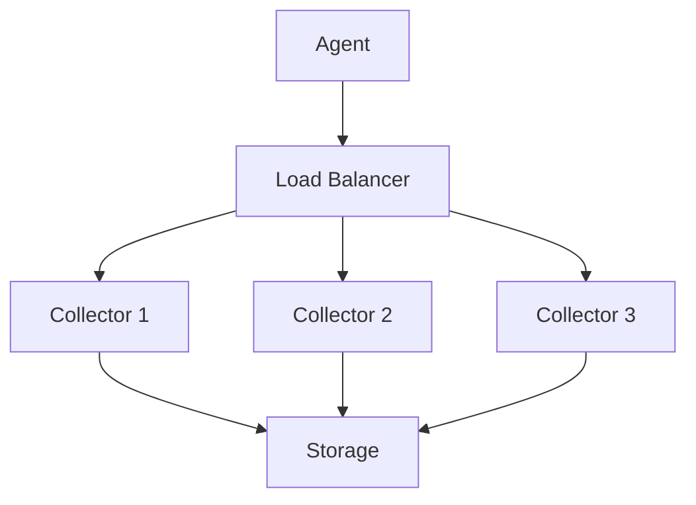

# Jaeger 高可用性配置

## 介绍

高可用性（High Availability, HA）是分布式系统设计中的重要概念，指系统能够在部分组件故障时继续提供服务。对于 Jaeger 这样的分布式追踪系统，高可用性配置尤为重要，因为它需要处理大量来自微服务的追踪数据，同时保证数据的完整性和可查询性。

本文将介绍 Jaeger 的高可用性配置方法，包括存储后端的选择、组件冗余部署以及故障恢复策略。

## 为什么需要高可用性？

在微服务架构中，服务间的调用链可能非常复杂。如果追踪系统不可用，开发者将无法诊断问题，影响系统的可观测性。高可用性配置可以：
- 避免单点故障（SPOF）
- 提高系统容错能力
- 确保数据不丢失
- 维持服务连续性

## Jaeger 组件与高可用性

Jaeger 主要由以下组件组成：
1. **Agent**：接收来自应用程序的跨度数据
2. **Collector**：接收 Agent 的数据并写入存储
3. **Query**：提供查询界面和 API
4. **Storage**：持久化存储追踪数据

要实现高可用，需要重点关注 Collector 和 Storage 组件。

## 存储后端的高可用配置

Jaeger 支持多种存储后端，以下是常见选项的高可用配置：

### 1. Elasticsearch 作为存储后端

Elasticsearch 天然支持分布式部署，是 Jaeger 高可用存储的理想选择。

```yaml
# jaeger-collector 配置示例
storage:
  type: elasticsearch
  options:
    es:
      server-urls: http://es-node1:9200,http://es-node2:9200,http://es-node3:9200
      username: elastic
      password: changeme
    es-archive:
      enabled: true
      server-urls: http://es-archive-node1:9200,http://es-archive-node2:9200
```

:::tip
建议 Elasticsearch 集群至少配置 3 个主节点，以实现故障转移和脑裂保护。
:::

### 2. Cassandra 作为存储后端

Cassandra 也是分布式数据库，具有高可用特性。

```yaml
# jaeger-collector 配置示例
storage:
  type: cassandra
  options:
    cassandra:
      servers: cassandra1,cassandra2,cassandra3
      keyspace: jaeger_v1_test
      replication-factor: 3
```

:::caution
`replication-factor` 应设置为至少 3，以确保数据冗余。这个数字不应超过 Cassandra 集群中的节点数。
:::

## Collector 的高可用部署

Collector 是无状态组件，可以通过以下方式实现高可用：

1. **多实例部署**：运行多个 Collector 实例
2. **负载均衡**：使用负载均衡器分发流量



## 实际案例：电商平台的高可用追踪

假设一个电商平台有以下需求：
- 每天处理 10 亿次追踪
- 99.99% 的可用性要求
- 数据保留 7 天

**解决方案**：
1. 部署 5 个 Collector 实例，前面使用 Kubernetes Service 做负载均衡
2. 使用 Elasticsearch 集群，包含 5 个数据节点和 3 个主节点
3. 配置 Elasticsearch 索引生命周期管理（ILM）自动滚动索引

```yaml
# Collector 部署示例 (Kubernetes Deployment)
apiVersion: apps/v1
kind: Deployment
metadata:
  name: jaeger-collector
spec:
  replicas: 5
  selector:
    matchLabels:
      app: jaeger
      component: collector
  template:
    metadata:
      labels:
        app: jaeger
        component: collector
    spec:
      containers:
      - name: jaeger-collector
        image: jaegertracing/jaeger-collector:1.30
        ports:
        - containerPort: 14269
        - containerPort: 14268
        - containerPort: 14250
        - containerPort: 9411
        env:
        - name: SPAN_STORAGE_TYPE
          value: elasticsearch
        - name: ES_SERVER_URLS
          value: http://es-cluster:9200
```

## 监控与告警

高可用系统需要完善的监控：
1. Collector 的吞吐量和错误率
2. 存储后端的延迟和资源使用率
3. 队列积压情况（如果使用 Kafka 缓冲）

```bash
# 示例 Prometheus 查询：Collector 错误率
rate(jaeger_collector_spans_received_total{result="err"}[5m]) / 
rate(jaeger_collector_spans_received_total[5m]) > 0.05
```

## 总结

实现 Jaeger 的高可用性需要：
1. 选择合适的分布式存储后端（Elasticsearch 或 Cassandra）
2. 部署多个 Collector 实例并配置负载均衡
3. 设置适当的监控和告警
4. 根据数据量规划存储容量和保留策略

## 附加资源

1. [Jaeger 官方文档 - 生产环境部署](https://www.jaegertracing.io/docs/1.30/deployment/)
2. [Elasticsearch 高可用最佳实践](https://www.elastic.co/guide/en/elasticsearch/reference/current/high-availability.html)
3. [Cassandra 数据复制策略](https://cassandra.apache.org/doc/latest/cassandra/architecture/dynamo.html#replication)

## 练习

1. 在本地使用 Docker Compose 部署一个包含 2 个 Collector 和 3 个 Elasticsearch 节点的 Jaeger 环境
2. 模拟一个 Collector 实例故障，观察系统行为
3. 配置 Prometheus 监控 Jaeger 的关键指标