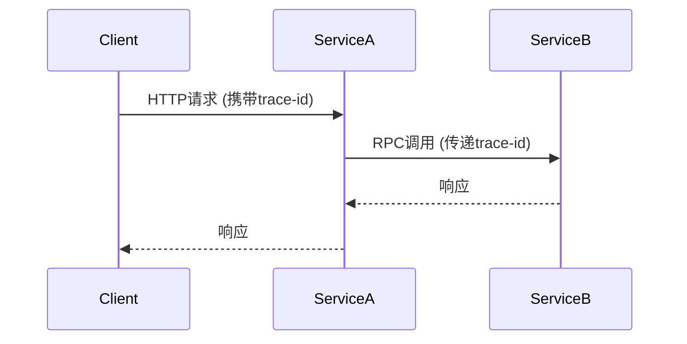

# 系统集成最佳实践

## 介绍

系统集成是分布式追踪的核心环节，Jaeger作为流行的开源工具，需要与应用程序、基础设施和服务网格等组件协同工作。本文将介绍如何以标准化、可维护的方式实现Jaeger与其他系统的集成，帮助初学者避免常见陷阱。

:::note 什么是系统集成？
在Jaeger上下文中，系统集成指将追踪功能嵌入到应用程序中，并确保数据能正确流向Jaeger后端，同时与其他监控工具（如Prometheus、Grafana）联动。
:::

## 基础集成步骤

### 1. 客户端库选择

Jaeger支持多种语言的客户端库，以下是常见选择：

- **Java**: `jaeger-client-java`
- **Python**: `jaeger-client`
- **Go**: `jaeger-client-go`
- **Node.js**: `jaeger-client`

:::tip 版本一致性
确保客户端库版本与Jaeger后端兼容，避免使用已弃用的API。
:::

### 2. 配置示例（Go语言）

以下是一个最小化的Go客户端配置示例：

```go
package main

import (
	"context"
	"log"

	"github.com/uber/jaeger-client-go"
	"github.com/uber/jaeger-client-go/config"
)

func main() {
	cfg := config.Configuration{
		ServiceName: "my-awesome-service",
		Sampler: &config.SamplerConfig{
			Type:  jaeger.SamplerTypeConst,
			Param: 1,
		},
		Reporter: &config.ReporterConfig{
			LogSpans:          true,
			LocalAgentHostPort: "jaeger-agent:6831",
		},
	}

	tracer, closer, err := cfg.NewTracer()
	if err != nil {
		log.Fatal("Could not initialize jaeger tracer:", err)
	}
	defer closer.Close()

	// 创建示例span
	span := tracer.StartSpan("say-hello")
	defer span.Finish()

	span.SetTag("greeting", "hello world")
}
```

**输出效果**：在Jaeger UI中将看到名为`say-hello`的span，包含自定义标签。

## 高级集成模式

### 上下文传播

跨服务传递追踪上下文是实现完整调用链的关键。Jaeger使用以下标准头信息：

- `uber-trace-id`
- `uber-baggage-`



### 与服务网格集成

如果使用Istio等服务网格，可通过Sidecar自动捕获流量：

```yaml
# Istio配置示例
apiVersion: networking.istio.io/v1alpha3
kind: VirtualService
metadata:
  name: productpage
spec:
  hosts:
  - productpage
  http:
  - route:
    - destination:
        host: productpage
        subset: v1
    headers:
      request:
        set:
          x-b3-traceid: "%REQ(UBER-TRACE-ID)%"
```

## 实战案例：电商系统集成

**场景**：用户下单后追踪订单处理全流程

1. **前端服务**：生成初始trace
2. **订单服务**：记录库存检查
3. **支付服务**：捕获支付延迟
4. **物流服务**：跟踪配送状态

```go
// 订单服务中的关键span
func processOrder(ctx context.Context, order Order) {
	span, ctx := opentracing.StartSpanFromContext(ctx, "process-order")
	defer span.Finish()

	// 记录业务属性
	span.SetTag("order.id", order.ID)
	span.SetTag("order.amount", order.Amount)

	checkInventory(ctx, order)  // 子span自动关联
	processPayment(ctx, order)
}
```

## 总结与最佳实践清单

1. **标准化配置**：使用环境变量管理端点配置
   ```sh
   JAEGER_AGENT_HOST=jaeger-agent
   JAEGER_AGENT_PORT=6831
   ```
2. **采样策略**：生产环境推荐动态采样
   ```yaml
   sampler:
     type: probabilistic
     param: 0.1
   ```
3. **标签规范**：定义统一的标签命名规则（如`service.payment.status`）
4. **错误处理**：始终记录错误状态
   ```go
   span.SetTag("error", true)
   span.LogKV("error_details", err.Error())
   ```

## 扩展练习

1. 在本地Docker环境部署Jaeger并集成一个Python Flask应用
2. 尝试通过Jaeger的依赖分析功能绘制服务关系图
3. 配置一个将追踪数据同时发送到Jaeger和Zipkin的双写方案

## 附加资源

- [Jaeger官方文档](https://www.jaegertracing.io/docs/)
- [OpenTracing语义规范](https://opentracing.io/specification/)
- [分布式追踪模式](https://microservices.io/patterns/observability/distributed-tracing.html)