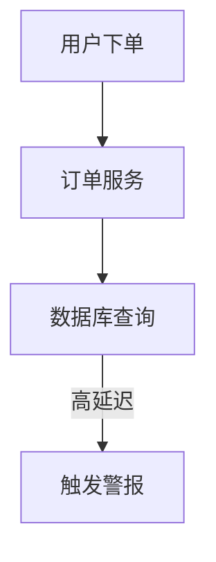

# 监控与警报策略

## 介绍

在现代分布式系统中，监控与警报是确保系统稳定性和快速故障恢复的关键组成部分。Jaeger 作为一款开源的分布式追踪系统，不仅帮助开发者理解请求在服务间的流转，还能通过监控关键指标和设置警报，提前发现潜在问题。本文将介绍如何利用 Jaeger 设计监控与警报策略，适合初学者快速上手。

---

## 为什么需要监控与警报？

监控的目的是实时收集系统运行状态的数据，而警报则是在检测到异常时通知相关人员。通过 Jaeger，你可以：
- 追踪请求延迟、错误率等关键指标。
- 识别性能瓶颈或异常行为。
- 快速定位故障根源。

:::tip
监控是“观察”，警报是“行动”。两者结合才能实现主动运维。
:::

---

## 监控策略设计

### 1. 定义关键指标
以下是与 Jaeger 相关的核心监控指标：
- **请求延迟（Latency）**：服务响应时间。
- **错误率（Error Rate）**：HTTP 5xx 或自定义错误的比例。
- **吞吐量（Throughput）**：单位时间的请求量。

### 2. 使用 Prometheus 集成
Jaeger 支持与 Prometheus 集成，通过以下配置暴露指标：
```yaml
# Jaeger 配置示例（部分）
metrics:
  backend: prometheus
  prometheus:
    host-port: "0.0.0.0:14269"
```

### 3. 查询监控数据
通过 PromQL 查询 Jaeger 的延迟分布：
```promql
histogram_quantile(0.95, sum(rate(jaeger_trace_latency_bucket[5m])) by (le))
```

---

## 警报策略设计

### 1. 设置警报规则
在 Prometheus 的 `alert.rules` 中定义规则，例如检测高错误率：
```yaml
groups:
- name: jaeger-alerts
  rules:
  - alert: HighErrorRate
    expr: rate(jaeger_http_requests_total{status=~"5.."}[5m]) / rate(jaeger_http_requests_total[5m]) > 0.05
    for: 10m
    labels:
      severity: critical
    annotations:
      summary: "High error rate detected in {{ $labels.service }}"
```

### 2. 通知渠道
通过 Alertmanager 将警报发送到 Slack 或邮件：
```yaml
route:
  receiver: slack-notifications
receivers:
- name: slack-notifications
  slack_configs:
  - channel: "#alerts"
    api_url: "https://hooks.slack.com/services/..."
```

:::warning
避免警报疲劳！只为关键问题设置警报，并合理设置阈值和静默规则。
:::

---

## 实际案例：电商系统的监控

### 场景描述
一个电商系统的订单服务出现间歇性超时。通过 Jaeger 追踪发现：
1. 订单服务的数据库查询延迟偶尔飙升。
2. 错误率在高峰时段超过 5%。

### 解决方案
1. **监控**：在 Jaeger 中标记所有数据库查询的 Span，并监控其延迟。
2. **警报**：当数据库查询延迟 > 500ms 持续 5 分钟时触发警报。
3. **优化**：通过追踪发现索引缺失，添加索引后延迟恢复正常。



---

## 总结

- **监控**：通过 Jaeger 和 Prometheus 收集关键指标。
- **警报**：基于业务需求设置规则，避免过度警报。
- **行动**：结合追踪数据快速定位问题根源。

---

## 附加资源

1. [Jaeger 官方文档](https://www.jaegertracing.io/docs/)
2. [Prometheus 警报指南](https://prometheus.io/docs/alerting/latest/overview/)
3. **练习**：在你的测试环境中配置一个 Jaeger 警报规则，模拟高延迟场景并验证警报触发。