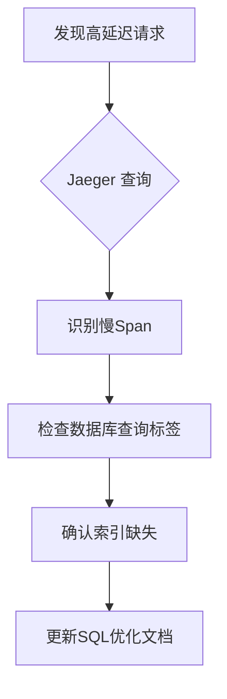

## 介绍

在分布式系统中，Jaeger 作为流行的追踪工具，帮助开发者监控和诊断复杂的服务交互。然而，随着系统规模扩大，**文档与知识管理**成为确保团队高效协作的关键。本文将介绍如何通过结构化文档、代码注释和知识共享实践，最大化 Jaeger 的价值。

---

## 为什么需要文档与知识管理？

1. **降低学习成本**：新成员能快速理解追踪数据的含义。
2. **统一问题排查流程**：标准化团队对 Jaeger 数据的使用方式。
3. **避免知识孤岛**：确保关键经验不会仅存在于个别成员脑中。

:::tip
良好的文档应像代码一样维护——版本化、可检索、定期更新。
:::

---

## 核心实践

### 1. 代码注释规范

在埋点代码中添加有意义的注释，说明追踪的上下文：

```go
// 追踪用户支付流程（span名称需与业务逻辑一致）
span := tracer.StartSpan("process_payment")
defer span.Finish()

// 添加业务相关标签（非技术细节）
span.SetTag("payment.method", "credit_card")
span.SetTag("user.id", userID)  // 注意：避免记录敏感信息
```

**关键点**：
- 解释 `span` 的业务目的而非技术实现
- 标注标签的合规性要求（如隐私数据）

---

### 2. 追踪文档模板

为每个重要服务创建追踪文档，包含：

```markdown
# 订单服务追踪规范

## 关键 Span
- `create_order`：覆盖订单创建全流程
- `inventory_check`：库存检查子过程

## 标签约定
| 标签名           | 类型   | 描述               |
|------------------|--------|--------------------|
| `order.currency` | string | 订单货币类型       |
| `order.items`    | int    | 商品数量（聚合值） |

## 常见问题
- Q: 为什么看不到支付回调数据？
  A: 确保已添加 `payment.callback` span 并检查采样率配置。
```

:::note
使用版本控制的 Markdown 文件，与代码库一起存储。
:::

---

### 3. 知识共享机制

#### 案例：性能瓶颈分析
通过 Mermaid 图展示如何将 Jaeger 数据转化为知识：



**实际步骤**：
1. 在团队 Wiki 记录该分析路径
2. 将解决方案添加到「性能优化」知识库
3. 下次同类问题可直接参考

---

## 工具推荐

1. **代码即文档**：
   - 使用 `swagger` 或 `protobuf` 注释生成追踪规范
   ```protobuf
   message PaymentTrace {
     string user_id = 1 [(jaeger.tag) = "user.id"];
     // @jaeger-tag: payment.amount
     double amount = 2;
   }
   ```

2. **知识库集成**：
   - 将 Jaeger 链接嵌入到 Grafana 看板或 Incident 报告

---

## 总结

| 实践                | 收益                              |
|---------------------|-----------------------------------|
| 标准化注释          | 提升代码可维护性                  |
| 结构化文档          | 加速问题定位                      |
| 案例知识库          | 避免重复踩坑                      |

**下一步练习**：
1. 为你的项目创建一个 `jaeger-guide.md` 文档
2. 通过注释生成 API 追踪文档（尝试 `swagger-jaeger` 插件）
3. 在团队会议中分享一个 Jaeger 排查案例

:::caution
定期审计文档有效性——过时的文档比没有文档更危险！
:::