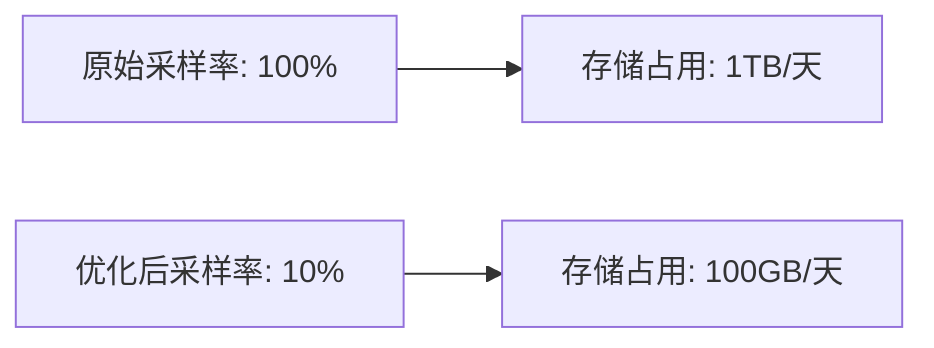

## 引言

持续改进（Continuous Improvement）是软件开发和运维中的核心实践，尤其在分布式追踪系统（如Jaeger）中至关重要。它通过**周期性评估、反馈循环和增量优化**，帮助团队不断提升系统的性能、可观测性和用户体验。本文将介绍如何在Jaeger中实施持续改进方法，并通过实际案例展示其价值。

---

## 什么是持续改进？

持续改进是一种系统化的方法，通过以下步骤实现目标：  
1. **计划（Plan）**：识别问题或改进机会。  
2. **执行（Do）**：实施小范围变更。  
3. **检查（Check）**：评估变更效果。  
4. **调整（Act）**：根据结果优化或推广变更。  

在Jaeger中，持续改进可能涉及：  
- 优化采样策略以减少存储开销  
- 改进标签设计以增强查询效率  
- 调整收集器配置以提升吞吐量  

---

## 持续改进的核心步骤

### 1. 指标收集与分析
使用Jaeger的内置指标（如`jaeger_collector_spans_received`）或集成Prometheus监控：

```go
// 示例：查询Jaeger收集器的吞吐量指标（PromQL）
rate(jaeger_collector_spans_received_total[5m])
```

:::tip
通过Grafana仪表盘可视化指标，快速发现性能瓶颈（如突增的延迟或错误率）。
:::

### 2. 实施变更
例如，调整采样率以平衡数据量和精度：

```yaml
# jaeger-agent配置示例（概率采样）
sampling:
  strategies:
    - type: probabilistic
      param: 0.1  # 10%的请求会被采样
```

### 3. 验证效果
对比变更前后的关键指标：  
- 存储使用量  
- 查询响应时间  
- 错误率  



### 4. 标准化与自动化
将成功改进的配置纳入CI/CD流程，例如通过Helm Chart管理Jaeger部署：

```yaml
# values.yaml片段
agent:
  sampling:
    strategies:
      - type: probabilistic
        param: 0.1
```

---

## 实际案例：优化高流量服务的追踪

**问题场景**：  
某电商平台的订单服务在促销期间产生大量追踪数据，导致Jaeger存储压力激增。

**改进过程**：  
1. **分析**：发现80%的追踪来自健康检查请求，价值低。  
2. **调整**：通过`agent.tags`过滤无关请求：  

```yaml
agent:
  tags:
    environment: production
  sampling:
    ignore_routes: ["/healthcheck"]
```

3. **结果**：存储成本降低65%，关键业务追踪的完整性保持不变。

---

## 总结

持续改进是Jaeger运维的关键实践，通过：  
✅ 基于数据的决策  
✅ 渐进式变更  
✅ 自动化验证  

确保系统始终以最优状态运行。

---

## 延伸资源

1. [Jaeger官方文档：采样配置](https://jaegertracing.io/docs/latest/sampling/)  
2. [Prometheus监控Jaeger指标](https://github.com/jaegertracing/jaeger/tree/main/metrics)  
3. **练习**：在本地Jaeger实例中尝试调整采样率，观察存储和查询性能的变化。