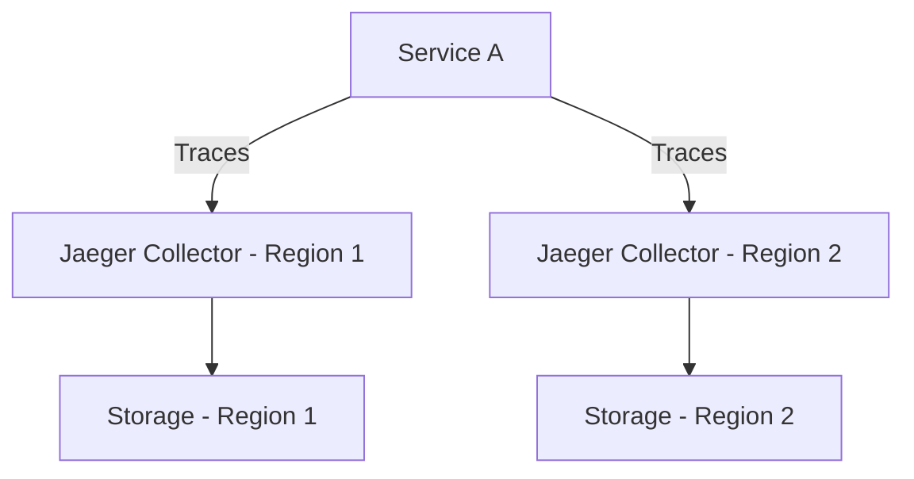

# 灾难恢复规划

## 介绍

灾难恢复规划（Disaster Recovery Planning, DRP）是为应对系统故障、数据丢失或其他灾难性事件而设计的策略。在分布式追踪系统（如 Jaeger）中，灾难恢复至关重要，因为追踪数据是诊断生产问题的关键依据。本文将介绍 Jaeger 的灾难恢复核心概念、实施步骤和实际案例。

## 为什么需要灾难恢复？

Jaeger 作为分布式追踪系统，通常存储大量请求链路数据。如果存储后端（如 Elasticsearch 或 Cassandra）发生故障，可能导致：
1. **数据丢失**：无法回溯历史问题。
2. **服务中断**：依赖 Jaeger 的团队无法排查故障。
3. **业务影响**：延迟或错误无法被及时诊断。

## 核心策略

### 1. 数据备份
Jaeger 依赖存储后端，因此需定期备份数据。以下是 Cassandra 的备份示例：

```bash
# 备份 Jaeger 的 keyspace
nodetool snapshot -t jaeger_backup jaeger
```

恢复时使用 `sstableloader` 工具：
```bash
sstableloader -d <cassandra_node> /path/to/backup
```

### 2. 多区域部署
通过跨区域部署 Jaeger Collector 和 Storage，避免单点故障。



### 3. 配置容错
在 Jaeger 客户端配置多个 Collector 端点：
```yaml
jaeger:
  service-name: my-app
  reporter:
    log-spans: true
    queue-size: 100
    local-agent-host-port: jaeger-agent:6831
    endpoint: http://jaeger-collector-1:14268/api/traces,http://jaeger-collector-2:14268/api/traces
```

## 实际案例

### 案例：电商平台故障恢复
某电商平台在黑色星期五期间遭遇数据中心宕机。由于提前实施以下措施，30 分钟内恢复 Jaeger 服务：
1. **热备存储**：Cassandra 集群在另一个区域同步运行。
2. **自动切换**：通过 Kubernetes 将流量路由到备用区域。
3. **数据完整性检查**：恢复后验证追踪数据的连续性。

:::tip
测试你的灾难恢复计划！定期模拟故障场景（如关闭主存储集群），验证恢复流程是否有效。
:::

## 总结

Jaeger 的灾难恢复规划需要：
1. **数据冗余**：定期备份存储后端。
2. **架构容错**：多区域/多集群部署。
3. **自动化工具**：快速切换和恢复。

## 扩展资源
- [Jaeger 官方文档 - 生产建议](https://www.jaegertracing.io/docs/latest/deployment/)
- [Cassandra 备份与恢复指南](https://cassandra.apache.org/doc/latest/operating/backups.html)
- 练习：在本地用 Docker 模拟 Jaeger + Cassandra 故障，尝试从备份恢复数据。