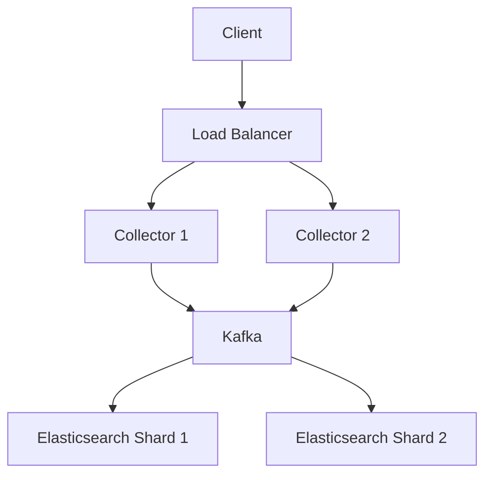

# 扩展性设计

## 介绍

在构建分布式系统时，扩展性是确保系统能够随着需求增长而平稳运行的关键因素。Jaeger作为一个分布式追踪系统，其扩展性设计尤为重要。本文将介绍如何为Jaeger设计可扩展的架构，包括水平扩展、存储优化和性能调优等核心概念。

:::note
**什么是扩展性设计？**  
扩展性设计是指系统能够通过增加资源（如服务器、存储等）来应对负载增长的能力。对于Jaeger来说，这意味着能够处理更多的追踪数据而不降低性能。
:::

## 核心概念

### 1. 水平扩展 vs 垂直扩展

- **水平扩展**：通过增加更多的机器来分散负载。Jaeger的组件（如Collector、Query）可以水平扩展。
- **垂直扩展**：通过升级单台机器的资源（如CPU、内存）来提升性能。通常用于数据库等有状态服务。

:::tip
Jaeger的Collector和Query服务是无状态的，非常适合水平扩展。存储层（如Elasticsearch或Cassandra）则需要根据具体场景选择扩展策略。
:::

### 2. 存储优化

Jaeger的存储层是扩展性的瓶颈之一。以下是常见的优化策略：

- **数据分片（Sharding）**：将数据分散到多个节点，避免单点压力。
- **TTL（Time-To-Live）**：为追踪数据设置过期时间，减少存储压力。
- **采样（Sampling）**：只存储部分追踪数据，降低存储和计算开销。

#### 代码示例：配置采样策略

```yaml
# jaeger-agent 配置示例
sampling:
  strategies:
    - type: probabilistic
      param: 0.1  # 采样率10%
```

### 3. 性能调优

- **批量处理**：Jaeger Collector支持批量接收和存储数据，减少I/O开销。
- **异步处理**：使用消息队列（如Kafka）解耦数据收集和存储。

## 实际案例

### 案例：电商平台的Jaeger扩展

假设一个电商平台在“黑五”期间流量激增，需要扩展Jaeger以处理更多的追踪请求。

1. **水平扩展Collector**：部署多个Collector实例，通过负载均衡分发请求。
2. **存储分片**：将Elasticsearch集群从3节点扩展到10节点，按时间分片数据。
3. **动态采样**：在高负载时降低采样率（如从100%降到20%）。



## 总结

扩展性设计是Jaeger部署中的关键环节，尤其是在高负载场景下。通过水平扩展、存储优化和性能调优，可以显著提升系统的稳定性和吞吐量。

:::caution
**注意事项**  
- 扩展存储层时需注意数据一致性和查询性能的平衡。
- 采样策略可能导致部分追踪数据丢失，需根据业务需求调整。
:::

## 附加资源

1. [Jaeger官方文档 - 扩展性建议](https://www.jaegertracing.io/docs/latest/performance-tuning/)
2. 《分布式系统：概念与设计》 - 扩展性相关章节
3. 练习：尝试在本地部署多节点Jaeger集群，模拟高负载场景下的扩展。