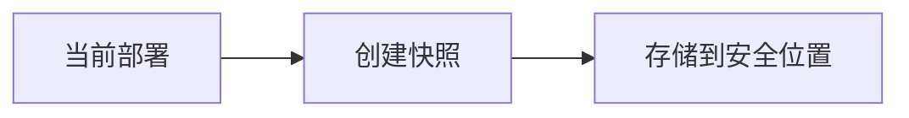
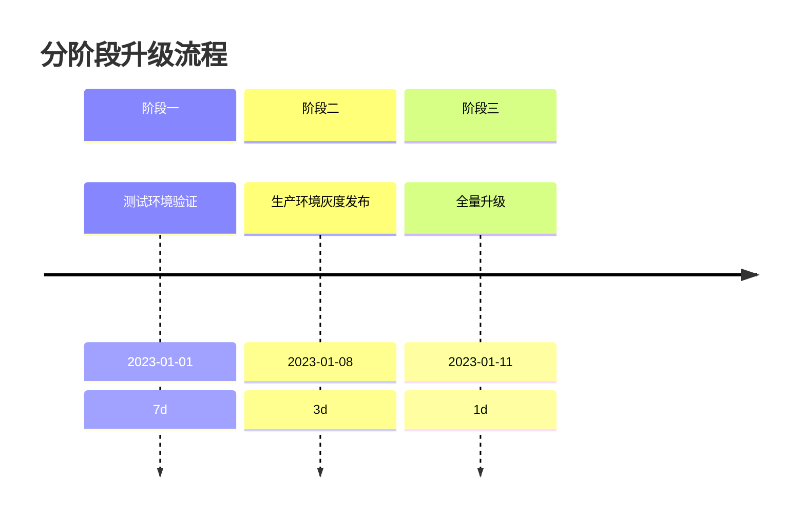

## 介绍

在分布式追踪系统中，Jaeger的版本升级是维护工作的重要环节。合理的升级策略能确保系统稳定性，避免数据丢失或服务中断。本文将详细介绍从升级前评估到验证的全流程策略。

## 升级前准备

### 1. 版本兼容性检查
查阅官方发布的[升级说明](https://www.jaegertracing.io/docs/)确认：
- 当前版本与目标版本是否兼容
- 是否有破坏性变更（Breaking Changes）

```bash
# 查看当前Jaeger版本
jaeger-all-in-one --version
```

### 2. 数据备份
对于生产环境，必须备份存储后端数据：


:::warning 重要
Elasticsearch用户需使用官方快照API：
```bash
PUT /_snapshot/jaeger_backup
{
  "type": "fs",
  "settings": { "location": "/backup/jaeger" }
}
```
:::

## 升级执行步骤

### 单机模式升级
使用Docker时的推荐流程：

1. 停止旧容器
```bash
docker stop jaeger
```

2. 拉取新版本镜像
```bash
docker pull jaegertracing/all-in-one:1.42.0
```

3. 启动新容器（保持原有配置）
```bash
docker run -d --name jaeger \
  -p 16686:16686 \
  -p 6831:6831/udp \
  jaegertracing/all-in-one:1.42.0
```

### Kubernetes集群升级
通过Helm的滚动升级策略：

```bash
helm upgrade jaeger jaegertracing/jaeger \
  --version 1.42.0 \
  -f values.yaml
```

:::tip 最佳实践
建议先在测试环境验证升级过程，使用相同配置和数据集模拟真实场景。
:::

## 实际案例

某电商平台升级过程：

1. **问题发现**：v1.30 → v1.35直接升级导致Kafka消息格式不兼容
2. **解决方案**：
   - 先升级到中间版本v1.32
   - 启用消息转换器
   - 最终升级到v1.35
3. **结果**：零停机时间，追踪数据完整保留



## 常见问题处理

### 回滚策略
当升级失败时：

1. 存储兼容时：直接降级容器/镜像版本
2. 存储不兼容时：
   - 恢复备份数据
   - 使用旧版本读取

```bash
# 检查存储兼容性
jaeger-query --query.base-path=/ --storage.type=elasticsearch \
  --storage.elasticsearch.server-urls=http://elasticsearch:9200
```

## 总结

关键升级原则：
- 始终阅读版本发布说明
- 生产环境必须备份数据
- 采用渐进式升级策略
- 监控升级后系统表现

## 延伸学习

- 官方升级指南：[Jaeger Upgrade Documentation](https://www.jaegertracing.io/docs/latest/upgrading/)
- 练习：在本地Docker环境尝试从v1.40升级到v1.42
- 社区支持：[Jaeger Slack频道](https://cloud-native.slack.com/archives/CGG7NFUJ3)