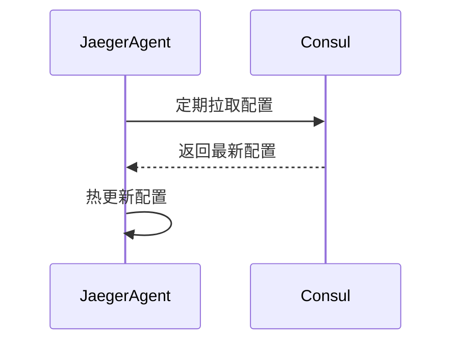

# Jaeger 配置管理

## 介绍

配置管理是Jaeger部署中的关键环节，它决定了追踪系统如何收集、处理和存储数据。良好的配置实践能提升系统可靠性，降低运维复杂度。本文将介绍Jaeger的核心配置方法，包括静态配置、环境变量和动态加载机制。

## 基础配置方式

### 1. 环境变量配置

Jaeger客户端和服务端都支持通过环境变量配置：

```bash
# 设置采样率为100%
export JAEGER_SAMPLER_TYPE=const
export JAEGER_SAMPLER_PARAM=1

# 指定Agent地址
export JAEGER_AGENT_HOST=localhost
export JAEGER_AGENT_PORT=6831
```

:::tip
环境变量适合容器化部署场景，可以通过Kubernetes ConfigMap或Docker环境变量批量管理
:::

### 2. 配置文件方式

对于复杂配置，推荐使用YAML/JSON格式的配置文件（以`jaeger-collector`为例）：

```yaml
# config.yaml
sampling:
  strategies:
    - service: "frontend"
      type: "probabilistic"
      param: 0.1
    - service: "backend.*"
      type: "ratelimiting"
      param: 2

storage:
  type: "elasticsearch"
  elasticsearch:
    server-urls: "http://elasticsearch:9200"
    username: "jaeger"
    password: "securepassword"
```

启动时指定配置文件：
```bash
jaeger-collector --config-file=config.yaml
```

## 动态配置管理

### 使用远程配置中心

Jaeger支持从远程配置中心动态加载配置（如Consul、Etcd）：



配置示例：
```go
import "github.com/jaegertracing/jaeger/pkg/config"

func main() {
    v := config.NewViper()
    v.AddRemoteProvider("consul", "localhost:8500", "jaeger/config")
    v.SetConfigType("json")
    err := v.ReadRemoteConfig()
    // ...处理配置
}
```

## 实际案例：多环境配置管理

### 开发环境配置

```yaml
# dev-config.yaml
sampling:
  default_strategy:
    type: "const"
    param: 1

logging:
  level: "debug"
```

### 生产环境配置

```yaml
# prod-config.yaml
sampling:
  default_strategy:
    type: "probabilistic"
    param: 0.01

storage:
  type: "cassandra"
  cassandra:
    servers: "cassandra.prod.svc:9042"
    keyspace: "jaeger_prod"
```

:::caution
生产环境务必配置适当的采样率，避免存储系统过载
:::

## 最佳实践总结

1. **分层配置**：基础配置用环境变量，复杂配置用文件
2. **敏感信息处理**：使用Secret管理密码等敏感数据
3. **版本控制**：配置文件应纳入版本控制系统
4. **配置验证**：启动前使用`jaeger-xxx --help-config`验证配置
5. **监控配置**：监控配置变更和生效情况

## 延伸学习

- 官方配置文档：[Jaeger Configuration](https://www.jaegertracing.io/docs/latest/deployment/)
- 实践练习：
  1. 尝试通过环境变量设置不同的采样策略
  2. 创建开发/测试两套配置文件并切换使用
  3. 实现从Consul动态加载配置的Demo

:::note
配置变更后需要重启服务才能生效（动态配置除外），建议在低峰期操作
:::