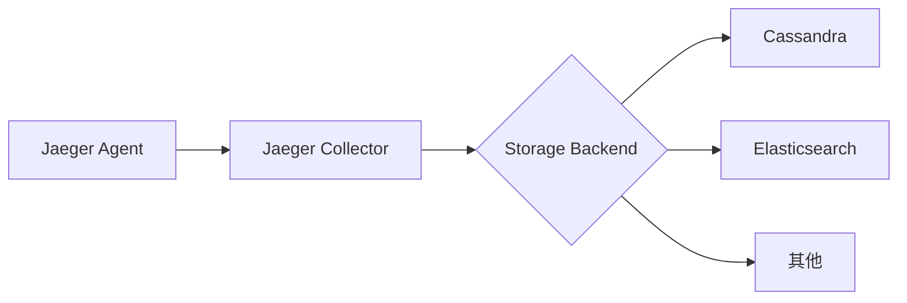

# Jaeger 数据保留策略

## 介绍

在分布式系统中，Jaeger 作为一款流行的分布式追踪工具，会生成大量追踪数据。如果不加以管理，这些数据会快速占用存储资源。**数据保留策略**定义了 Jaeger 如何存储、保留和清理追踪数据，是生产环境部署的关键配置之一。

:::note 初学者提示
数据保留策略的核心目标是：**平衡存储成本与调试需求**。保留太久浪费资源，保留太短可能丢失关键信息。
:::

## Jaeger 存储架构概述

Jaeger 支持多种存储后端（如 Cassandra、Elasticsearch、内存存储等），不同后端的保留策略配置方式不同。以下是典型架构：



## 主要配置方法

### 1. 基于时间的保留策略

最常见的策略是根据时间自动清理旧数据。以下是各后端的配置示例：

#### Cassandra 配置

在 `jaeger-cassandra-schema` 初始化时设置 TTL（Time-To-Live）：

```bash
# 创建 keyspace 时设置默认 TTL（单位：秒）
CREATE KEYSPACE jaeger_v1_datacenter1 
WITH replication = {'class': 'SimpleStrategy', 'replication_factor': '1'}
AND default_time_to_live = 172800;  # 保留2天（60*60*24*2）
```

#### Elasticsearch 配置

通过 Elasticsearch 的索引生命周期管理 (ILM)：

```json
PUT _ilm/policy/jaeger_policy
{
  "policy": {
    "phases": {
      "hot": {
        "actions": {
          "rollover": {
            "max_age": "1d"
          }
        }
      },
      "delete": {
        "min_age": "7d",
        "actions": {
          "delete": {}
        }
      }
    }
  }
}
```

### 2. 基于空间的保留策略

限制总存储大小，当达到阈值时删除旧数据：

```yaml
# Jaeger Collector 配置示例（Elasticsearch）
storage:
  elasticsearch:
    max-num-spans: 10000000  # 保留最多1千万条span
```

:::warning 注意
空间策略需要密切监控，突然的流量激增可能导致数据快速被清理。
:::

## 实际案例

### 电商平台配置案例

某电商平台在黑色星期五期间需要：
- 保留最近3天的完整追踪数据（用于实时问题诊断）
- 保留30天的抽样数据（1%采样率，用于长期趋势分析）

**实现方案**：
```yaml
# Jaeger 配置片段
sampling:
  strategies-repo-file: /etc/jaeger/sampling_strategies.json

storage:
  elasticsearch:
    index-prefix: "jaeger-"
    ilm-policy: "jaeger-rollover-policy"
```

配套的 ILM 策略：
```json
{
  "policy": {
    "phases": {
      "hot": {
        "actions": {
          "rollover": {
            "max_age": "3d",
            "max_size": "50gb"
          }
        }
      },
      "warm": {
        "min_age": "3d",
        "actions": {
          "forcemerge": {
            "max_num_segments": 1
          }
        }
      },
      "delete": {
        "min_age": "30d"
      }
    }
  }
}
```

## 最佳实践建议

1. **分层存储**：
   - 热数据：SSD存储，快速访问
   - 冷数据：HDD或对象存储，降低成本

2. **动态采样**：
   ```go
   // 示例：根据操作类型动态调整采样率
   if operation == "checkout" {
       return Sampler{Param: 100} // 100%采样重要操作
   } else {
       return Sampler{Param: 1}  // 1%采样其他操作
   }
   ```

3. **监控指标**：
   - `jaeger_spans_received_total`
   - `jaeger_storage_errors_total`
   - 存储后端磁盘使用率

## 总结

合理的数据保留策略应该考虑：
- 业务需求（调试需要保留多久？）
- 存储成本
- 查询性能

:::tip 练习建议
1. 在本地使用 Docker 启动 Jaeger 和 Elasticsearch
2. 尝试配置不同的 ILM 策略
3. 使用 `jmeter` 生成负载，观察数据清理行为
:::

## 扩展阅读

- [Jaeger 官方文档 - 存储后端](https://www.jaegertracing.io/docs/latest/deployment/#storage-backends)
- [Elasticsearch ILM 详解](https://www.elastic.co/guide/en/elasticsearch/reference/current/index-lifecycle-management.html)