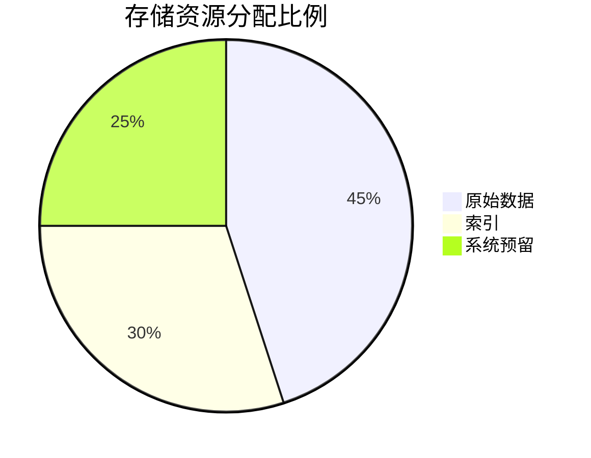

# Jaeger 最佳实践：资源预算规划

## 引言

资源预算规划是分布式追踪系统（如Jaeger）中至关重要的运维环节。它帮助开发者预先评估和分配系统资源（CPU、内存、存储等），避免因资源不足导致的服务中断，或因过度配置造成的成本浪费。本文将通过实际案例和配置示例，带你掌握Jaeger资源规划的核心方法。

---

## 为什么需要资源预算规划？

Jaeger作为分布式追踪系统，其组件（Collector、Query、Storage等）对资源的需求随着业务流量增长而变化。未合理规划时可能出现：
- **Collector过载**：高并发追踪数据压垮服务
- **存储爆炸**：Span数据超出磁盘容量
- **查询超时**：大规模检索耗尽内存

:::tip 关键原则
资源预算 = 预估流量 × 单请求消耗 × 安全系数
:::

---

## 核心组件资源分析

### 1. Collector资源估算
Collector处理并转发Span数据，其资源需求与**每秒Span数量**直接相关。

**计算公式**：
```plaintext
所需vCPU ≈ (Spans/sec ÷ 10,000) × 0.5
所需内存(GB) ≈ (Spans/sec ÷ 1,000) × 0.1
```

**示例场景**：
- 业务产生 50,000 spans/sec
- 计算得：
  - vCPU ≈ (50,000/10,000)×0.5 = 2.5 → 选择3核
  - 内存 ≈ (50,000/1,000)×0.1 = 5GB

### 2. Storage资源规划
以Elasticsearch为例，存储需求取决于：
- 每日Span量
- 平均Span大小
- 保留周期



**存储计算公式**：
```plaintext
总存储量 = 每日Span量 × Span平均大小 × 保留天数 × 压缩因子(通常0.5)
```

---

## 实际配置示例

### Collector资源配置（Kubernetes示例）
```yaml
# jaeger-collector-deployment.yaml
resources:
  limits:
    cpu: "2"
    memory: "4Gi"
  requests:
    cpu: "1.5"
    memory: "3Gi"
```

:::caution 注意
生产环境应设置`limits`防止单容器耗尽节点资源！
:::

### 存储配置调优
调整Elasticsearch分片数量避免小文件问题：
```json
PUT _template/jaeger
{
  "settings": {
    "number_of_shards": "3",
    "number_of_replicas": "1"
  }
}
```

---

## 真实案例：电商大促准备

**背景**：
某电商预计大促期间流量增长3倍，当前Jaeger数据：
- 日常：20,000 spans/sec
- 平均Span大小：2KB
- 当前ES存储：500GB

**规划步骤**：
1. 计算峰值流量：20,000 × 3 = 60,000 spans/sec
2. Collector扩容：需6vCPU/12GB内存（原配置2vCPU/4GB）
3. 存储扩展：
   - 每日新增数据：60,000 × 2KB × 86400 ≈ 10TB/天
   - 7天保留需：10TB × 7 × 0.5 = 35TB

---

## 总结与练习

### 关键总结
- 定期监控`jaeger_collector_spans_received`等指标
- 预留20%-30%缓冲资源应对突发流量
- 存储采用冷热分离架构降低成本

### 课后练习
1. 计算以下场景所需资源：
   - 15,000 spans/sec
   - Span大小1.5KB
   - 需保留14天数据
2. 尝试在测试环境部署Jaeger，通过`stress-tool`模拟流量并观察资源使用

### 扩展阅读
- [Jaeger官方容量规划指南](https://jaegertracing.io/docs/latest/operator/#capacity-planning)
- 《分布式系统观测》第5章