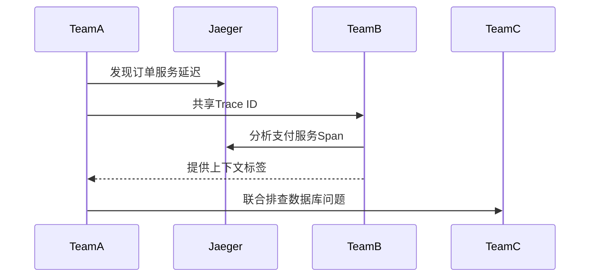

# Jaeger 最佳实践：团队协作模式

## 引言

在现代微服务架构中，分布式追踪系统如Jaeger已成为团队协作的"望远镜"。本文将介绍如何通过标准化实践、上下文共享和工具链整合，让开发团队在复杂系统中高效协作。

:::note 为什么需要协作模式？
单个开发者可能只需关注自己的服务，但当10个团队同时修改相互依赖的微服务时，缺乏统一标准会导致追踪数据难以理解。
:::

## 核心协作实践

### 1. 统一的Span命名规范

所有团队应遵守相同的命名约定：

```go
// 好例子：<服务名>.<操作名>.<资源类型>
span.SetOperationName("userService.GetUser.db")

// 反模式：模糊的命名
span.SetOperationName("query_data")
```

### 2. 上下文传播标准

使用Jaeger的`Inject`和`Extract`方法确保跨服务边界的上下文传递：

```python
# 发送方
from jaeger_client import Config
carrier = {}
tracer.inject(span_context, opentracing.Format.TEXT_MAP, carrier)
headers.update(carrier)

# 接收方
span_ctx = tracer.extract(opentracing.Format.TEXT_MAP, headers)
```

### 3. 共享标签约定

定义团队间通用的标签键：

| 标签键            | 描述                  | 示例值       |
|-------------------|----------------------|-------------|
| `team`           | 负责团队              | `checkout-team` |
| `business.domain` | 业务领域              | `payments`   |
| `error.retryable` | 错误是否可重试        | `true`       |

## 跨团队调试流程



## 真实案例：电商平台故障排查

**场景**：黑色星期五期间，订单成功率下降15%

1. 前端团队发现`/checkout`接口延迟增加
2. 通过共享的`orderId=BF-1123`标签快速定位到：
   - 支付服务超时（团队B负责）
   - 库存服务锁竞争（团队C负责）
3. 三方协作添加诊断标签：
   ```java
   span.setTag("payment.gateway", "stripe");
   span.setTag("inventory.lock.wait_ms", 450);
   ```

## 协作工具推荐

1. **Trace注释系统**：
   ```bash
   # 通过CLI添加注释
   jaeger-annotate --trace-id=abc123 --comment="团队A: 确认是缓存穿透问题"
   ```

2. **共享过滤器**保存常用查询：
   ```
   team=checkout-team AND http.status_code=500
   ```

## 总结与练习

**关键收获**：
- 统一的命名和标签是协作的基础
- 上下文传播需要跨团队标准化
- 工具链整合能显著提升效率

**练习建议**：
1. 在本地Jaeger实例中创建模拟Trace
2. 与同伴互相添加诊断注释
3. 尝试通过业务ID（如orderId）关联不同团队的Span

**延伸阅读**：
- Jaeger官方文档《跨团队追踪规范》
- 《分布式系统观测性》第5章
- OpenTelemetry语义约定标准