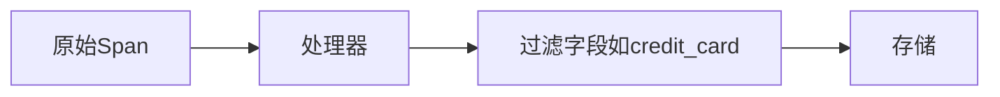

# 追踪数据治理

## 介绍

在现代分布式系统中，追踪数据（如Jaeger收集的Span数据）是理解系统行为的关键。但随着数据量的增长，如何高效管理这些数据变得至关重要。**追踪数据治理**涉及数据的采集、存储、访问控制和生命周期管理，确保数据既满足调试需求，又不会成为系统负担。

## 为什么需要追踪数据治理？

1. **成本控制**：未经管理的追踪数据可能占用大量存储资源。<br />
2. **隐私合规**：某些追踪数据可能包含敏感信息（如用户ID）。<br />
3. **查询效率**：合理的数据清理策略能提升查询性能。

---

## 核心治理策略

### 1. 采样策略

通过采样减少数据量，同时保留关键信息。Jaeger支持以下采样类型：

```go
// 示例：Jaeger客户端配置概率采样（采样率50%）
config := jaegercfg.Configuration{
    Sampler: &jaegercfg.SamplerConfig{
        Type:  "probabilistic",
        Param: 0.5,
    },
}
```

:::tip
**动态采样**更适合生产环境，可根据请求类型调整采样率（如对错误请求全采样）。
:::

### 2. 数据存储管理

Jaeger支持多种存储后端（如Cassandra、Elasticsearch），需配置数据保留策略：

```yaml
# 示例：Elasticsearch索引生命周期管理
PUT _ilm/policy/jaeger-indices
{
  "policy": {
    "phases": {
      "hot": { "actions": {} },
      "delete": { "min_age": "7d", "actions": { "delete": {} } }
    }
  }
}
```

### 3. 敏感数据处理

使用[红action](https://www.jaegertracing.io/docs/latest/security/#redaction)过滤敏感字段：



---

## 实际案例

### 案例：电商平台的追踪治理
1. **需求**：高流量下控制存储成本，同时保留订单错误追踪。<br />
2. **方案**：
   - 对 `/checkout` 接口全采样，其他接口概率采样（10%）。
   - 使用Elasticsearch自动删除7天前的数据。
   - 通过Tag过滤移除用户邮箱字段。

```json
// 处理前的Span（含敏感信息）
{
  "traceID": "abc123",
  "tags": {
    "user.email": "test@example.com",
    "http.status_code": 500
  }
}
```

---

## 总结

| 治理维度       | 工具/策略                      | 效果               |
|----------------|-------------------------------|--------------------|
| 数据量控制     | 动态采样                      | 减少50%~90%存储   |
| 存储优化       | ILM策略 + 压缩                | 降低存储成本      |
| 隐私保护       | 字段红action                  | 避免敏感数据泄露  |

---

## 延伸练习
1. 在本地Jaeger中配置一个概率采样器，观察不同采样率对数据量的影响。<br />
2. 使用OpenTelemetry的`SpanProcessor`实现一个简单的字段过滤器。

:::note 附加资源
- [Jaeger官方文档：采样配置](https://www.jaegertracing.io/docs/latest/sampling/)
- [Elasticsearch ILM详解](https://www.elastic.co/guide/en/elasticsearch/reference/current/index-lifecycle-management.html)
:::