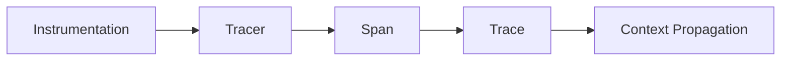
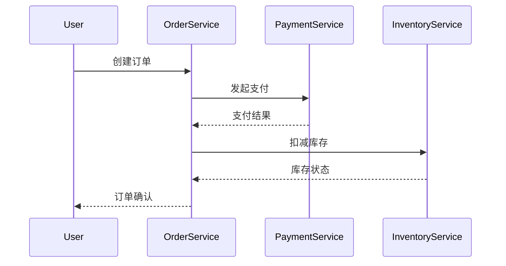

# 微服务架构追踪

## 什么是分布式追踪？

在现代微服务架构中，一个用户请求可能跨越多个服务。分布式追踪（Distributed Tracing）通过记录请求在系统中的完整路径，帮助开发者：

1. 可视化请求流转过程
2. 定位性能瓶颈
3. 分析跨服务错误
4. 监控服务依赖关系

:::tip 类比理解
想象快递物流追踪系统：每个转运站（服务）都会记录包裹（请求）的处理时间和状态，最终组合成完整的运输路线图。
:::

## Jaeger 的核心概念



1. **Span**：代表一个工作单元（如API调用）
   - 包含开始/结束时间、操作名称、标签等元数据
2. **Trace**：由多个Span组成的有向无环图
3. **Context Propagation**：跨服务传递追踪上下文

## 代码示例：基础Span创建

以下展示使用Jaeger客户端库的Python示例：

```python
from jaeger_client import Config

def init_tracer(service):
    config = Config(
        config={
            'sampler': {'type': 'const', 'param': 1},
            'logging': True,
        },
        service_name=service,
    )
    return config.initialize_tracer()

tracer = init_tracer('payment-service')

with tracer.start_span('process-payment') as span:
    span.set_tag('payment_amount', 100)
    span.log_kv({'event': 'payment_processed'})
    print("Payment processed")  # 实际业务逻辑
```

**输出结果**：
```
Started span: operation_name=process-payment
Logged event: payment_processed
```

## 实际案例：电商订单流程

假设我们有如下微服务架构：



通过Jaeger追踪该流程时，我们会看到：

1. 每个服务生成自己的Span
2. Span之间通过父子关系关联
3. 可以计算各阶段耗时（如支付处理时间）

## 上下文传播实战

跨服务追踪的关键在于传递上下文。以下是HTTP请求中的Header示例：

```python
from opentracing.propagation import Format
from opentracing_instrumentation.request_context import get_current_span

def make_request(url):
    span = get_current_span()
    headers = {}
    tracer.inject(
        span_context=span.context,
        format=Format.HTTP_HEADERS,
        carrier=headers)
    
    # 携带追踪头部的实际请求
    requests.get(url, headers=headers)
```

:::caution 注意事项
1. 确保所有服务使用相同的追踪上下文格式
2. 异步操作需要特殊处理上下文传递
3. 采样率在生产环境需谨慎配置
:::

## 生产环境最佳实践

1. **采样策略**：
   - 开发环境：100%采样
   - 生产环境：自适应采样（如0.1%）
2. **标签设计**：
   ```python
   span.set_tag('http.status_code', 200)
   span.set_tag('user.id', '12345')
   ```
3. **错误记录**：
   ```python
   span.set_tag('error', True)
   span.log_kv({'event': 'error', 'stack': str(ex)})
   ```

## 总结与扩展

通过本案例我们学习了：

✓ 分布式追踪的核心价值  
✓ Jaeger的基本工作流程  
✓ 跨服务上下文传播方法  
✓ 生产环境配置要点  

**延伸学习**：
1. 尝试集成Jaeger到你的Spring Boot/Node.js项目
2. 比较Jaeger与Zipkin的异同
3. 探索OpenTelemetry标准

:::note 练习任务
1. 在本地的Docker环境部署Jaeger
2. 使用任何语言的SDK创建包含3个Span的Trace
3. 在Jaeger UI中查询你的Trace
:::