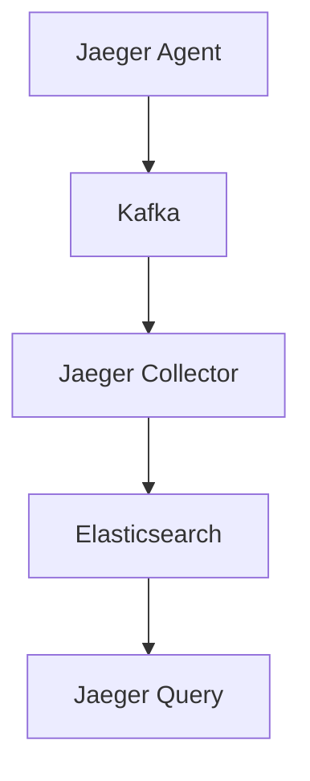
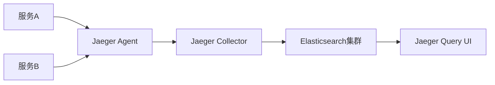

# 大规模部署案例

## 介绍

在现代分布式系统中，服务之间的调用关系变得越来越复杂。当一个请求需要经过多个微服务时，如何追踪请求的完整路径并分析性能瓶颈变得至关重要。Jaeger作为一款开源的分布式追踪系统，正是为解决这一问题而生。本文将介绍Jaeger在大规模部署中的实际应用案例，帮助初学者理解其核心概念和实现方式。

## 什么是大规模部署？

大规模部署通常指的是需要管理数百甚至数千个微服务的系统。在这样的环境中，传统的日志和监控工具往往难以满足需求，因为：

1. 服务间的调用链过于复杂
2. 数据量巨大
3. 需要实时分析和可视化

Jaeger通过以下方式解决这些问题：

- 分布式上下文传播
- 高效的采样策略
- 可扩展的存储后端
- 强大的查询界面

## 核心概念

### 1. 采样策略

在大规模部署中，采集所有请求的追踪数据是不现实的。Jaeger提供了多种采样策略：

```go
// 示例：设置概率采样策略
sampler := jaeger.NewProbabilisticSampler(0.1) // 采样10%的请求
tracer, closer, err := cfg.NewTracer(
    config.Sampler(sampler),
)
```

:::tip
对于高流量系统，通常从低采样率(如1%)开始，然后根据需求调整。
:::

### 2. 存储后端选择

Jaeger支持多种存储后端：

- 内存(仅用于测试)
- Cassandra
- Elasticsearch
- Kafka(作为缓冲)



## 实际案例：电商平台

让我们看一个真实的电商平台案例，该平台有300+微服务，日请求量超过10亿。

### 挑战

1. 黑色星期五期间流量激增10倍
2. 支付流程涉及15个微服务
3. 需要实时发现性能瓶颈

### 解决方案

1. **部署架构**：



2. **配置优化**：

```yaml
# jaeger-agent配置示例
sampling:
  strategies:
    - type: probabilistic
      param: 0.01
agent:
  http-server:
    host-port: ":6831"
```

3. **结果**：
   - 成功识别支付流程中的瓶颈服务
   - P99延迟降低了40%
   - 存储成本减少60%(通过智能采样)

## 最佳实践

1. **渐进式部署**：
   - 从核心服务开始
   - 逐步扩展到所有微服务

2. **采样策略调整**：
   - 对关键路径提高采样率
   - 对非关键路径降低采样率

3. **存储优化**：
   - 根据保留策略设置TTL
   - 使用Elasticsearch的索引生命周期管理

```go
// 示例：动态调整采样率
dynamicSampler := jaeger.NewAdaptiveSampler(
    jaeger.SamplerOptions{
        InitialSamplingRate: 0.01,
        MaxSamplingRate:    0.5,
    },
)
```

## 总结

Jaeger在大规模部署中表现出色，通过合理的配置和优化，可以：

1. 显著降低系统复杂性
2. 快速定位性能问题
3. 优化资源利用率

对于初学者来说，建议从单机部署开始，逐步理解各个组件的关系，然后再扩展到分布式环境。

## 附加资源

1. [Jaeger官方文档](https://www.jaegertracing.io/docs/)
2. 《分布式追踪实战》书籍
3. 练习：尝试在本地用Docker部署Jaeger，并追踪一个简单的微服务应用

:::caution
在生产环境部署前，务必进行充分的性能测试和容量规划。
:::