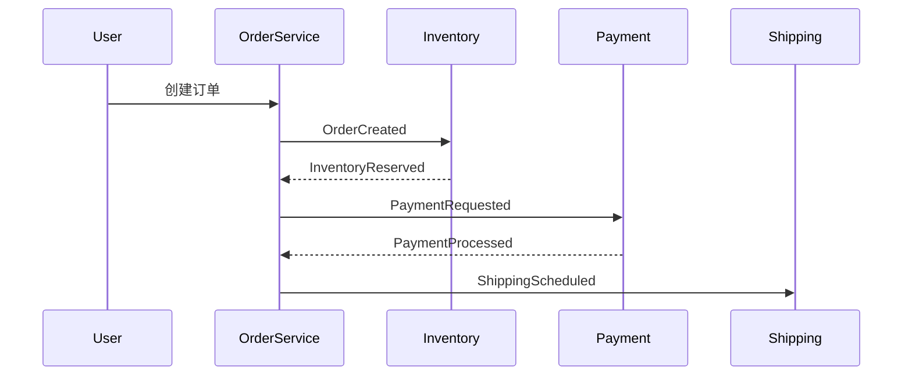

## 介绍

事件驱动架构（Event-Driven Architecture, EDA）是一种基于事件的松散耦合系统设计模式，其中组件通过异步事件通信。在这种架构下，追踪事件的流动和性能变得尤为重要。Jaeger 作为分布式追踪工具，可以帮助开发者可视化事件流、诊断延迟问题，并理解系统的整体行为。

本案例研究将展示如何利用 Jaeger 追踪事件驱动架构中的事件流，适合初学者理解核心概念和实践方法。

---

## 核心概念

### 1. 事件驱动架构基础
在 EDA 中，事件生产者（Producer）发出事件，事件消费者（Consumer）监听并处理这些事件。常见组件包括：
- **事件总线/消息代理**（如 Kafka、RabbitMQ）
- **生产者/消费者服务**
- **事件存储**

### 2. Jaeger 的作用
Jaeger 通过以下方式增强 EDA 的可观测性：
- **跨服务追踪**：关联多个服务间的事件调用链。
- **延迟分析**：识别事件处理中的性能瓶颈。
- **依赖关系图**：可视化事件流的拓扑结构。

---

## 代码示例：追踪 Kafka 事件

以下是一个使用 OpenTelemetry 和 Jaeger 追踪 Kafka 事件的 Python 示例：

### 生产者端代码
```python
from opentelemetry import trace
from opentelemetry.sdk.trace import TracerProvider
from opentelemetry.sdk.trace.export import BatchSpanProcessor
from opentelemetry.exporter.jaeger.thrift import JaegerExporter
from kafka import KafkaProducer

# 初始化 Jaeger 导出器
trace.set_tracer_provider(TracerProvider())
jaeger_exporter = JaegerExporter(
    agent_host_name="localhost",
    agent_port=6831,
)
trace.get_tracer_provider().add_span_processor(BatchSpanProcessor(jaeger_exporter))

# 创建 Kafka 生产者
producer = KafkaProducer(bootstrap_servers='localhost:9092')
tracer = trace.get_tracer(__name__)

with tracer.start_as_current_span("kafka_produce") as span:
    span.set_attribute("event.type", "user.signup")
    producer.send("user_events", value=b'{"user_id": 123}')
```

### 消费者端代码
```python
from opentelemetry import trace
from opentelemetry.sdk.trace import TracerProvider
from opentelemetry.sdk.trace.export import BatchSpanProcessor
from opentelemetry.exporter.jaeger.thrift import JaegerExporter
from kafka import KafkaConsumer

# 初始化追踪（同生产者端）
# ...

consumer = KafkaConsumer('user_events', bootstrap_servers='localhost:9092')
tracer = trace.get_tracer(__name__)

for message in consumer:
    with tracer.start_as_current_span("kafka_consume") as span:
        span.set_attribute("event.value", str(message.value))
        print(f"Consumed: {message.value}")
```

---

## 案例研究：电商订单系统

### 场景描述
一个电商平台使用事件驱动架构处理订单：
1. 用户下单触发 `OrderCreated` 事件
2. 库存服务消费事件并预留库存
3. 支付服务处理付款
4. 物流服务安排配送

### Jaeger 追踪结果
通过 Jaeger UI 可以看到：
- 完整的订单处理链路
- 各服务处理耗时
- 事件传递的因果关系



---

## 总结与练习

### 关键点总结
1. Jaeger 可以追踪跨服务的事件流
2. 需要为生产者和消费者添加明确的上下文传播
3. 事件属性（如 `event.type`）有助于分类分析

### 扩展练习
1. 尝试在本地部署 Kafka 和 Jaeger，重现上述示例
2. 为事件添加自定义标签（如业务 ID）
3. 模拟高延迟场景，观察 Jaeger 的火焰图变化

### 附加资源
- [Jaeger 官方文档](https://www.jaegertracing.io/docs/)
- [OpenTelemetry Kafka 示例](https://github.com/open-telemetry/opentelemetry-python-contrib/tree/main/examples/kafka)