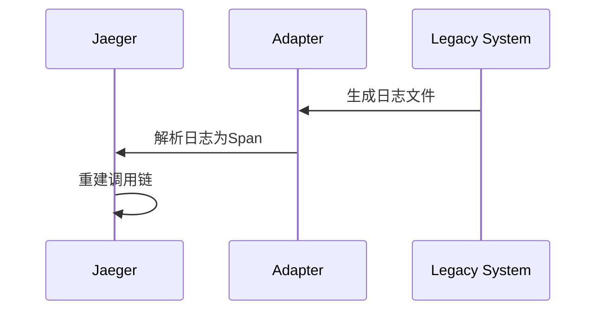

## 什么是遗留系统集成？

遗留系统（Legacy System）指那些使用老旧技术栈但仍承担关键业务功能的系统。集成这类系统时，常面临协议不兼容、数据格式差异等问题。Jaeger作为分布式追踪工具，能帮助可视化跨新旧系统的调用链路，快速定位性能瓶颈。

:::note 关键挑战
- 协议不兼容（如SOAP vs REST）
- 无现代监控接口
- 技术栈差异（如COBOL与Go混用）
:::

## 基础集成方案

### 方案1：代理层追踪

通过中间件为遗留系统添加追踪头：

```go
// 代理服务示例
func legacyProxyHandler(w http.ResponseWriter, r *http.Request) {
    span, _ := opentracing.StartSpanFromContext(r.Context(), "legacy-proxy")
    defer span.Finish()

    // 转换HTTP请求到遗留系统协议
    soapReq := convertToSOAP(r)
    resp := sendToLegacySystem(soapReq)

    // 记录响应时间等指标
    span.LogFields(log.String("response", resp.Status))
}
```

### 方案2：日志注入

当无法修改代码时，通过解析日志生成追踪数据：



## 真实案例：银行系统改造

**场景**：某银行需要将核心的COBOL交易系统与新的Java微服务整合。

**实施步骤**：

1. 在API网关层注入追踪上下文
   ```java
   // Java网关代码片段
   @Override
   public void filter(ContainerRequestContext requestContext) {
       Span span = tracer.buildSpan("cobol-gateway")
           .asChildOf(tracer.activeSpan())
           .start();
       
       requestContext.setProperty("span", span);
   }
   ```

2. 使用Sidecar模式转换协议：
   ```bash
   # 启动协议转换容器
   docker run -p 8080:8080 \
     -e LEGACY_ENDPOINT=http://cobol:9000 \
     jaeger/proxy-adapter
   ```

3. 关键指标监控：
   - COBOL系统响应延迟
   - 协议转换成功率
   - 事务完整性校验

:::tip 性能优化
对高频调用的遗留接口，建议：
1. 增加缓存层
2. 批量处理请求
3. 使用Jaeger分析热点路径
:::

## 总结与练习

### 核心要点
- 代理层是最安全的集成方式
- 日志解析适合无法修改的系统
- 始终监控数据一致性

### 动手练习
1. 使用Docker模拟一个遗留HTTP服务
   ```dockerfile
   FROM python:2.7
   RUN pip install flask
   COPY legacy-app.py /app/
   CMD ["python", "/app/legacy-app.py"]
   ```

2. 实现一个能注入追踪头的反向代理

### 扩展阅读
- 《分布式系统模式》- 绞杀者模式
- Jaeger官方文档中的跨语言追踪案例
- OpenTracing的 baggage 传递规范
``` 

注意：实际使用时请移除最外层的