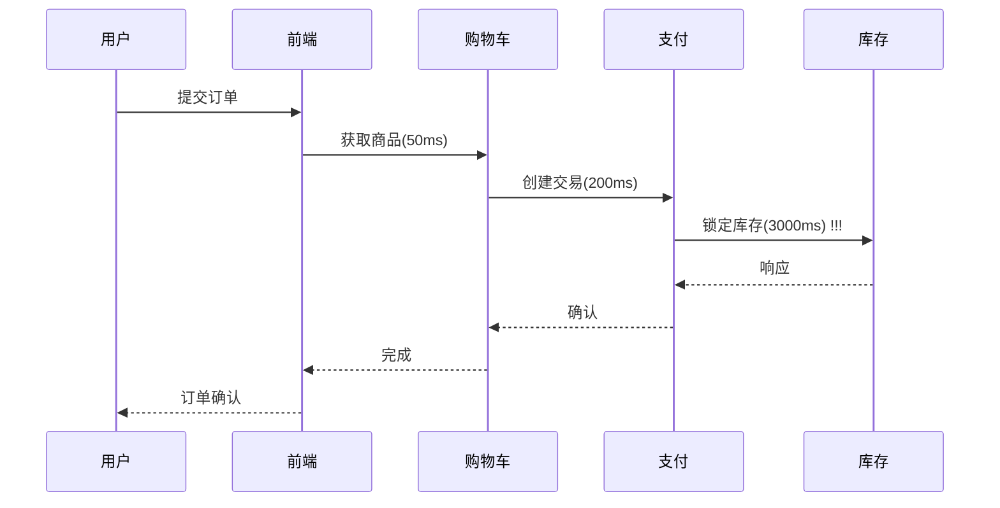

# DevOps实践集成：Jaeger案例研究

## 介绍

在现代软件开发中，DevOps强调开发(Dev)与运维(Ops)的协作，而分布式追踪工具如Jaeger能帮助团队快速定位微服务架构中的性能问题。本案例将展示如何将Jaeger融入DevOps实践，实现从代码部署到生产监控的全链路可观测性。

:::tip 关键概念
- **持续集成/持续部署(CI/CD)**：自动化构建、测试和部署流程
- **分布式追踪**：记录请求在微服务间的调用路径和耗时
- **黄金指标**：延迟、流量、错误率、饱和度
:::

## 基础集成步骤

### 1. 在CI/CD管道中添加Jaeger客户端

以下是一个Node.js项目的示例，在`package.json`中添加Jaeger客户端依赖：

```json
{
  "dependencies": {
    "jaeger-client": "^3.18.0"
  }
}
```

### 2. 初始化追踪器

创建`tracer.js`配置文件：

```javascript
const { initTracer } = require('jaeger-client');

const config = {
  serviceName: 'my-express-app',
  sampler: {
    type: 'const',
    param: 1,
  },
  reporter: {
    logSpans: true,
    agentHost: 'jaeger-agent.default.svc.cluster.local'
  }
};

const tracer = initTracer(config);
module.exports = tracer;
```

### 3. 在部署脚本中启用追踪

Kubernetes部署示例（`deployment.yaml`）：

```yaml
env:
- name: JAEGER_AGENT_HOST
  value: "jaeger-agent"
- name: JAEGER_SAMPLER_TYPE
  value: "const"
```

## 真实案例：电商平台故障排查

### 场景描述
某电商网站在促销期间出现结账延迟，涉及服务：
- 前端 → 购物车服务 → 支付服务 → 库存服务

### 排查过程
1. 通过Jaeger UI发现支付服务到库存服务的调用存在3秒延迟
2. 检查跨度(span)详情，发现数据库查询超时
3. 团队协作修复索引问题后，部署验证版本



:::note 团队协作收益
- 开发：快速定位到具体代码模块
- 运维：发现数据库资源不足
- 业务方：理解性能瓶颈对转化的影响
:::

## 进阶实践

### 自动化报警集成

将Jaeger指标与Prometheus集成：

```yaml
# prometheus-config.yml
scrape_configs:
  - job_name: 'jaeger-metrics'
    static_configs:
      - targets: ['jaeger-collector:14269']
```

### 在Jenkins管道中添加追踪

```groovy
pipeline {
    agent any
    stages {
        stage('Build') {
            steps {
                withTracer(tracer) { span ->
                    span.setTag("build.id", env.BUILD_ID)
                    sh 'npm install'
                }
            }
        }
    }
}
```

## 总结与练习

### 核心收获
- Jaeger帮助实现DevOps中的可观测性需求
- 追踪数据促进跨职能团队协作
- 可以集成到从开发到生产的全流程

### 练习建议
1. 在本地Docker环境部署Jaeger
   ```bash
   docker run -d -p 16686:16686 jaegertracing/all-in-one
   ```
2. 为现有项目添加简单跨度并查看结果
3. 尝试在CI流水线中添加构建阶段追踪

### 扩展阅读
- Jaeger官方文档中的"生产部署指南"
- 《分布式系统观测性》第三章
- OpenTelemetry与Jaeger的集成方案