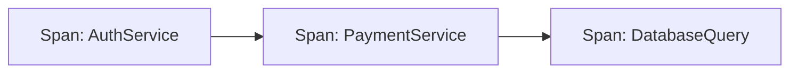
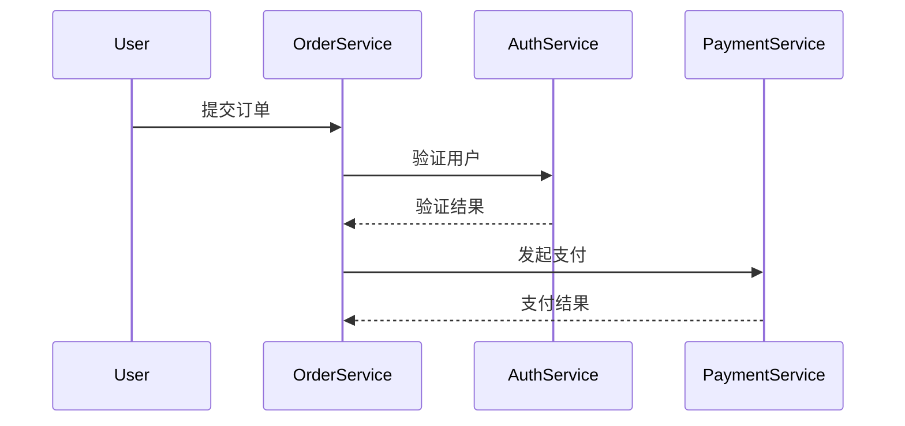

## 什么是实时系统追踪？

实时系统追踪（Distributed Tracing）是一种用于监控和分析分布式系统性能的技术。它通过记录请求在多个服务间的流转路径（如微服务架构），帮助开发者定位延迟问题、调试错误和优化系统性能。Jaeger 是 Uber 开源的一款分布式追踪系统，广泛用于生产环境。

:::note 关键术语
- **Span**：代表一个独立的工作单元（如一次 API 调用）。
- **Trace**：由多个 Span 组成的有向无环图，描述一个完整请求的生命周期。
- **Context Propagation**：在服务间传递追踪上下文（如 Trace ID）。
:::

## 核心概念

### 1. Span 的结构
每个 Span 包含以下信息：
- 操作名称（如 `GET /api/users`）
- 开始和结束时间戳
- 标签（Key-Value 格式的元数据）
- 日志（事件记录）



### 2. 代码示例：创建 Span
以下是一个使用 Jaeger 客户端（Python）的示例：

```python
from jaeger_client import Config

def init_tracer(service):
    config = Config(
        config={'sampler': {'type': 'const', 'param': 1}},
        service_name=service
    )
    return config.initialize_tracer()

tracer = init_tracer("my-web-app")

with tracer.start_span('handle-request') as span:
    span.set_tag('http.method', 'GET')
    span.log_kv({'event': 'processing_started'})
    # 业务逻辑代码
    print("Processing request...")  # 输出示例
```

**输出结果**：
在 Jaeger UI 中会显示一个名为 `handle-request` 的 Span，包含标签和日志。

## 实际案例：电商订单流程

假设一个电商系统的下单流程涉及以下服务：
1. **用户服务**（验证用户）
2. **库存服务**（检查库存）
3. **支付服务**（处理付款）

### 追踪流程


### 问题诊断场景
如果用户投诉“下单慢”，通过 Jaeger 可以：
1. 发现 `PaymentService` 的 Span 耗时异常
2. 检查该 Span 的日志，发现第三方支付网关响应延迟
3. 优化方案：增加支付超时机制或切换网关

## 总结

实时系统追踪通过可视化请求链路，解决了分布式系统的“黑盒”问题。Jaeger 提供的功能包括：
- 跨服务调用链展示
- 延迟热点分析
- 错误根源定位

:::tip 练习建议
1. 在本机部署 Jaeger（参考 [官方文档](https://www.jaegertracing.io/docs/latest/getting-started/)）
2. 修改上述 Python 示例，添加多个嵌套 Span
3. 尝试在 Jaeger UI 中筛选特定 Trace
:::

## 扩展资源
- 书籍：《Distributed Tracing in Practice》
- 工具：Zipkin, OpenTelemetry
- 进阶：学习 OpenTelemetry 的自动埋点