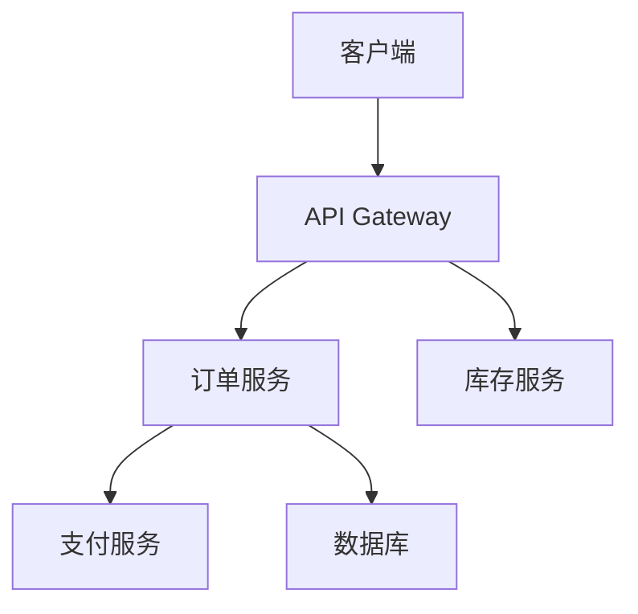

# Jaeger 案例研究：性能问题诊断案例

## 介绍

在现代分布式系统中，性能问题往往难以定位。Jaeger 作为开源的分布式追踪系统，能帮助我们可视化请求流程、分析延迟瓶颈。本案例将展示如何用 Jaeger 诊断一个真实的 API 性能问题。

:::note 什么是分布式追踪？
分布式追踪记录请求在微服务架构中的完整路径，包含每个服务的处理时间和元数据，通常以**有向无环图(DAG)**形式呈现。
:::

## 案例背景

假设我们有一个电商系统，用户反馈"下单接口响应缓慢"。系统架构如下：



## 诊断步骤

### 1. 收集追踪数据

首先确保所有服务已集成 Jaeger 客户端。以下是 Go 服务的初始化示例：

```go
import (
    "github.com/uber/jaeger-client-go"
    jaegercfg "github.com/uber/jaeger-client-go/config"
)

func initTracer() (opentracing.Tracer, io.Closer) {
    cfg := jaegercfg.Configuration{
        ServiceName: "order-service",
        Sampler: &jaegercfg.SamplerConfig{
            Type:  jaeger.SamplerTypeConst,
            Param: 1,
        },
    }
    return cfg.NewTracer()
}
```

### 2. 分析追踪结果

在 Jaeger UI 中发现异常追踪：

```
下单请求 (总耗时 4.2s)
├─ API Gateway (120ms)
├─ 订单服务 (3.8s)
   ├─ 支付服务调用 (150ms)
   └─ 数据库查询 (3.6s)  <-- 瓶颈!
```

### 3. 定位问题代码

检查订单服务的数据库操作，发现未使用索引的查询：

```python
# 问题代码
def get_orders(user_id):
    return Order.objects.filter(
        user_id=user_id,
        status__in=['pending', 'processing']  # 全表扫描
    ).order_by('-created_at')
```

### 4. 优化方案

添加复合索引并重写查询：

```sql
CREATE INDEX idx_user_status ON orders(user_id, status);
```

```python
# 优化后代码
def get_orders(user_id):
    return Order.objects.filter(
        user_id=user_id
    ).filter(
        Q(status='pending') | Q(status='processing')
    ).order_by('-created_at')
```

## 验证结果

优化后追踪数据对比：

```mermaid
barChart
    title 响应时间对比
    x-axis 优化前, 优化后
    y-axis 时间(ms)
    series 数据库查询
        3600, 320
```

## 关键学习点

1. **追踪可视化**：Jaeger 的时间线能直观展示耗时分布
2. **上下文传播**：确保在所有服务中传递追踪上下文
3. **重点检查**：
   - 超过 100ms 的数据库查询
   - 重复的网络调用
   - 未并行的依赖调用

## 练习建议

1. 在本地启动 Jaeger 并集成到示例项目
2. 故意制造 N+1 查询问题，观察追踪表现
3. 尝试使用 Jaeger 的对比功能分析优化效果

## 总结

通过本案例我们学会了：
- 如何使用 Jaeger 识别性能瓶颈
- 如何分析追踪数据中的异常模式
- 数据库查询优化的基本方法

:::tip 扩展学习
- Jaeger 官方文档的[高级过滤功能](https://www.jaegertracing.io/docs/)
- OpenTelemetry 的自动插桩技术
- 分布式追踪的采样策略选择
:::