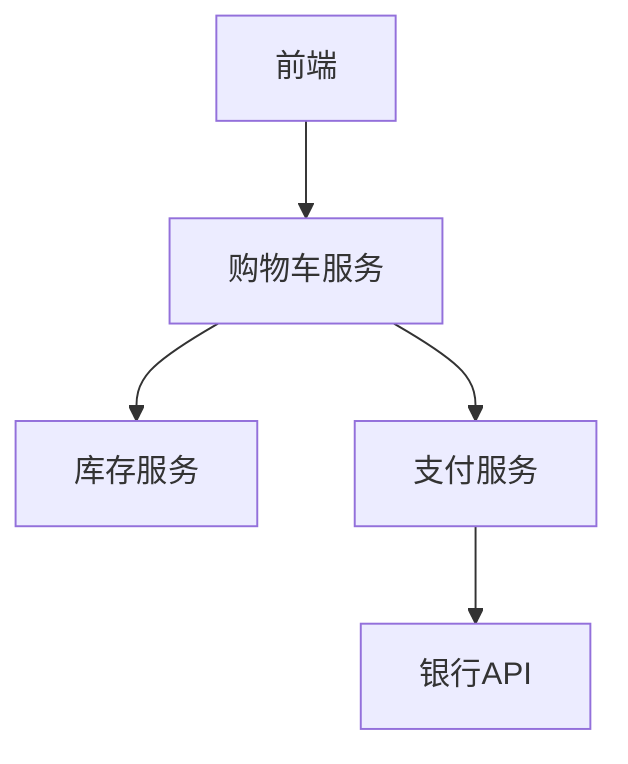

## 介绍

在分布式系统中，故障排除往往像大海捞针。Jaeger 作为一款开源的分布式追踪工具，能帮助我们快速定位性能瓶颈和错误源头。本案例将带您通过真实场景，学习如何利用 Jaeger 进行高效的故障诊断。

:::note 关键概念
- **Span**：代表一个独立的工作单元（如 API 调用）
- **Trace**：由多个 Span 组成的有向无环图，描述完整请求链路
- **Tag**：用于标注 Span 的键值对元数据
:::

## 案例背景

假设我们有一个电商系统，用户报告"购物车结算延迟"。系统架构如下：



## 第一步：发现问题

在 Jaeger UI 中，我们注意到 `POST /checkout` 接口的 P99 延迟从 200ms 飙升到 2s：

```json
{
  "operation": "POST /checkout",
  "avgDuration": "1.8s",
  "errorRate": "5%"
}
```

## 第二步：分析追踪数据

筛选出高延迟的 Trace，发现支付服务阶段存在异常：

```mermaid
gantt
    title 高延迟请求的 Trace 分析
    dateFormat  X
    axisFormat %s
    section 请求链路
    前端 : 0, 50
    购物车服务 : 50, 100
    支付服务 : 100, 2000
```



## 第三步：深入检查问题 Span

展开支付服务的 Span，发现关键信息：

```json
{
  "spanID": "abc123",
  "operation": "ProcessPayment",
  "duration": "1900ms",
  "tags": {
    "http.status_code": "500",
    "retry_count": "3"
  }
}
```

:::caution 问题迹象
- 异常高的重试次数（retry_count=3）
- 间歇性的 500 错误
:::

## 第四步：代码审查

检查支付服务代码，发现银行 API 调用缺少超时设置：

```go
// 问题代码示例
func ProcessPayment() error {
    resp, err := http.Get("https://bank-api/process") // 无超时控制
    // ...
}
```

修复方案：

```go
// 修复后的代码
func ProcessPayment() error {
    client := http.Client{
        Timeout: 2 * time.Second, // 添加超时
    }
    resp, err := client.Get("https://bank-api/process")
    // ...
}
```

## 第五步：验证修复

部署后通过 Jaeger 确认：

1. 平均延迟降至 300ms
2. 错误率降至 0.1%
3. 不再出现重试记录

## 实际应用技巧

1. **筛选技巧**：
   ```bash
   # 查找所有包含错误标签的 Span
   tag=http.status_code=500
   ```

2. **对比分析**：
   - 比较正常/异常 Trace 的耗时分布
   - 使用 Jaeger 的对比视图功能

3. **指标关联**：
   ```mermaid
   graph LR
       A[Jaeger Trace] --> B[Prometheus]
       A --> C[日志系统]
       C --> D[具体错误堆栈]
   ```

## 总结与练习

通过本案例，我们学会了：

1. 如何通过延迟突增发现潜在问题
2. 使用 Jaeger 标签系统定位异常组件
3. 结合代码审查解决实际问题

**练习任务**：
1. 在本地启动 Jaeger 并导入示例 Trace 数据
2. 尝试找出一个模拟的"订单查询超时"问题
3. 使用标签筛选出所有数据库查询超过 1s 的 Span

**扩展阅读**：
- Jaeger 官方文档中的[高级筛选语法](https://jaegertracing.io/docs/)
- 《分布式系统观测》第三章：追踪分析实战