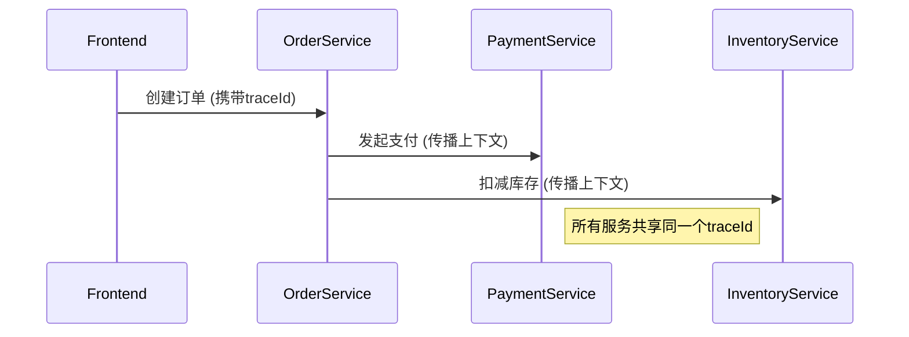

## 引言

在现代微服务架构中，不同服务可能使用多种编程语言编写（如Go、Python、Java等）。Jaeger作为分布式追踪系统，需要在这些异构环境中无缝集成。本文将介绍如何通过**OpenTracing标准**实现跨语言Span上下文传播，并通过案例展示真实场景下的解决方案。

---

## 核心概念

### 1. OpenTracing跨语言规范
Jaeger遵循OpenTracing API标准，关键组件包括：
- **SpanContext**：跨服务边界的唯一标识（traceId, spanId, baggage）
- **Propagation**：通过HTTP头或二进制格式（如gRPC metadata）传递上下文

### 2. 多语言集成的关键步骤
1. **初始化各语言Tracer**  
2. **上下文注入(Inject)**：在客户端将SpanContext序列化到载体（如HTTP头）  
3. **上下文提取(Extract)**：在服务端从载体重建SpanContext  

---

## 代码示例

### Python (Flask) 与 Go 服务交互

#### Python客户端代码
```python
from flask import Flask, request
import opentracing
from jaeger_client import Config

app = Flask(__name__)
tracer = Config(config={'sampler': {'type': 'const', 'param': 1}}).initialize_tracer()

@app.route('/call-go')
def call_go():
    span_ctx = tracer.extract(opentracing.Format.HTTP_HEADERS, request.headers)
    with tracer.start_span('python_span', child_of=span_ctx) as span:
        headers = {}
        tracer.inject(span.context, opentracing.Format.HTTP_HEADERS, headers)
        # 调用Go服务（示例伪代码）
        response = requests.get('http://go-service/process', headers=headers)
    return response.text
```

#### Go服务端代码
```go
package main

import (
	"github.com/opentracing/opentracing-go"
	"github.com/uber/jaeger-client-go"
	"net/http"
)

func handler(w http.ResponseWriter, r *http.Request) {
	spanCtx, _ := opentracing.GlobalTracer().Extract(
		opentracing.HTTPHeaders,
		opentracing.HTTPHeadersCarrier(r.Header))
	
	span := opentracing.StartSpan("go_span", opentracing.ChildOf(spanCtx))
	defer span.Finish()
	
	// 业务逻辑处理...
	w.Write([]byte("Processed by Go"))
}
```

---

## 实际案例：电商订单流程

### 场景描述
- **前端**：JavaScript (Next.js)  
- **订单服务**：Java (Spring Boot)  
- **支付服务**：Go  
- **库存服务**：Python  



---

## 常见问题解决

:::caution 上下文丢失问题
当未正确传播headers时，可能出现新创建的Span无法关联到原有Trace。解决方案：
- 检查各语言SDK版本兼容性
- 使用`jaeger-debug-id`头手动调试
:::

:::tip 性能优化
对于高并发场景：
- 使用`jaeger-client`的远程采样配置
- 在gRPC中改用二进制传播格式（如`Format.BINARY`）
:::

---

## 总结与资源

### 关键要点
1. 所有服务必须使用相同的**传播格式**（如HTTP_HEADERS）
2. Baggage（键值对）可以跨语言传递业务数据
3. 通过Jaeger UI可查看完整的跨语言调用链

### 扩展练习
1. 尝试在Node.js和Ruby服务之间传递Span上下文
2. 使用Baggage实现跨语言的用户ID透传

### 推荐资源
- [Jaeger官方多语言示例库](https://github.com/jaegertracing/jaeger-client-examples)
- OpenTracing传播协议标准文档