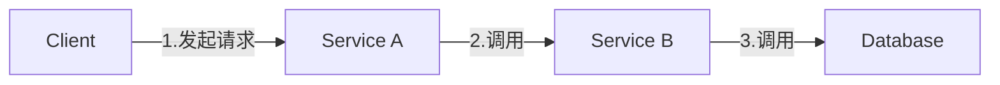
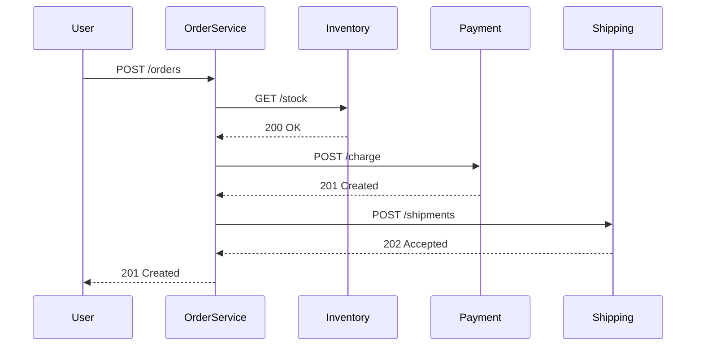

# 云原生应用追踪

## 什么是分布式追踪？

在微服务和云原生架构中，一个用户请求可能跨越多个服务。分布式追踪通过**唯一标识符**将请求的完整路径串联起来，帮助开发者：

- 定位性能瓶颈
- 分析跨服务调用关系
- 诊断复杂系统中的错误

## Jaeger 核心概念



Jaeger 的追踪模型包含三个关键元素：

1. **Span**：代表一个独立的工作单元（如API调用）
2. **Trace**：由多个Span组成的有向无环图（DAG）
3. **Context Propagation**：在服务间传递追踪信息

## 实战示例：Python Flask应用

安装必要依赖：
```bash
pip install flask opentracing jaeger-client
```

基础追踪代码：
```python
from jaeger_client import Config
from flask import Flask
import opentracing

app = Flask(__name__)

# 初始化Jaeger
def init_tracer(service):
    config = Config(
        config={'sampler': {'type': 'const', 'param': 1}},
        service_name=service)
    return config.initialize_tracer()

tracer = init_tracer('order-service')

@app.route('/order')
def create_order():
    span_ctx = tracer.extract(format='text_map', carrier=request.headers)
    span = tracer.start_span('create_order', child_of=span_ctx)
    
    # 业务逻辑...
    span.log_kv({'event': 'order_created', 'item': 'XYZ123'})
    
    span.finish()
    return "Order created!"

if __name__ == "__main__":
    app.run(port=5000)
```

## 上下文传播机制

当服务A调用服务B时，追踪上下文通过HTTP头传递：
```
X-B3-TraceId: 80f198ee56343ba864fe8b2a57d3eff7
X-B3-SpanId: e457b5a2e4d86bd1
X-B3-ParentSpanId: 05e3ac9a4f6e3b90
```

## 真实案例：电商系统追踪

假设一个下单流程涉及以下服务：
1. 用户服务（验证用户）
2. 库存服务（检查库存）
3. 支付服务（处理支付）
4. 物流服务（创建运单）



通过Jaeger UI可以看到：
- 每个服务的耗时
- 调用深度和依赖关系
- 异常发生的具体位置

## 总结与进阶

:::tip 关键收获
- 分布式追踪是云原生应用的"X光机"
- Jaeger通过Span/Trace模型记录调用链
- 上下文传播是跨服务追踪的关键
:::

**推荐练习**：
1. 在本地的Docker环境部署Jaeger
2. 为现有微服务添加OpenTracing支持
3. 模拟一个慢请求，通过Jaeger定位问题

**延伸阅读**：
- OpenTelemetry项目规范
- 分布式追踪的采样策略
- 服务网格(Service Mesh)中的追踪集成