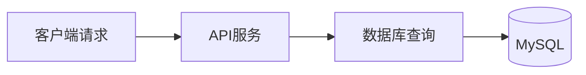

# 数据库性能分析

## 介绍

数据库性能分析是优化应用程序响应时间和资源利用率的关键步骤。通过追踪数据库查询的执行过程，开发者可以识别慢查询、锁定竞争或索引缺失等问题。分布式追踪工具如 **Jaeger** 能够可视化这些调用链，帮助初学者直观理解性能瓶颈。

:::tip 为什么需要性能分析？
- 发现耗时过长的SQL查询
- 识别未使用索引的全表扫描
- 检测N+1查询等反模式
:::

## 核心概念

### 1. 追踪指标
Jaeger记录的关键数据包括：
- **Duration**：查询执行总时间
- **Span Tags**：包含SQL语句、参数和错误信息
- **Context Propagation**：跨服务的调用关系



### 2. 常见性能问题
| 问题类型          | Jaeger中的表现               |
|-------------------|-----------------------------|
| 缺少索引          | 长耗时+全表扫描标记          |
| 连接泄漏          | 持续增长的活跃连接数         |
| 事务隔离冲突      | 高锁等待时间                 |

## 实战案例

### 场景：电商订单查询延迟
假设用户抱怨订单列表加载缓慢，我们通过Jaeger发现以下追踪数据：

```json
{
  "operation": "SELECT orders",
  "duration": "1200ms",
  "tags": {
    "sql.query": "SELECT * FROM orders WHERE user_id=123",
    "rows_scanned": 10000
  }
}
```

### 优化步骤
1. **添加索引**：
   ```sql
   CREATE INDEX idx_user_orders ON orders(user_id);
   ```

2. **优化查询**（前后对比）：
   ```sql
   -- 优化前
   SELECT * FROM orders WHERE user_id=123;

   -- 优化后
   SELECT id, order_date, amount FROM orders 
   WHERE user_id=123 
   ORDER BY order_date DESC LIMIT 50;
   ```

3. **验证结果**：
   - 追踪显示查询时间从1200ms降至45ms
   - 扫描行数从10,000减少到50

:::caution 注意
索引不是万能的，过多的索引会降低写入性能。使用 `EXPLAIN` 分析查询计划很重要！
:::

## 高级技巧

### 1. 批量查询优化
```go
// 反模式：N+1查询
for _, id := range userIDs {
  db.Query("SELECT * FROM users WHERE id=?", id)
}

// 优化方案：IN查询
db.Query("SELECT * FROM users WHERE id IN (?)", userIDs)
```

### 2. 连接池配置
通过Jaeger发现连接等待时间过长时：
```yaml
# 数据库配置示例
pool:
  max_connections: 50
  idle_timeout: 30s
```

## 总结

关键学习点：
1. Jaeger可以可视化数据库调用链
2. 索引优化需要结合查询模式
3. 批量操作比循环单条查询更高效

## 扩展练习

1. 在本地启动Jaeger并追踪一个简单CRUD应用
   ```bash
   docker run -d --name jaeger \
     -p 16686:16686 \
     jaegertracing/all-in-one:1.40
   ```

2. 尝试故意制造性能问题（如移除索引），观察追踪变化

## 延伸阅读
- [Jaeger官方文档](https://www.jaegertracing.io/docs/)
- 《高性能MySQL》索引优化章节
- OpenTelemetry SQL instrumentation规范