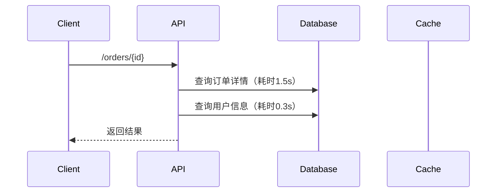

# API性能优化

## 简介

API性能优化是提升应用程序响应速度和资源利用率的关键步骤。通过分布式追踪工具（如Jaeger），开发者可以直观地识别性能瓶颈。本文将通过真实案例，逐步演示如何分析并优化API性能。

---

## 为什么需要API性能优化？

1. **用户体验**：缓慢的API响应会导致用户流失。
2. **资源成本**：低效的API可能浪费服务器资源。
3. **可扩展性**：优化后的API能更好地应对高并发场景。

:::tip 关键指标
- 延迟（Latency）
- 吞吐量（Throughput）
- 错误率（Error Rate）
:::

---

## 实战案例：订单查询API优化

### 初始问题
用户反馈订单查询接口在高峰期平均响应时间超过 **2秒**，目标是将延迟降低到 **200ms** 以内。

### 步骤1：用Jaeger定位瓶颈

通过Jaeger追踪，发现以下调用链：



### 步骤2：优化方案
1. **缓存热点数据**：将订单详情存入Redis。
2. **并行查询**：用户信息与订单详情并行获取。

优化后代码示例（Node.js）：
```javascript
// 旧版：串行查询
async function getOrder(id) {
  const order = await db.query('SELECT * FROM orders WHERE id = ?', [id]); // 阻塞
  const user = await db.query('SELECT * FROM users WHERE id = ?', [order.userId]);
  return { ...order, user };
}

// 新版：并行+缓存
async function getOrderOptimized(id) {
  const [order, user] = await Promise.all([
    redis.get(`order:${id}`).catch(() => db.query('...')), // 优先读缓存
    db.query('SELECT * FROM users WHERE id = ?', [userId])
  ]);
  return { ...order, user };
}
```

### 步骤3：验证结果
| 指标         | 优化前 | 优化后 |
|--------------|--------|--------|
| 平均延迟     | 2000ms | 150ms  |
| 数据库负载   | 80%    | 30%    |

---

## 常见优化策略

### 1. 数据库优化
- 添加索引：`CREATE INDEX idx_order_id ON orders(id);`
- 批量查询替代循环查询

### 2. 网络优化
- 使用CDN缓存静态资源
- 启用HTTP/2或HTTP/3

### 3. 代码层优化
```javascript
// 反例：N+1查询问题
orders.forEach(order => {
  const user = await getUser(order.userId); // 循环内查询
});

// 正例：批量查询
const userIds = orders.map(o => o.userId);
const users = await getUsers(userIds); // 单次查询
```

---

## 总结

通过Jaeger等工具，我们可以：
1. 可视化API调用链路
2. 定位性能瓶颈
3. 验证优化效果

:::caution 注意事项
- 避免过早优化，先确保功能正确性
- 监控优化后的系统稳定性
:::

---

## 扩展练习
1. 用Jaeger追踪一个简单API，绘制调用流程图。
2. 尝试对某个慢查询添加数据库索引，比较前后性能差异。
3. 实现一个缓存层，测试命中率对延迟的影响。