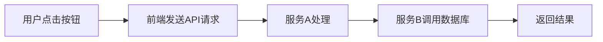

# 用户体验追踪

## 介绍

用户体验追踪（User Experience Monitoring）是通过收集和分析用户在应用程序中的交互数据，优化系统性能并提升用户满意度的技术。在分布式系统中，Jaeger 等工具可以帮助开发者追踪请求链路，识别延迟或错误，从而定位影响用户体验的瓶颈。

:::note 为什么需要用户体验追踪？
- 发现页面加载缓慢、操作卡顿等问题的根本原因。
- 将用户行为（如点击、API 调用）与后端服务性能关联。
- 量化用户体验指标（如响应时间、错误率）。
:::

## 核心概念

### 1. 追踪（Tracing）
Jaeger 通过 **Span**（单个操作）和 **Trace**（跨服务的完整请求链路）记录请求路径。例如：



### 2. 用户体验指标
- **页面加载时间**：从用户发起请求到页面完全渲染。
- **操作响应时间**：如按钮点击到结果展示的延迟。
- **错误率**：失败请求占总请求的比例。

## 代码示例

### 前端：记录用户操作
以下是一个用 JavaScript 发送追踪数据的示例：

```javascript
// 使用 OpenTelemetry 初始化追踪
const { WebTracerProvider } = require('@opentelemetry/sdk-trace-web');
const provider = new WebTracerProvider();
provider.register();

// 追踪按钮点击事件
document.getElementById('submit-btn').addEventListener('click', () => {
    const tracer = provider.getTracer('user-experience-tracer');
    const span = tracer.startSpan('button_click');
    
    // 模拟API调用
    fetch('/api/submit', { method: 'POST' })
        .then(response => {
            span.setAttribute('http.status_code', response.status);
            span.end();
        })
        .catch(error => {
            span.recordException(error);
            span.end();
        });
});
```

### 后端：关联追踪信息（Python/Flask）
```python
from opentelemetry import trace
from flask import Flask

app = Flask(__name__)
tracer = trace.get_tracer("user.action.tracer")

@app.route('/api/submit', methods=['POST'])
def submit():
    with tracer.start_as_current_span("process_submission"):
        # 处理业务逻辑
        return {"status": "success"}, 200
```

## 实际案例：电商网站优化

### 问题场景
用户反馈“结算页面加载缓慢”，但后端服务未显示明显异常。

### 使用 Jaeger 分析
1. **追踪发现**：前端发起 `POST /checkout` 后，调用了 3 个微服务（订单、库存、支付）。
2. **瓶颈定位**：支付服务的 `validate_payment` 步骤平均耗时 2.5 秒。
3. **优化结果**：缓存支付验证结果后，页面加载时间缩短 65%。

:::tip 关键步骤
- 在前端关键操作中注入追踪代码。
- 确保前后端传递 `trace-id` 以关联链路。
- 使用 Jaeger UI 可视化分析跨度时间。
:::

## 总结

用户体验追踪通过将用户行为与系统性能数据结合，帮助开发者：
- 量化体验问题（如“缓慢”具体指多少秒）。
- 快速定位跨服务瓶颈。
- 验证优化效果（如 A/B 测试前后对比）。

## 扩展练习
1. 在本地 Jaeger 实例中模拟一个包含前端点击和后端处理的完整追踪。
2. 尝试为 `fetch` 请求自动注入 `trace-id`（提示：使用 OpenTelemetry 拦截器）。

## 附加资源
- [Jaeger 官方文档](https://www.jaegertracing.io/docs/)
- [OpenTelemetry 前端追踪指南](https://opentelemetry.io/docs/instrumentation/js/)