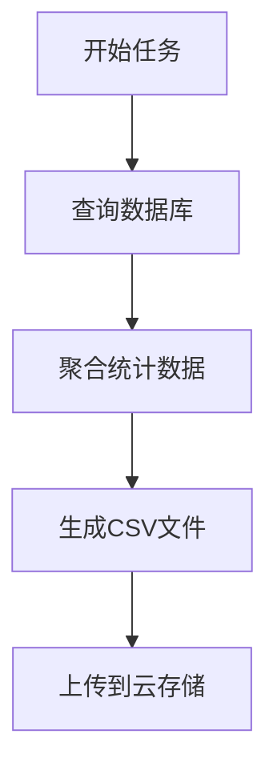

# 批处理任务追踪

## 介绍

批处理任务（Batch Processing）是指一次性处理大量数据的自动化任务，常见于数据导入、报表生成或日志分析等场景。由于批处理任务通常运行时间较长且涉及多个步骤，追踪其执行过程对排查问题或优化性能至关重要。Jaeger作为分布式追踪系统，可以帮助开发者可视化批处理任务的执行路径和耗时。

## 核心概念

1. **Span**：代表任务中的一个操作单元（如读取文件、转换数据）。
2. **Trace**：由多个Span组成的完整任务执行链。
3. **Context Propagation**：跨服务或步骤传递追踪上下文。

## 代码示例

以下是一个Python批处理任务的追踪示例，使用`opentracing`库与Jaeger集成：

```python
import opentracing
from jaeger_client import Config

# 初始化Jaeger追踪器
def init_tracer(service_name):
    config = Config(
        config={'sampler': {'type': 'const', 'param': 1}},
        service_name=service_name
    )
    return config.initialize_tracer()

tracer = init_tracer("batch-data-processor")

def process_data(file_path):
    with tracer.start_active_span('process_data') as scope:
        scope.span.log_kv({'event': 'start', 'file': file_path})
        
        # 模拟数据处理步骤
        with tracer.start_active_span('validate_input'):
            validate(file_path)
        
        with tracer.start_active_span('transform_data'):
            transform(file_path)
        
        scope.span.log_kv({'event': 'complete'})

process_data("data.csv")
```

**输入/输出说明**：
- 输入：文件路径（如`data.csv`）
- 输出：Jaeger UI中将显示包含`validate_input`和`transform_data`子Span的追踪树。

## 实际案例：电商订单报表生成

假设一个电商平台需要每日生成订单报表，流程如下：



在Jaeger中追踪此任务时，可以发现：
- 如果`聚合统计数据`步骤耗时异常，可能是数据库查询未优化。
- 文件上传失败时会显示错误标签。

:::tip 最佳实践
1. 为每个批处理步骤创建独立Span
2. 记录关键事件（如`开始/完成`时间戳）
3. 对错误使用`span.set_tag('error', True)`
:::

## 总结

通过Jaeger追踪批处理任务，开发者能够：
- 可视化任务执行流程
- 快速定位性能瓶颈
- 分析历史任务执行趋势

## 扩展练习
1. 尝试在本地运行Jaeger并追踪一个文件处理脚本
2. 为长时间任务添加进度日志（如`span.log_kv({'progress': '50%'})`）
3. 比较不同任务参数的执行耗时差异

## 附加资源
- [Jaeger官方文档](https://www.jaegertracing.io/docs/)
- OpenTracing Python库示例
