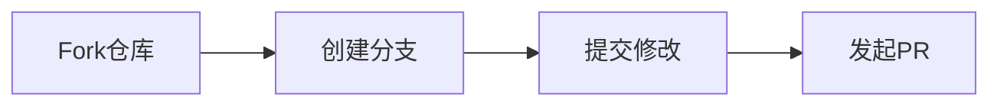

# Jaeger 生态系统：社区资源

## 简介

Jaeger作为一款开源的分布式追踪系统，拥有活跃的开发者社区和丰富的学习资源。无论是初学者还是资深用户，都可以通过这些资源快速解决问题、学习最佳实践，甚至参与项目贡献。本文将介绍Jaeger生态中的核心社区资源及其使用方法。

---

## 官方资源

### 1. 官方文档
Jaeger的[官方文档](https://www.jaegertracing.io/docs/)是最权威的学习起点，包含：
- **安装指南**：从Docker到Kubernetes的部署示例
- **API参考**：详细接口说明
- **架构设计**：核心组件交互原理

:::tip 文档搜索技巧
使用文档站内的搜索框时，尝试输入关键字如 `sampling` 或 `span` 快速定位内容。
:::

### 2. GitHub仓库
主仓库 [`jaegertracing/jaeger`](https://github.com/jaegertracing/jaeger) 提供：
- 源代码
- Issue跟踪
- Pull Request模板

```bash
# 克隆仓库示例
git clone https://github.com/jaegertracing/jaeger.git
```

---

## 交流渠道

### 1. Slack社区
加入 [CNCF Slack](https://cloud-native.slack.com) 的 `#jaeger` 频道，实时提问：
```plaintext
常见问题格式：
[Q] 如何设置采样率？  
[A] 修改agent的--sampling.strategies-file参数...
```

### 2. 邮件列表
订阅 [`jaeger-tracing`](https://groups.google.com/g/jaeger-tracing) 参与深度讨论。

---

## 学习资源

### 1. 交互式教程
使用 `hotrod` 示例应用实践追踪：
```go
// 启动示例应用（需安装Jaeger）
go run ./examples/hotrod/main.go all
```
访问 `http://localhost:8080` 查看实时追踪数据。

### 2. 技术博客
推荐阅读：
- 《Jaeger内部机制解析》
- 《在生产环境中调试微服务》

---

## 贡献指南

### 1. 首次贡献
通过 `good first issue` 标签寻找适合新手的任务：


### 2. 代码规范
遵循项目中的 `CONTRIBUTING.md`，特别注意：
- 单元测试覆盖率
- Go语言代码风格

---

## 真实案例

### 电商平台故障排查
某团队通过Jaeger社区资源解决了订单超时问题：
1. 在Slack确认采样配置问题
2. 参考GitHub Issue调整采样率
3. 使用博客中的性能优化建议

---

## 总结

Jaeger社区提供了多层次的支持体系：

| 资源类型       | 适用场景                     |
|----------------|----------------------------|
| 官方文档       | 系统学习核心功能             |
| Slack/邮件列表 | 实时技术交流                 |
| 示例代码       | 快速验证想法                 |

---

## 延伸资源

1. [Jaeger Tracing YouTube频道](https://www.youtube.com/c/JaegerTracing)
2. [Awesome Jaeger](https://github.com/jaegertracing/awesome-jaeger) 精选工具列表

:::note 练习建议
尝试完成以下任务：
1. 在Slack社区回答一个新手问题
2. 提交文档改进的PR
3. 复现一个hotrod示例的变体
:::