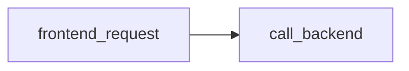
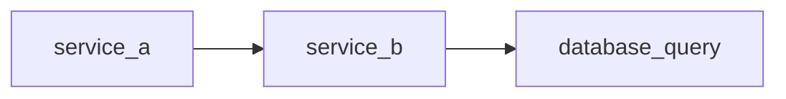

## 介绍

Jaeger 是一个开源的分布式追踪系统，用于监控和排查微服务架构中的性能问题。案例库（Case Library）是通过真实场景展示 Jaeger 功能的集合，帮助开发者理解如何在实际项目中集成和使用 Jaeger。本文将逐步介绍典型案例，并提供代码示例和可视化分析。

---

## 基础案例：追踪 HTTP 请求

### 场景描述
假设你有一个微服务应用，包含前端服务（Frontend）和后端服务（Backend）。当用户发起请求时，需要追踪请求在服务间的流转情况。

### 代码示例
以下是一个使用 OpenTelemetry 和 Jaeger 的 Python 示例：

```python
# frontend.py
from opentelemetry import trace
from opentelemetry.sdk.trace import TracerProvider
from opentelemetry.sdk.trace.export import BatchSpanProcessor
from opentelemetry.exporter.jaeger.thrift import JaegerExporter

# 初始化追踪器
trace.set_tracer_provider(TracerProvider())
jaeger_exporter = JaegerExporter(
    agent_host_name="localhost",
    agent_port=6831,
)
trace.get_tracer_provider().add_span_processor(BatchSpanProcessor(jaeger_exporter))

tracer = trace.get_tracer(__name__)

# 模拟 HTTP 请求
with tracer.start_as_current_span("frontend_request"):
    print("Frontend processing request...")
    # 调用后端服务（模拟）
    with tracer.start_as_current_span("call_backend"):
        print("Calling backend service...")
```

### 输出结果
在 Jaeger UI 中，你会看到如下追踪链：


:::tip
确保 Jaeger Agent 已运行，并监听 `localhost:6831` 端口。
:::

---

## 进阶案例：跨服务追踪

### 场景描述
当请求跨越多个服务（如 `Service A -> Service B -> Database`）时，Jaeger 可以展示完整的调用链路。

### 代码片段
```python
# service_a.py
with tracer.start_as_current_span("service_a"):
    requests.get("http://service-b/api")

# service_b.py
with tracer.start_as_current_span("service_b"):
    db.query("SELECT * FROM table")
```

### Jaeger UI 效果


:::note
跨服务追踪需要确保 `trace_id` 在服务间正确传递（通常通过 HTTP Headers）。
:::

---

## 实际应用场景

### 电商系统故障排查
**问题**：用户下单缓慢。<br />
**排查步骤**：
1. 在 Jaeger 中筛选 `order_service` 的追踪记录。
2. 发现某个 `payment_service` 的调用耗时异常。
3. 定位到支付网关的第三方 API 响应延迟。

### 关键代码
```python
# order_service.py
with tracer.start_as_current_span("process_order"):
    payment_result = pay_with_external_gateway()  # 耗时 2s！
```

---

## 总结与练习

### 总结
- Jaeger 案例库通过真实场景演示了分布式追踪的核心功能。
- 从单服务到跨服务追踪，逐步掌握上下文传播和性能分析。

### 练习
1. 在本机部署 Jaeger 并运行基础案例。
2. 尝试修改代码，模拟一个高延迟的数据库查询，并在 Jaeger 中观察结果。

### 附加资源
- [Jaeger 官方文档](https://www.jaegertracing.io/docs/)
- OpenTelemetry 上下文传播规范