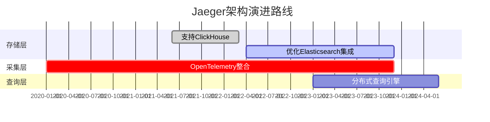

# 技术路线图

## 介绍

技术路线图（Technology Roadmap）是描述技术发展路径的可视化工具，它帮助开发者理解一个项目的当前状态、未来计划以及关键里程碑。对于Jaeger这样的分布式追踪系统，技术路线图能清晰地展示其功能演进、性能优化和生态集成的方向。

:::note 为什么需要技术路线图？
- **明确目标**：帮助社区和用户了解项目优先级  
- **协作透明**：公开规划以吸引贡献者参与  
- **避免重复**：减少功能开发的冲突
:::

## Jaeger 的核心路线图

### 1. 核心架构演进



关键方向：
- **存储后端多样化**：从最初的Cassandra扩展到Elasticsearch、ClickHouse等  
- **采集标准化**：逐步迁移到OpenTelemetry数据模型  
- **查询优化**：支持跨地域的分布式追踪查询

### 2. 关键功能规划

#### 示例：Trace上下文传播
```go
// 代码示例：Go语言中的Trace上下文注入
import (
    "go.opentelemetry.io/otel"
    "go.opentelemetry.io/otel/propagation"
)

func injectContext(ctx context.Context, headers map[string]string) {
    propagator := otel.GetTextMapPropagator()
    propagator.Inject(ctx, propagation.MapCarrier(headers))
}
```

输入/输出说明：
- **输入**：包含Trace信息的context对象  
- **输出**：注入traceID和spanID的HTTP头信息

:::tip 实际应用场景
电商系统调用链追踪：
1. 用户请求 → 订单服务 → 支付服务 → 库存服务  
2. 每个服务自动传播Trace上下文  
3. Jaeger汇总所有span生成完整调用图
:::

## 学习路径建议

### 初学者路线
1. **基础阶段**（1-2周）  
   - 理解分布式追踪概念  
   - 部署Jaeger All-in-One实例  
   ```bash
   docker run -d --name jaeger \
     -p 16686:16686 \
     jaegertracing/all-in-one:latest
   ```

2. **中级阶段**（2-4周）  
   - 集成到Spring Boot/Go应用  
   - 学习Tag和Log的添加方式  
   ```java
   // Java示例
   Span span = tracer.buildSpan("checkout").start();
   span.setTag("user.id", userId);
   span.log("Payment processed");
   ```

3. **高级阶段**（4+周）  
   - 自定义存储后端配置  
   - 参与社区功能开发

## 社区参与指南

如何贡献：
1. 从`good first issue`标签开始  
2. 参加每月的路线图讨论会议  
3. 测试新版本并提交反馈

:::caution 注意事项
- 提交PR前务必阅读[贡献指南](https://github.com/jaegertracing/jaeger/blob/main/CONTRIBUTING.md)  
- 重大功能变更需要先创建RFC提案
:::

## 总结与资源

**关键收获**：
- Jaeger正朝着多云、多存储支持方向发展  
- OpenTelemetry将成为采集层标准  
- 查询性能是未来优化重点

**延伸学习**：
- [Jaeger官方路线图](https://github.com/jaegertracing/jaeger/wiki/Roadmap)  
- OpenTelemetry规范文档  
- 分布式系统诊断案例研究

**练习建议**：
1. 在本地环境部署多组件Jaeger集群  
2. 尝试将应用从旧版客户端迁移到OpenTelemetry  
3. 使用Jaeger分析一个微服务应用的性能瓶颈