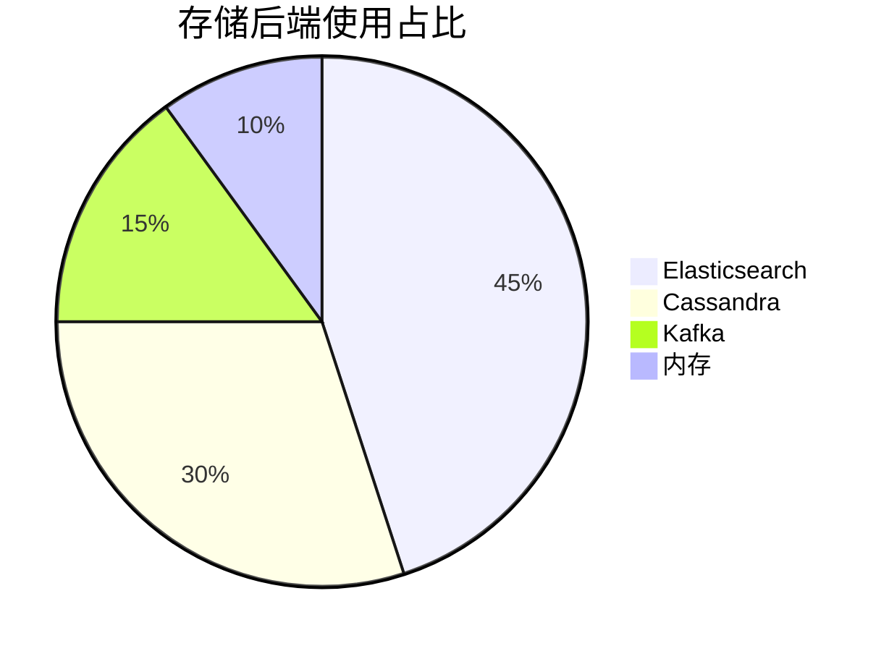

# Jaeger 生态系统相关项目

## 介绍

Jaeger作为云原生基金会(CNCF)的分布式追踪系统，与多个开源项目深度集成，形成强大的可观测性生态系统。本指南将介绍与Jaeger协同工作的核心工具，帮助初学者构建完整的监控解决方案。

## 核心集成项目

### 1. OpenTelemetry

OpenTelemetry(简称OTel)是Jaeger的数据采集标准入口，提供统一的API、SDK和工具链：

```go
// 示例：Go中使用OpenTelemetry导出数据到Jaeger
import (
    "go.opentelemetry.io/otel"
    "go.opentelemetry.io/otel/exporters/jaeger"
)

func initTracer() {
    exporter, _ := jaeger.New(jaeger.WithCollectorEndpoint(
        jaeger.WithEndpoint("http://localhost:14268/api/traces"),
    ))
    tp := trace.NewTracerProvider(trace.WithBatcher(exporter))
    otel.SetTracerProvider(tp)
}
```

:::tip 工作流程
1. 应用通过OTel SDK生成追踪数据<br />
2. OTel Collector处理数据<br />
3. 最终导出到Jaeger后端存储
:::

### 2. Prometheus

Jaeger与Prometheus的集成主要体现在指标监控方面：

```yaml
# jaeger-query服务的Prometheus监控配置
scrape_configs:
  - job_name: 'jaeger'
    static_configs:
      - targets: ['jaeger-query:16686']
```

### 3. Kubernetes Operator

Jaeger Operator简化了在K8s中的部署管理：

```bash
# 安装Jaeger Operator
kubectl create -f https://github.com/jaegertracing/jaeger-operator/releases/download/v1.35.0/jaeger-operator.yaml
```

## 存储后端选项

Jaeger支持多种存储后端，各有适用场景：



## 实际案例：电商系统监控

假设我们需要监控一个包含以下服务的电商平台：

1. 用户服务 → 2. 商品服务 → 3. 支付服务

集成方案：
- 使用OpenTelemetry自动注入追踪
- Jaeger收集全链路数据
- Prometheus监控各服务指标
- 通过Grafana展示综合仪表盘

:::note 典型问题排查
当支付超时发生时，可以：
1. 在Jaeger中过滤`/payment`操作<br />
2. 查看完整调用链<br />
3. 定位到商品服务的数据库查询瓶颈
:::

## 总结

Jaeger生态系统通过与其他云原生工具的集成，提供了完整的分布式追踪解决方案：

- **数据采集**：OpenTelemetry
- **指标监控**：Prometheus
- **部署管理**：Kubernetes Operator
- **存储扩展**：Elasticsearch/Cassandra

## 延伸学习

建议尝试以下实践：
1. 使用Docker Compose部署Jaeger+OpenTelemetry示例
2. 在本地Spring Boot应用中集成OTel SDK
3. 配置Jaeger与Grafana的联动

官方资源：
- [Jaeger官方文档](https://www.jaegertracing.io/docs/)
- [OpenTelemetry集成指南](https://opentelemetry.io/docs/instrumentation/)
``` 

注意：实际使用时请移除最外层的