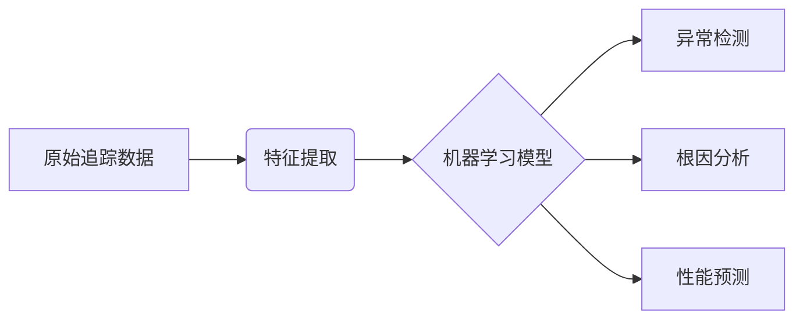
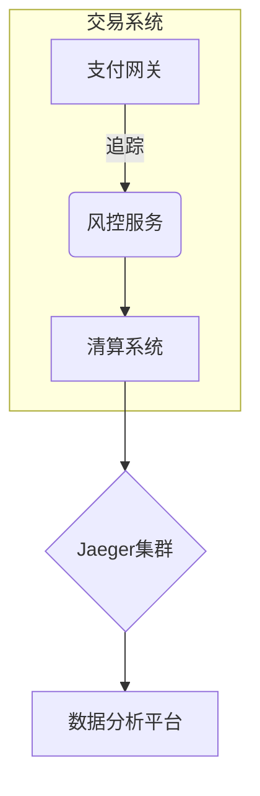

# Jaeger 生态系统的未来发展趋势

## 引言

Jaeger作为云原生基金会（CNCF）的毕业项目，已成为分布式追踪领域的标杆工具。随着微服务和云原生架构的普及，Jaeger生态系统正在快速演进。本文将分析其技术发展方向、社区动态以及在实际场景中的应用趋势。

## 1. 核心技术的演进方向

### 1.1 更高效的存储后端
当前Jaeger支持多种存储后端（如Cassandra、Elasticsearch），未来可能：

```go
// 示例：未来可能新增的存储接口
type FutureStorage interface {
    WriteSpan(ctx context.Context, span *model.Span) error
    QueryTraces(ctx context.Context, query *TraceQueryParameters) ([]*model.Trace, error)
    // 新增的流式处理接口
    StreamSpans(ctx context.Context) (<-chan *model.Span, error)
}
```

趋势包括：
- 原生支持更多时序数据库（如Prometheus兼容存储）
- 边缘计算场景下的轻量级存储方案
- 自动化的存储分层策略

### 1.2 智能化分析能力
通过机器学习实现：
- 异常检测自动告警
- 根因分析自动化
- 性能瓶颈预测



## 2. 生态系统扩展

### 2.1 更紧密的云原生集成
:::tip 即将到来的集成
- 与OpenTelemetry深度整合
- Service Mesh（如Istio）的无缝对接
- Kubernetes Operator功能增强
:::

### 2.2 多语言SDK支持
当前已支持的主要语言：
1. Go
2. Java
3. Python
4. Node.js

未来可能新增：
- Rust原生SDK
- WebAssembly支持
- 嵌入式系统轻量级SDK

## 3. 行业应用趋势

### 3.1 金融科技案例
某国际银行使用Jaeger实现的架构：



成果：
- 交易延迟降低40%
- 故障定位时间从小时级缩短到分钟级

### 3.2 物联网场景
未来可能的应用模式：
```python
# 伪代码：边缘设备上的轻量级追踪
from jaeger_edge_sdk import Tracer

tracer = Tracer(
    sample_rate=0.1,
    max_batch_size=10,
    edge_gateway="192.168.1.100:6831"
)

with tracer.start_span("sensor_read") as span:
    span.tag("device_id", "sensor-42")
    data = read_sensor()
```

## 4. 开发者体验改进

### 4.1 本地开发增强
未来版本可能包含：
```bash
# 示例：改进的本地开发命令
jaeger-cli local start \
    --with-metrics \
    --with-logging \
    --auto-open-ui
```

### 4.2 可视化增强
预期功能：
- 拓扑图自动布局优化
- 跨服务耗时热力图
- 对比分析视图

## 总结与展望

Jaeger生态系统未来将重点关注：
1. **智能化**：AI驱动的分析能力
2. **轻量化**：边缘计算和IoT场景支持
3. **一体化**：与云原生工具链深度集成

:::note 学习建议
- 关注Jaeger GitHub的Roadmap讨论
- 尝试最新的Alpha版本功能
- 参与CNCF相关技术会议
:::

## 扩展资源

1. [Jaeger官方路线图](https://github.com/jaegertracing/jaeger/blob/main/ROADMAP.md)
2. CNCF TOC会议记录中关于追踪技术的讨论
3. OpenTelemetry与Jaeger的集成示例仓库