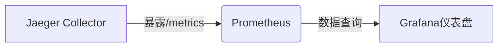
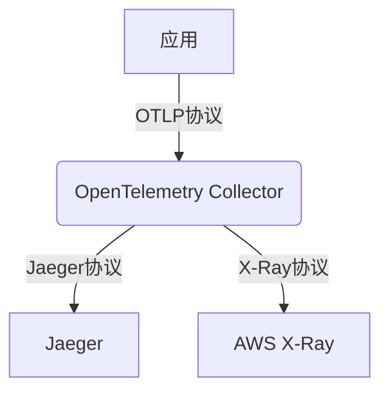

# 第三方工具集成

## 介绍

在分布式系统中，Jaeger作为一款强大的分布式追踪工具，常常需要与其他工具协同工作。通过**第三方工具集成**，开发者可以将Jaeger的追踪数据与日志系统、监控平台、CI/CD管道等结合，实现更全面的可观测性。本指南将介绍常见的集成方式，并提供实际案例帮助初学者快速上手。

:::tip 为什么需要集成？
- **数据关联**：将追踪数据与日志、指标关联，快速定位问题。
- **自动化**：通过CI/CD工具实现自动化部署和测试。
- **扩展功能**：利用其他工具增强Jaeger的分析能力（如机器学习告警）。
:::

---

## 常见集成方案

### 1. 与日志系统集成（如ELK Stack）

将Jaeger的Trace ID注入到应用日志中，便于在Kibana中通过Trace ID直接跳转到Jaeger的追踪详情。

#### 实现步骤
1. **配置日志格式**：在应用日志中包含Jaeger的Trace ID。
   ```python
   # Python示例（使用OpenTelemetry）
   from opentelemetry import trace
   import logging

   logging.basicConfig(format='%(asctime)s [%(levelname)s] trace_id=%(otelTraceID)s - %(message)s')
   tracer = trace.get_tracer(__name__)
   ```

2. **在Kibana中关联数据**：
   - 使用`trace_id`字段在Kibana中创建数据视图。
   - 通过超链接直接跳转到Jaeger UI（需配置Jaeger的URL模板）。

#### 实际案例
当服务报错时，在Kibana中搜索错误日志，点击`trace_id`即可查看Jaeger中的完整调用链。

---

### 2. 与Prometheus/Grafana集成

通过Jaeger的监控指标（如请求延迟、错误率）在Grafana中创建仪表盘。

#### 配置示例
1. 启用Jaeger的Prometheus指标导出：
   ```yaml
   # Jaeger Collector配置
   metrics:
     backend: prometheus
     http-route: /metrics
   ```

2. 在Grafana中导入Jaeger的官方仪表盘模板（ID：10001）。



---

### 3. 与CI/CD工具集成（如Jenkins）

在流水线中自动验证追踪数据，确保新版本不会引入性能退化。

#### Jenkins Pipeline示例
```groovy
pipeline {
  agent any
  stages {
    stage('Deploy and Test') {
      steps {
        sh 'kubectl apply -f deployment.yaml'
        sh 'curl -s http://service-under-test/api | jq'
        // 验证Jaeger中是否生成新追踪
        sh '''
          TRACE_ID=$(jaeger-cli get-traces --service my-service -l 1 | jq '.data[0].traceID')
          if [ -z "$TRACE_ID" ]; then exit 1; fi
        '''
      }
    }
  }
}
```

---

## 高级集成：OpenTelemetry Collector

OpenTelemetry Collector可以作为中间层，将数据路由到Jaeger和其他后端（如AWS X-Ray）。



配置示例：
```yaml
# otel-collector-config.yaml
exporters:
  jaeger:
    endpoint: "jaeger:14250"
  awsxray:
    region: "us-west-2"
```

---

## 总结

通过第三方工具集成，Jaeger可以成为可观测性生态系统的核心组件。关键点：
- **日志集成**：通过Trace ID实现日志与追踪的关联。
- **监控集成**：利用Prometheus指标创建告警。
- **自动化**：在CI/CD中验证追踪数据。

## 扩展练习
1. 尝试在本地部署中将Jaeger与Prometheus集成。
2. 为你的应用添加Trace ID到日志中，并在Kibana中测试跳转功能。

## 附加资源
- [Jaeger官方文档](https://www.jaegertracing.io/docs/latest/)
- [OpenTelemetry Collector指南](https://opentelemetry.io/docs/collector/)