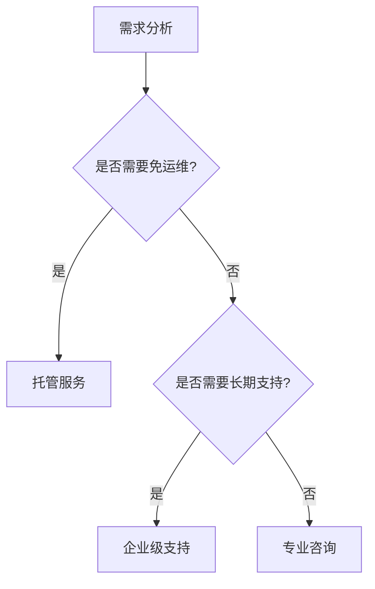

# 商业支持选项

## 介绍

Jaeger 是一个开源的分布式追踪系统，广泛应用于微服务架构中，帮助开发者监控和诊断复杂的系统交互。虽然 Jaeger 本身是开源的，但许多企业和团队可能需要额外的商业支持，以确保系统的稳定性、安全性和高性能。本文将介绍 Jaeger 生态系统中常见的商业支持选项，包括企业级支持、托管服务和专业咨询。

## 为什么需要商业支持？

开源工具虽然强大，但在实际生产环境中可能会遇到以下挑战：
- **复杂部署**：Jaeger 的部署和配置可能对初学者来说较为复杂。
- **性能优化**：大规模使用时需要针对特定场景优化性能。
- **安全合规**：企业可能需要满足特定的安全或合规要求。
- **紧急问题**：生产环境中出现问题时需要快速响应。

商业支持可以帮助解决这些问题，提供专业的技术保障。

---

## 商业支持选项

### 1. 企业级支持
企业级支持通常由提供 Jaeger 相关服务的公司（如云厂商或专业支持团队）提供，包括：
- **24/7 技术支持**：紧急问题的快速响应。
- **定制化配置**：根据企业需求调整 Jaager 的部署和配置。
- **长期维护**：确保 Jaeger 版本与依赖的兼容性。

:::tip
企业级支持适合中大型企业或对系统稳定性要求较高的团队。
:::

#### 示例：联系支持团队
许多公司提供企业支持计划，例如：
```bash
# 示例：通过邮件联系支持团队
support@jaeger-enterprise.com
```

---

### 2. 托管服务
托管服务是一种“即用即付”的模式，由第三方提供商（如云厂商）托管和管理 Jaeger 实例。优势包括：
- **免运维**：无需自行部署和维护 Jaeger。
- **自动扩展**：根据负载动态调整资源。
- **集成监控**：提供额外的监控和告警功能。

#### 实际案例：使用 AWS X-Ray 与 Jaeger
AWS 提供了托管式追踪服务（X-Ray），同时支持与 Jaeger 集成：
```yaml
# 示例：配置 Jaeger 与 AWS X-Ray 集成
jaeger:
  storage:
    type: xray
    xray:
      region: us-west-2
```

---

### 3. 专业咨询
专业咨询团队提供定制化的服务，例如：
- **架构设计**：帮助设计适合企业需求的追踪系统。
- **性能调优**：优化 Jaeger 的存储和查询性能。
- **培训服务**：为团队提供 Jaeger 的使用和最佳实践培训。

:::note
咨询服务的价格通常按项目或小时计费，适合需要短期深度支持的团队。
:::

---

## 如何选择商业支持？

选择商业支持时，需考虑以下因素：
1. **预算**：企业级支持和托管服务通常成本较高。
2. **团队规模**：小型团队可能只需要咨询服务，而大型团队可能需要全面支持。
3. **技术能力**：如果团队缺乏 Jaeger 运维经验，托管服务可能是更好的选择。



---

## 总结

商业支持选项为 Jaeger 用户提供了额外的保障和便利，尤其是在生产环境中。根据团队的需求和资源，可以选择企业级支持、托管服务或专业咨询。以下是一些下一步行动建议：
- **评估需求**：明确团队的技术能力和预算。
- **联系供应商**：了解不同支持选项的具体内容和价格。
- **试用服务**：部分提供商提供免费试用或演示。

## 附加资源
- [Jaeger 官方文档](https://www.jaegertracing.io/docs/)
- [AWS X-Ray 与 Jaeger 集成指南](https://docs.aws.amazon.com/xray/latest/devguide/xray-services-jaeger.html)
- [CNCF 提供的 Jaeger 培训课程](https://www.cncf.io/certification/training/)

:::caution
在选择商业支持时，务必确认供应商的信誉和服务范围，避免因支持不足导致生产问题。
:::