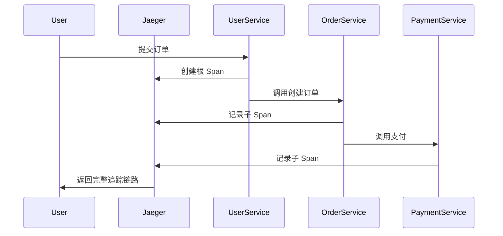

# Jaeger 生态系统培训资源

## 介绍

Jaeger 是一个开源的分布式追踪系统，用于监控和排查微服务架构中的性能问题。对于初学者来说，掌握 Jaeger 的核心概念和工具链是迈向分布式系统可观测性的重要一步。本文将介绍 Jaeger 生态系统的关键培训资源，包括官方文档、互动教程、视频课程和社区支持。

## 官方文档

Jaeger 的[官方文档](https://www.jaegertracing.io/docs/)是最权威的学习起点，涵盖以下内容：

1. **核心概念**：如 traces（追踪）、spans（跨度）、context propagation（上下文传播）。
2. **部署指南**：支持 Docker、Kubernetes 和本地运行。
3. **客户端库**：支持 Java、Go、Python 等语言的集成方式。

:::tip
阅读文档时，优先关注 [Getting Started](https://www.jaegertracing.io/docs/latest/getting-started/) 部分，快速搭建实验环境。
:::

## 互动教程

### 1. Jaeger with HotROD 示例

HotROD (Ride on Demand) 是 Jaeger 官方提供的演示应用，展示分布式追踪的实际效果。运行以下命令启动示例：

```bash
docker run -it --rm \
  -p 8080:8080 -p 16686:16686 \
  jaegertracing/example-hotrod:latest \
  all
```

访问 `http://localhost:8080` 触发服务调用，然后在 Jaeger UI (`http://localhost:16686`) 查看生成的追踪数据。

### 2. OpenTelemetry 集成

Jaeger 兼容 OpenTelemetry 标准。以下是一个 Python 示例，使用 OpenTelemetry SDK 发送数据到 Jaeger：

```python
from opentelemetry import trace
from opentelemetry.sdk.trace import TracerProvider
from opentelemetry.sdk.trace.export import BatchSpanProcessor
from opentelemetry.exporter.jaeger.thrift import JaegerExporter

# 设置 Jaeger Exporter
jaeger_exporter = JaegerExporter(
    agent_host_name="localhost",
    agent_port=6831,
)

# 配置追踪提供者
trace.set_tracer_provider(TracerProvider())
tracer = trace.get_tracer(__name__)
span_processor = BatchSpanProcessor(jaeger_exporter)
trace.get_tracer_provider().add_span_processor(span_processor)

# 生成一个示例 span
with tracer.start_as_current_span("example_span"):
    print("This operation is being traced!")
```

## 视频课程与工作坊

以下免费资源适合视觉学习者：

1. **CNCF Jaeger 官方教程**：通过实际案例演示 Jaeger 的功能。
2. **KubeCon 演讲**：搜索 "Jaeger" 获取最新行业实践。

## 社区与支持

- **GitHub Issues**：提交问题或功能请求。
- **Slack 频道**：加入 [CNCF Slack](https://cloud-native.slack.com) 的 `#jaeger` 频道。
- **Stack Overflow**：使用 `jaeger` 标签提问。

## 实际案例：电商系统追踪

假设一个电商系统包含以下服务：
1. 用户服务
2. 订单服务
3. 支付服务

通过 Jaeger 追踪一次下单请求的流程：



## 总结

Jaeger 的学习路径可以概括为：
1. 理解分布式追踪的基本概念。
2. 通过官方示例实践数据采集。
3. 集成到实际项目中并优化性能。

## 附加练习

1. 使用 Docker 部署 Jaeger 并导入示例数据。
2. 为你的一个微服务添加 OpenTelemetry  instrumentation。
3. 在 Jaeger UI 中分析一个慢请求的瓶颈。

:::note
遇到问题时，记得查阅 [Troubleshooting Guide](https://www.jaegertracing.io/docs/latest/troubleshooting/)！
:::