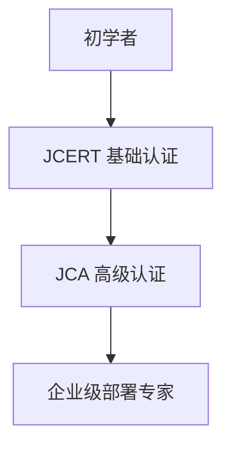

# 认证与学习路径

## 引言

Jaeger作为云原生基金会(CNCF)的毕业项目，是分布式追踪领域的标杆工具。本指南将带你了解Jaeger官方认证体系，并规划适合初学者的学习路线，帮助你从零开始构建可观测性技能树。

## Jaeger 认证体系

Jaeger目前提供两个级别的官方认证：

1. **Jaeger认证工程师(JCERT)** - 基础认证
2. **Jaeger认证架构师(JCA)** - 高级认证



## 学习路径规划

### 阶段1：基础掌握 (2-4周)

#### 核心概念
- 分布式追踪原理
- OpenTelemetry标准
- Span与Trace的关系

#### 实践示例
通过Docker快速启动Jaeger：

```bash
docker run -d --name jaeger \
  -p 16686:16686 \
  -p 6831:6831/udp \
  jaegertracing/all-in-one:latest
```

访问 `http://localhost:16686` 即可看到Jaeger UI。

### 阶段2：中级集成 (4-6周)

#### 典型集成场景
1. 微服务应用接入
2. 与Prometheus/Grafana联动
3. 生产环境部署模式

:::tip 实际案例
电商系统的订单流程追踪：
```python
from opentelemetry import trace
from opentelemetry.sdk.trace import TracerProvider

# 初始化追踪器
trace.set_tracer_provider(TracerProvider())
tracer = trace.get_tracer(__name__)

with tracer.start_as_current_span("order_processing"):
    # 业务逻辑代码
    print("Processing order...")
```
:::

### 阶段3：高级优化 (6-8周)

#### 关键技能
- 采样策略配置
- 存储后端性能调优
- 安全认证配置

示例配置采样率：
```yaml
sampling:
  strategies:
    - service: "payment-service"
      type: "probabilistic"
      param: 0.1  # 10%采样率
```

## 认证准备建议

1. **JCERT考试重点**：
   - 基本架构组件(Agent/Collector/Query等)
   - 常用CLI命令
   - 基础问题排查

2. **JCA考试重点**：
   - 大规模部署方案
   - 多租户实现
   - 安全审计配置

:::warning 注意
认证考试需要实际操作经验，建议至少完成3个真实项目集成后再报考
:::

## 总结与资源

### 知识巩固
- 官方文档：https://www.jaegertracing.io/docs/
- CNCF培训课程：https://training.linuxfoundation.org/

### 推荐练习
1. 在本地搭建多组件Jaeger集群
2. 实现一个Python/Java服务的完整追踪
3. 配置基于角色的访问控制(RBAC)

通过系统化的学习和实践，你将逐步掌握Jaeger在生产环境中的实际应用能力。建议每完成一个学习阶段后，通过实际项目验证所学知识。

```mermaid
flowchart LR
    学习-->实践-->认证-->进阶学习