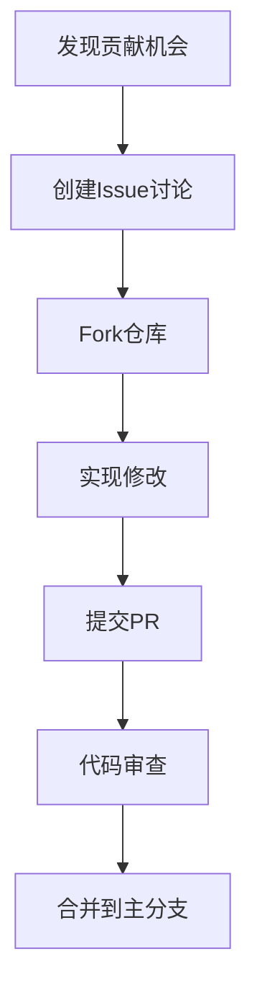

# 社区贡献指南

## 介绍

欢迎来到Jaeger生态系统的社区贡献指南！无论你是初学者还是经验丰富的开发者，参与开源项目都是提升技能和回馈社区的好方式。本指南将帮助你了解如何为Jaeger项目做出贡献，包括代码、文档、测试和社区支持。

Jaeger是一个开源的分布式追踪系统，用于监控和排查微服务架构中的问题。它的成功离不开全球开发者的共同努力。你的贡献可以帮助Jaeger变得更强大、更易用。

## 为什么贡献？

贡献开源项目有许多好处：
- **学习新技术**：通过实际项目提升编程和协作能力。
- **建立职业网络**：结识志同道合的开发者。
- **提升影响力**：你的工作将被全球开发者使用。
- **回馈社区**：帮助项目成长，让更多人受益。

## 贡献类型

Jaeger社区欢迎多种形式的贡献：

### 1. 代码贡献
- 修复bug
- 实现新功能
- 优化现有代码

### 2. 文档改进
- 修正错误
- 添加示例
- 改善可读性

### 3. 测试和报告
- 提交bug报告
- 编写测试用例
- 验证修复

### 4. 社区支持
- 回答问题
- 分享经验
- 推广项目

## 开始贡献

### 第一步：设置开发环境

1. **Fork仓库**：访问[Jaeger GitHub仓库](https://github.com/jaegertracing/jaeger)并点击"Fork"按钮。

2. **克隆仓库**：
   ```bash
   git clone https://github.com/your-username/jaeger.git
   cd jaeger
   ```

3. **添加上游仓库**：
   ```bash
   git remote add upstream https://github.com/jaegertracing/jaeger.git
   ```

### 第二步：选择任务

查看以下资源寻找贡献机会：
- `Good First Issue`标签的问题
- 项目路线图
- 文档中的TODO注释

:::tip
初学者可以从文档改进或小型bug修复开始，逐步熟悉代码库。
:::

### 第三步：提交更改

1. 创建新分支：
   ```bash
   git checkout -b fix/typo-in-readme
   ```

2. 做出修改后提交：
   ```bash
   git add .
   git commit -m "fix: correct typo in README.md"
   ```

3. 推送到你的fork：
   ```bash
   git push origin fix/typo-in-readme
   ```

4. 创建Pull Request(PR)：
   - 访问你的fork的GitHub页面
   - 点击"Compare & pull request"
   - 填写PR描述，引用相关issue(如果有)

## 代码示例：添加简单的Span处理器

以下是一个简单的贡献示例，展示如何添加一个基本的Span处理器：

```go
package processor

import (
	"context"

	"github.com/jaegertracing/jaeger/model"
)

// SimpleSpanProcessor 是一个演示用的简单处理器
type SimpleSpanProcessor struct{}

// ProcessSpan 处理接收到的span
func (p *SimpleSpanProcessor) ProcessSpan(span *model.Span, options ProcessSpanOptions) error {
	// 在这里添加你的处理逻辑
	log.Printf("Processing span: %s", span.OperationName)
	return nil
}

// NewSimpleSpanProcessor 创建新的SimpleSpanProcessor实例
func NewSimpleSpanProcessor() *SimpleSpanProcessor {
	return &SimpleSpanProcessor{}
}
```

要在Jaeger中使用这个处理器，你需要在适当的位置注册它。这通常涉及修改collector的初始化代码。

## 贡献流程

Jaeger社区的典型贡献流程如下：



## 最佳实践

1. **遵循编码规范**：Jaeger有特定的代码风格指南，提交前确保符合要求。

2. **编写测试**：新功能或bug修复应包含相应的测试用例。

3. **保持提交信息清晰**：使用[约定式提交](https://www.conventionalcommits.org/)格式。

4. **响应及时**：关注PR或issue的讨论，及时回复评论。

5. **保持礼貌**：开源社区建立在相互尊重的基础上。

## 实际案例

**案例：改进文档中的部署示例**

一位贡献者发现Kubernetes部署示例中缺少资源限制配置，可能导致生产环境问题。他：

1. 创建issue描述问题
2. Fork仓库并创建分支
3. 更新部署示例，添加资源限制
4. 提交PR并链接原始issue
5. 与维护者讨论后，PR被合并

这个改进帮助了许多用户避免了潜在的生产环境问题。

## 社区资源

- **官方文档**：[https://www.jaegertracing.io/docs/](https://www.jaegertracing.io/docs/)
- **GitHub仓库**：[https://github.com/jaegertracing/jaeger](https://github.com/jaegertracing/jaeger)
- **Slack频道**：[https://cloud-native.slack.com/archives/CGG7NFUJ3](https://cloud-native.slack.com/archives/CGG7NFUJ3)
- **每周会议**：查看社区日历参与讨论

## 总结

为Jaeger生态系统做贡献是学习分布式系统和开源协作的绝佳方式。从小的改进开始，逐步深入核心功能。记住，每个贡献无论大小都是有价值的！

:::note
即使你只是修正了一个拼写错误，也是在帮助项目变得更好。不要低估小贡献的价值！
:::

## 下一步

1. 浏览Jaeger GitHub仓库的`Good First Issue`
2. 加入Slack频道介绍自己
3. 尝试构建Jaeger并运行测试套件
4. 查看开放PR，学习审查流程

祝你贡献愉快！Jaeger社区期待你的加入。