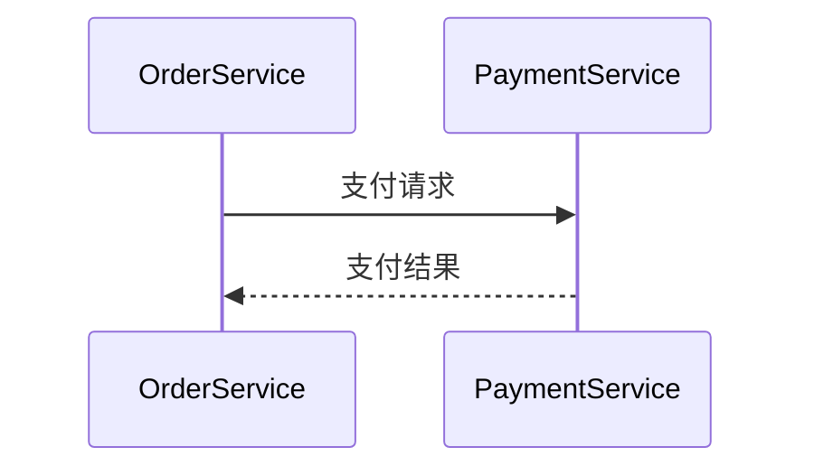

# Jaeger 生态系统：开发者资源

## 简介

Jaeger是一个开源的分布式追踪系统，用于监控和排查微服务架构中的复杂问题。作为开发者，了解Jaeger生态系统中的资源（如客户端库、工具和集成方案）能帮助您更高效地实现追踪功能。本文将介绍关键开发者资源，并提供实际应用示例。

---

## 核心开发者工具

### 1. Jaeger客户端库

Jaeger支持多种语言的客户端库，包括：
- **Java** (`jaeger-client-java`)
- **Go** (`jaeger-client-go`)
- **Python** (`jaeger-client-python`)
- **Node.js** (`jaeger-client`)

:::tip
安装Java客户端的示例：
```bash
<dependency>
  <groupId>io.jaegertracing</groupId>
  <artifactId>jaeger-client</artifactId>
  <version>1.8.1</version>
</dependency>
```
:::

### 2. OpenTelemetry集成

Jaeger兼容[OpenTelemetry](https://opentelemetry.io/)（OTel），推荐使用OTel SDK实现跨平台追踪。以下是一个Python示例：

```python
from opentelemetry import trace
from opentelemetry.exporter.jaeger.thrift import JaegerExporter
from opentelemetry.sdk.trace import TracerProvider

provider = TracerProvider()
trace.set_tracer_provider(provider)
exporter = JaegerExporter(agent_host_name="localhost", agent_port=6831)
```

---

## 实际案例：追踪微服务请求

### 场景描述
假设有两个服务：`OrderService`（订单服务）和`PaymentService`（支付服务）。我们需要追踪一个订单支付的完整流程。

### 代码实现（Go语言）

```go
package main

import (
	"context"
	"github.com/opentracing/opentracing-go"
	"github.com/uber/jaeger-client-go"
)

func createOrder(ctx context.Context) {
	span, _ := opentracing.StartSpanFromContext(ctx, "create_order")
	defer span.Finish()
	// 业务逻辑...
}

func main() {
	tracer, closer := jaeger.NewTracer(
		"OrderService",
		jaeger.NewConstSampler(true),
		jaeger.NewNullReporter(),
	)
	defer closer.Close()
	opentracing.SetGlobalTracer(tracer)

	span := tracer.StartSpan("process_payment")
	ctx := opentracing.ContextWithSpan(context.Background(), span)
	createOrder(ctx)
	span.Finish()
}
```

### 追踪结果
在Jaeger UI中，您将看到如下调用链：


---

## 调试与优化

### 常见问题排查
1. **数据未上报**：检查Jaeger Agent的端口（默认6831）是否开放。
2. **采样率过低**：在配置中调整采样策略：
   ```yaml
   sampler:
     type: const
     param: 1  # 100%采样
   ```

---

## 总结与资源

### 关键点回顾
- Jaeger客户端库简化了跨语言追踪的实现。
- OpenTelemetry是未来的标准集成方案。
- 通过实际案例理解调用链追踪的价值。

### 延伸学习
- [Jaeger官方文档](https://jaegertracing.io/docs/)
- [OpenTelemetry最佳实践](https://opentelemetry.io/docs/concepts/)
- 练习：尝试在您的本地环境中部署Jaeger并追踪一个简单的HTTP服务。

:::note
遇到问题？访问Jaeger的[GitHub讨论区](https://github.com/jaegertracing/jaeger/discussions)获取帮助！
:::