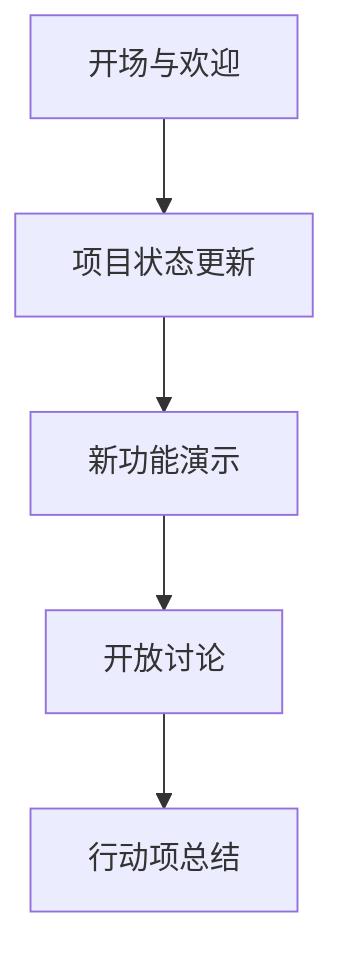

## 介绍

在 Jaeger 生态系统中，**会议与活动**是开发者、贡献者和用户交流经验、学习新技术和推动项目发展的重要平台。无论是线上研讨会、线下 meetup 还是大型技术会议，这些活动都能帮助你快速掌握 Jaeger 的核心功能、最佳实践以及社区动态。

对于初学者来说，参与这些活动可以：
- 直接向核心开发者提问
- 了解实际应用案例
- 获取第一手学习资源
- 扩展技术人脉

## Jaeger 活动类型

### 1. 官方会议
Jaeger 社区定期举办以下活动：

#### 社区例会 (Community Meetings)
- **频率**：每月一次
- **内容**：项目进展、路线图讨论、RFC 提案
- **参与方式**：通过 Zoom 或 YouTube 直播

:::tip
会议议程和记录通常发布在 [Jaeger 官方 GitHub Wiki](https://github.com/jaegertracing/jaeger/wiki) 上。
:::

#### 示例会议流程：


### 2. 技术研讨会 (Tech Talks)
- **形式**：深度技术分享（45分钟演讲 + 15分钟 Q&A）
- **主题示例**：
  - "Jaeger 与 OpenTelemetry 集成实践"
  - "在生产环境中调试分布式事务"

### 3. 黑客松 (Hackathons)
- **目标**：集中解决特定问题或开发新功能
- **适合**：已有基础知识的开发者
- **典型产出**：
  ```go
  // 示例：Hackathon 中可能改进的代码片段
  span := tracer.StartSpan("checkout")
  defer span.Finish()
  // 添加新的标签系统
  span.SetTag("payment.method", "credit_card")
  ```

## 如何参与

### 线上活动准备
1. 注册活动（通常通过 Meetup 或 Eventbrite）
2. 测试技术环境：
   ```bash
   # 检查网络工具
   ping meet.jaegertracing.io
   # 测试视频播放
   curl -I https://youtube.com/jaeger-live
   ```

### 线下活动建议
- 提前准备问题清单
- 携带可运行 Jaeger 的笔记本电脑
- 安装基础工具链：
  ```bash
  # 快速验证环境
  docker run --rm -it \
    -p 16686:16686 \
    jaegertracing/all-in-one:latest
  ```

## 实际案例

### 案例：电商公司通过会议解决问题
**问题**：订单追踪链断裂<br />
**解决方案**：在 Jaeger 欧洲峰会上学习到上下文传播的最佳实践：

```java
// 会前代码
try (Scope scope = tracer.buildSpan("serviceA").startActive(true)) {
    callServiceB(); // 丢失上下文
}

// 会后改进代码
try (Scope scope = tracer.buildSpan("serviceA").startActive(true)) {
    HttpClient client = HttpClient.newBuilder()
        .setHeader("uber-trace-id", currentSpanContextToString())
        .build();
    callServiceB(client);
}
```

## 资源与后续步骤

### 推荐练习
1. 参加下一次社区会议并提交一个问题
2. 在本地复现演讲中的 demo
3. 在 GitHub 上评论会议笔记

### 学习资源
- [Jaeger 社区日历](https://calendar.google.com/jaeger)
- [过往会议录像](https://youtube.com/jaeger-playlist)
- [活动代码示例库](https://github.com/jaegertracing/demo-scripts)

:::note
首次参会者常问问题已整理在 [FAQ 文档](https://jaegertracing.io/docs/faq/) 的 "Events" 部分。
::>

## 总结

通过积极参与 Jaeger 的会议与活动，你可以：
- 加速学习曲线
- 获得专家指导
- 了解行业趋势
- 为开源项目做出贡献

建议从观察者开始，逐步成长为积极的参与者甚至演讲者。社区始终欢迎新的声音和观点！