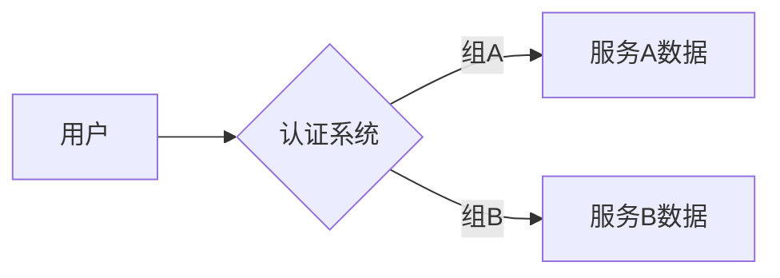

# Jaeger 用户组

## 介绍

在分布式系统中，**用户组**是 Jaeger 生态系统中的一个重要概念，用于管理不同用户或团队对追踪数据的访问权限。通过用户组，可以实现以下目标：

1. **权限隔离**：限制特定用户只能查看与其相关的服务追踪数据。
2. **多租户支持**：在共享的 Jaeger 实例中为不同团队分配独立空间。
3. **安全控制**：防止敏感数据被未授权人员访问。

:::tip 适用场景
- 企业内部分多个开发团队共享 Jaeger
- SaaS 平台需要为不同客户提供独立的追踪视图
- 需要遵守数据访问合规性要求的环境
:::

## 核心概念

### 1. 用户组的工作原理

Jaeger 本身不直接提供用户组功能，但可以通过以下方式实现：

- **与外部认证系统集成**（如 LDAP、OAuth）
- **使用存储后端的分区特性**（如 Elasticsearch 索引模式）
- **通过代理层实现**（如 Nginx 基于路径的访问控制）



### 2. 配置示例

以下是使用 Jaeger Query Service 实现基础权限控制的配置片段：

```yaml
# jaeger-query 配置示例
auth:
  enabled: true
  bearer_token_propagation: true
  http_credentials:
    username: "admin"
    password: "$2a$10$..." # bcrypt 哈希
```

### 3. 实际案例

**场景**：电商平台有三个团队需要共享 Jaeger：
- 订单服务团队
- 支付服务团队
- 物流服务团队

**解决方案**：
1. 为每个服务添加特定标签（如 `team=order`）
2. 配置查询时自动过滤数据：
   ```bash
   # 查询订单团队的追踪数据
   curl -H "Authorization: Bearer ORDER_TEAM_TOKEN" \
     "http://jaeger-query/api/traces?service=order-service&tags={\"team\":\"order\"}"
   ```

## 高级用法

### 1. 与 OpenPolicyAgent 集成

```rego
# policy.rego
package jaeger.authz

default allow = false

allow {
    input.path = "/api/traces"
    input.user.groups[_] == "devops"
}
```

### 2. 存储后端分区

对于 Elasticsearch 后端，可以按团队创建独立索引：
```bash
# 每天为不同团队创建独立索引
jaeger-span-2023-11-01-teamA
jaeger-span-2023-11-01-teamB
```

## 常见问题

:::caution 注意事项
1. Jaeger UI 本身不显示组信息，需要通过自定义开发增强
2. 细粒度权限控制可能影响查询性能
3. 确保所有服务都正确设置了标识组的标签
:::

## 总结

Jaeger 用户组是通过外部系统实现的权限管理机制，主要价值在于：
- 实现数据隔离和安全访问
- 支持多团队协作环境
- 灵活适配各种认证系统

## 扩展学习

1. 尝试将 Jaeger 与你的公司 LDAP 系统集成
2. 为测试环境配置一个基于 IP 的简单访问控制
3. 研究 Jaeger 的 `--query.bearer-token-propagation` 参数作用

:::warning 生产环境建议
对于关键业务系统，建议结合服务网格（如 Istio）的 RBAC 功能实现端到端的权限控制。
:::