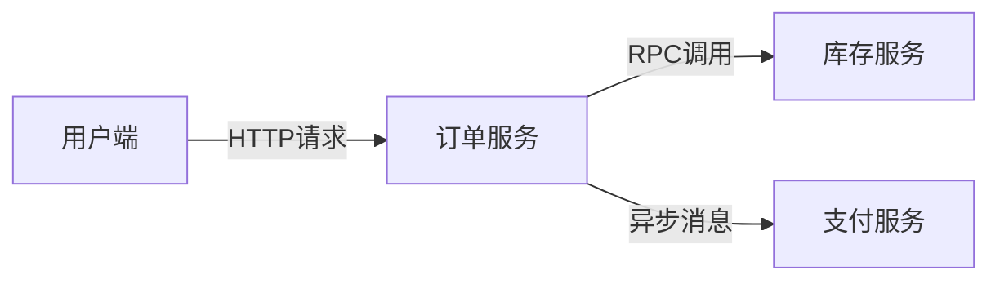

# Jaeger 客户端库概览

## 介绍

Jaeger是一个开源的**分布式追踪系统**，用于监控和排查微服务架构中的复杂事务。Jaeger客户端库是开发者将追踪功能集成到应用程序中的桥梁，支持多种编程语言并自动生成追踪数据（spans）。本文将带你了解核心客户端库的功能和实际应用。

:::note 关键术语
- **Span**：代表一个独立的工作单元（如API调用）。
- **Trace**：由多个Span组成的有向无环图，描述完整事务流程。
:::

## 支持的客户端库

Jaeger官方提供以下语言的客户端实现：

| 语言       | 库名称                  | 主要特点                          |
|------------|-------------------------|-----------------------------------|
| Go         | `jaeger-client-go`      | 高性能，原生支持上下文传播        |
| Java       | `jaeger-client-java`    | 集成OpenTracing API，支持Spring   |
| Python     | `jaeger-client-python`  | 异步支持，Django/Flask中间件      |
| Node.js    | `jaeger-client`         | 基于Promise的异步追踪             |

## 核心功能

### 1. 追踪创建

通过`Tracer`实例创建Span，记录操作耗时和元数据。以下是Python示例：

```python
from jaeger_client import Config

config = Config(config={'sampler': {'type': 'const', 'param': 1}}, service_name='myapp')
tracer = config.initialize_tracer()

with tracer.start_span('say-hello') as span:
    span.log_kv({'event': 'name-request', 'value': 'world'})
    print("Hello, world!")
```

**输出到Jaeger UI的Span信息**:
```json
{
  "traceID": "3a2f1d5e8c7b9a",
  "spans": [{
    "operationName": "say-hello",
    "logs": [{"event": "name-request", "value": "world"}]
  }]
}
```

### 2. 上下文传播

跨服务传递Trace上下文（通常通过HTTP头）。Java示例展示上下文提取：

```java
Tracer tracer = ...;
SpanContext parentCtx = tracer.extract(
    Format.Builtin.HTTP_HEADERS,
    new TextMapAdapter(request.getHeaders())
);

Span span = tracer.buildSpan("child-span")
    .asChildOf(parentCtx)
    .start();
```

## 实际案例：电商订单流程

通过订单创建场景展示多服务调用追踪：



对应的Go代码实现关键追踪点：

```go
func CreateOrder(ctx context.Context, req *OrderRequest) {
    span, ctx := opentracing.StartSpanFromContext(ctx, "create-order")
    defer span.Finish()

    // 调用库存服务
    inventorySpan := tracer.StartSpan("check-inventory", opentracing.ChildOf(span.Context()))
    defer inventorySpan.Finish()
    CallInventoryService(ctx, req.Items)

    // 异步支付处理
    paymentSpan := tracer.StartSpan("process-payment", opentracing.ChildOf(span.Context()))
    PublishPaymentEvent(ctx, req.Payment)
    paymentSpan.Finish()
}
```

:::tip 最佳实践
1. 为所有跨进程调用添加上下文传播
2. 对数据库查询等耗时操作单独创建Span
3. 使用`log_kv`记录关键业务参数（注意脱敏）
:::

## 总结

Jaeger客户端库通过简单的API提供了：
- 分布式事务的端到端可视化
- 性能瓶颈定位能力
- 错误传播路径分析

## 扩展资源

1. [Jaeger官方文档](https://www.jaegertracing.io/docs/)
2. 练习：在本地Docker环境部署Jaeger并收集Python Flask应用的追踪数据
3. 进阶：尝试将追踪数据与Prometheus指标关联

:::caution 注意
生产环境应配置适当的采样率（如0.1%），避免高流量时存储过载。
:::