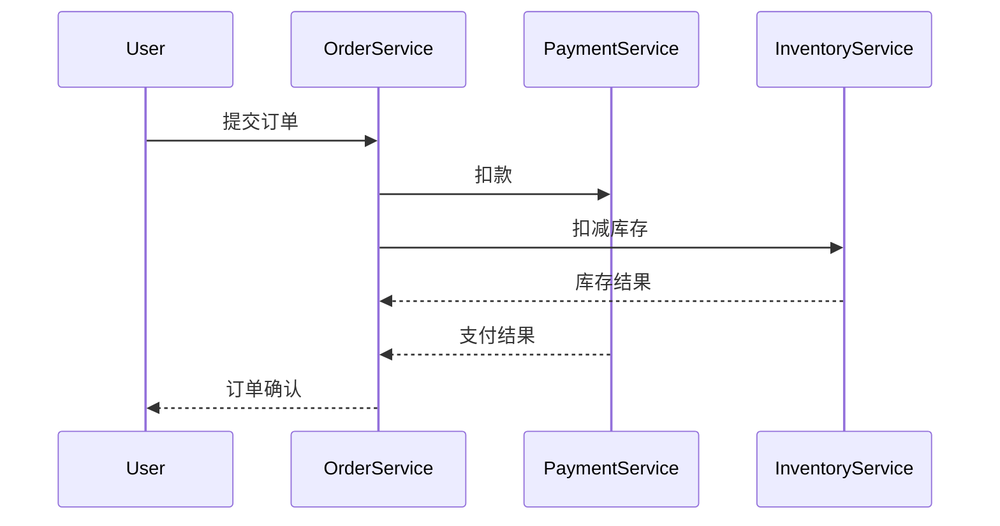

# Jaeger 客户端集成 - Java篇

## 介绍

Jaeger是一个开源的分布式追踪系统，用于监控和排查微服务架构中的复杂事务流。Java客户端集成是通过Jaeger提供的Java库将追踪功能嵌入到你的应用程序中。本文将带你从零开始完成集成过程。

:::note 分布式追踪是什么？
就像快递物流跟踪系统可以显示包裹的运输路径一样，分布式追踪能记录请求在微服务间的流转过程。
:::

## 前置条件
- JDK 8+
- Maven/Gradle项目
- 基础Java知识

## 第一步：添加依赖

对于Maven项目，在`pom.xml`中添加：

```xml
<dependency>
    <groupId>io.jaegertracing</groupId>
    <artifactId>jaeger-client</artifactId>
    <version>1.8.1</version>
</dependency>
```

对于Gradle项目：

```groovy
implementation 'io.jaegertracing:jaeger-client:1.8.1'
```

## 第二步：基础配置

创建`JaegerTracer`实例的典型方式：

```java
import io.jaegertracing.Configuration;
import io.opentracing.Tracer;

public class TracingInit {
    public static Tracer initTracer(String serviceName) {
        Configuration.SamplerConfiguration samplerConfig = 
            Configuration.SamplerConfiguration.fromEnv()
                .withType("const")
                .withParam(1); // 采样率100%
        
        Configuration.ReporterConfiguration reporterConfig = 
            Configuration.ReporterConfiguration.fromEnv()
                .withLogSpans(true);
        
        Configuration config = new Configuration(serviceName)
            .withSampler(samplerConfig)
            .withReporter(reporterConfig);
        
        return config.getTracer();
    }
}
```

:::tip 配置说明
- `withType("const")`：恒定采样策略
- `withParam(1)`：采样所有请求
- `withLogSpans(true)`：输出span日志到控制台
:::

## 第三步：创建追踪Span

基本使用示例：

```java
Tracer tracer = TracingInit.initTracer("order-service");

try (Scope scope = tracer.buildSpan("process-order").startActive(true)) {
    // 业务逻辑
    processOrder();
    
    // 添加标签
    scope.span().setTag("order.value", 150.00);
    
    // 记录日志
    scope.span().log("Order processed successfully");
} catch (Exception e) {
    scope.span().setTag("error", true);
    scope.span().log(e.getMessage());
}
```

## 实际应用场景

### 电商订单处理流程



对应代码实现：

```java
public class OrderService {
    private final Tracer tracer;
    
    public OrderService(Tracer tracer) {
        this.tracer = tracer;
    }
    
    public void processOrder(Order order) {
        try (Scope scope = tracer.buildSpan("process-order").startActive(true)) {
            // 记录订单信息
            scope.span().setTag("order.id", order.getId());
            
            // 调用支付服务
            try (Scope paymentScope = tracer.buildSpan("process-payment").startActive(true)) {
                paymentService.charge(order);
            }
            
            // 调用库存服务
            try (Scope inventoryScope = tracer.buildSpan("update-inventory").startActive(true)) {
                inventoryService.update(order);
            }
        }
    }
}
```

## 高级配置

### 上报到Jaeger Collector

```java
Configuration.ReporterConfiguration reporterConfig = 
    Configuration.ReporterConfiguration.fromEnv()
        .withSender(
            new Configuration.SenderConfiguration()
                .withEndpoint("http://jaeger-collector:14268/api/traces")
        );
```

### 自定义采样策略

```java
Configuration.SamplerConfiguration samplerConfig = 
    new Configuration.SamplerConfiguration()
        .withType("probabilistic")
        .withParam(0.5); // 50%采样率
```

## 常见问题

:::caution 注意事项
1. 生产环境不应使用100%采样（`withParam(1)`）
2. 确保不会在循环中创建大量span
3. 跨线程时需要手动传播span上下文
:::

## 总结

通过本文你学会了：
- 添加Jaeger Java客户端依赖
- 配置和初始化Tracer
- 创建基本的span和scope
- 在实际业务场景中的应用
- 常见的高级配置选项

## 扩展练习

1. 尝试在Spring Boot项目中集成Jaeger
2. 创建一个跨三个微服务的完整追踪示例
3. 实现自定义的采样策略（如只采样特定用户的请求）

## 附加资源

- [Jaeger官方文档](https://www.jaegertracing.io/docs/)
- [OpenTracing Java API](https://github.com/opentracing/opentracing-java)
- [分布式追踪模式](https://microservices.io/patterns/observability/distributed-tracing.html)