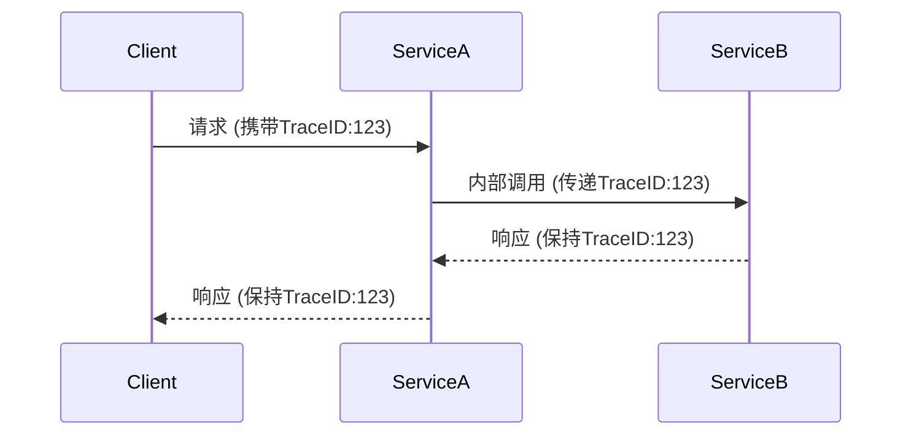

# 追踪上下文传递

## 介绍

在分布式系统中，一个请求可能会跨越多个服务。为了完整追踪整个请求链路，我们需要在服务间传递**追踪上下文**（Trace Context）。Jaeger通过特定的HTTP头或RPC上下文来传递这些信息，确保所有相关操作属于同一个逻辑事务。

:::note 关键概念
- **Trace ID**：唯一标识一个分布式追踪链。
- **Span ID**：标识当前操作的片段。
- **Parent Span ID**：指向父级操作（用于构建层级关系）。
:::

## 上下文传递机制

### 1. HTTP头传递
当服务通过HTTP通信时，Jaeger会将上下文注入以下标准头中：
- `uber-trace-id`：包含Trace ID、Span ID、Parent Span ID和采样标志
- `uberctx-{key}`：用于传递自定义Baggage（跨服务键值数据）

示例请求头：
```http
GET /api/data HTTP/1.1
Host: example.com
uber-trace-id: 3a3c43f33a3c43f3:1e3443a4:0:1
uberctx-user-id: 12345
```

### 2. 代码示例（Node.js）

#### 发送请求时携带上下文
```javascript
const { initTracer } = require('jaeger-client');
const axios = require('axios');

// 初始化追踪器
const tracer = initTracer(config);

async function fetchData() {
  const span = tracer.startSpan('call_external_api');
  
  // 将当前span上下文注入headers
  const headers = {};
  tracer.inject(span.context(), FORMAT_HTTP_HEADERS, headers);
  
  try {
    const response = await axios.get('http://service-b/api', { headers });
    span.finish();
    return response.data;
  } catch (err) {
    span.setTag('error', true);
    span.log({ 'error.message': err.message });
    span.finish();
    throw err;
  }
}
```

#### 接收请求时提取上下文
```javascript
app.get('/api', (req, res) => {
  // 从HTTP头提取上下文
  const parentSpanContext = tracer.extract(FORMAT_HTTP_HEADERS, req.headers);
  
  // 创建子span
  const span = tracer.startSpan('process_request', {
    childOf: parentSpanContext
  });
  
  // 业务逻辑...
  span.finish();
  res.send('Data processed');
});
```

### 3. 上下文传递流程



## 实际应用场景

**电商订单处理流程**：
1. 用户下单（前端服务）
2. 扣减库存（库存服务）
3. 创建订单（订单服务）
4. 支付处理（支付服务）

通过上下文传递，我们可以：
- 追踪整个订单生命周期的性能
- 定位具体失败的服务
- 分析跨服务调用的延迟

:::tip 调试技巧
在开发环境中，可以通过Jaeger UI查看完整的调用链，特别关注：
- 各Span的时间消耗
- 错误标记（红色标记）
- Baggage中传递的业务数据
:::

## 总结

追踪上下文传递是分布式追踪的核心机制，它使得：
- 跨服务调用能够关联到同一个追踪链
- 系统行为可视化成为可能
- 性能分析和故障排查更加高效

## 扩展练习

1. 尝试在两个微服务间手动传递追踪上下文（不使用SDK自动注入）
2. 在Jaeger UI中观察Baggage的传递效果
3. 模拟一个调用失败场景，观察错误如何在整个调用链中传播

## 附加资源
- [Jaeger官方文档 - 上下文传播](https://www.jaegertracing.io/docs/1.6/client-libraries/#propagation)
- [OpenTracing传播标准](https://opentracing.io/docs/overview/inject-extract/)