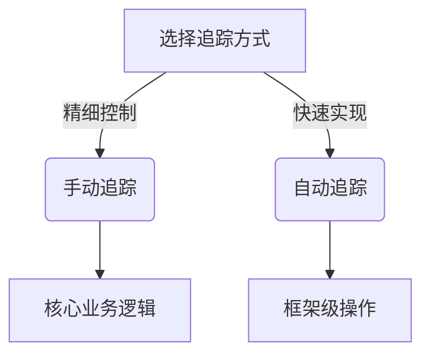

# 手动与自动追踪

在分布式系统中，追踪（Tracing）是理解请求流经多个服务的关键技术。Jaeger作为流行的分布式追踪系统，支持**手动追踪**和**自动追踪**两种方式。本文将介绍它们的核心概念、实现方法及实际应用场景。

## 什么是追踪？

追踪是通过记录请求在系统中的路径（称为**Span**）来构建完整的调用链（称为**Trace**）。每个Span包含：
- 操作名称（如API端点）
- 时间戳（开始/结束时间）
- 上下文信息（如请求ID）

## 手动追踪

手动追踪需要开发者显式地创建和结束Span，适合需要精细控制的场景。

### 基本用法示例（Python）

```python
from jaeger_client import Config
from opentracing_instrumentation.request_context import get_current_span

# 初始化Jaeger客户端
config = Config(config={'sampler': {'type': 'const', 'param': 1}}, service_name='my_app')
tracer = config.initialize_tracer()

# 手动创建Span
with tracer.start_span('manual_operation') as span:
    span.set_tag('http.method', 'GET')
    span.log_kv({'event': 'processing_started'})
    # 业务逻辑...
    span.log_kv({'event': 'processing_finished'})
```

:::note
手动追踪的优势：
1. 完全控制Span的生命周期
2. 可添加自定义标签和日志
3. 适合核心业务逻辑的深度监控
:::

## 自动追踪

自动追踪通过框架/库自动生成Span，减少样板代码。常见实现方式：

### 1. 中间件集成（Flask示例）

```python
from flask import Flask
from flask_opentracing import FlaskTracing

app = Flask(__name__)
tracing = FlaskTracing(tracer, True, app)  # 自动追踪所有路由

@app.route('/')
def home():
    return "自动追踪的路由"
```

### 2. 数据库调用自动追踪

```python
from opentracing_instrumentation.client_hooks import install_all_patches

install_all_patches()  # 自动追踪HTTP/数据库请求
```

:::tip
自动追踪适合：
- 快速为现有系统添加基础追踪
- 标准化操作（如HTTP请求）
- 减少侵入性代码修改
:::

## 对比分析



| 特性         | 手动追踪                | 自动追踪                |
|--------------|-------------------------|-------------------------|
| 控制粒度     | 细粒度                  | 粗粒度                  |
| 代码侵入性   | 高                      | 低                      |
| 学习成本     | 较高                    | 较低                    |
| 适用场景     | 关键业务路径            | 基础设施调用            |

## 实际案例

### 电商系统支付流程

```python
# 手动追踪核心支付逻辑
with tracer.start_span('process_payment') as span:
    span.set_tag('payment.amount', amount)
    try:
        charge_credit_card()
        span.set_tag('payment.status', 'success')
    except Exception as e:
        span.set_tag('payment.status', 'failed')
        span.log_kv({'error': str(e)})

# 自动追踪数据库查询
result = db.query("SELECT * FROM inventory")  # 自动生成Span
```

## 总结

- **手动追踪**：适合需要深度监控的核心业务逻辑
- **自动追踪**：适合快速实现基础追踪需求
- 最佳实践：两者结合使用，自动追踪基础设施调用，手动追踪业务关键路径

## 扩展学习

1. Jaeger官方文档：[Tracing API Best Practices](https://www.jaegertracing.io/docs/)
2. 尝试为你的Web框架添加自动追踪
3. 练习比较手动/自动生成的Span差异