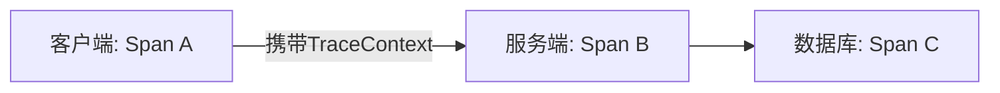

# 跨进程追踪

## 介绍

在分布式系统中，一个用户请求可能跨越多个服务进程。**跨进程追踪**允许我们将这些分散的操作串联成完整的调用链，帮助开发者：

1. 可视化请求在系统中的完整路径
2. 定位性能瓶颈
3. 分析跨服务边界的错误

Jaeger通过**上下文传播(Context Propagation)**机制实现这一功能，本文将使用OpenTracing标准进行演示。

## 核心概念

### 追踪上下文(Trace Context)

每个跨进程调用都需要携带以下信息：
- **Trace ID**：全局唯一标识符，贯穿整个调用链
- **Span ID**：当前操作的唯一标识
- **Parent Span ID**：父级操作标识（用于构建层级关系）



### 传播方式

常见上下文传播载体：
1. HTTP Headers（最常用）
2. gRPC Metadata
3. 消息队列属性（如Kafka Headers）

## 代码实战

### 基础HTTP传播示例

#### 客户端代码（Node.js）

```javascript
const { initTracer } = require('jaeger-client');
const opentracing = require('opentracing');

// 初始化追踪器
const tracer = initTracer(config);

function makeRequest() {
    const span = tracer.startSpan('client_call');
    
    // 将上下文注入HTTP头
    const headers = {};
    tracer.inject(span, opentracing.FORMAT_HTTP_HEADERS, headers);
    
    // 模拟HTTP请求
    fetch('http://service/api', { 
        headers,
        method: 'POST'
    }).then(() => {
        span.finish();
    });
}
```

#### 服务端代码（Java Spring）

```java
@RestController
public class ApiController {
    
    @PostMapping("/api")
    public ResponseEntity<?> handleRequest(HttpServletRequest request) {
        // 从HTTP头提取上下文
        SpanContext parentCtx = tracer.extract(
            Format.Builtin.HTTP_HEADERS,
            new HttpServletRequestExtractAdapter(request));
        
        // 创建子Span
        Span span = tracer.buildSpan("server_processing")
                         .asChildOf(parentCtx)
                         .start();
        
        try {
            // 业务逻辑...
            return ResponseEntity.ok().build();
        } finally {
            span.finish();
        }
    }
}
```

### 输出结果

在Jaeger UI中看到的完整追踪链：
```
Trace View:
client_call (200ms)
└── server_processing (180ms)
    └── db_query (150ms)
```

## 进阶场景

### 异步消息处理

通过Kafka传递上下文：

```python
# 生产者
def produce_message():
    span = tracer.start_span('producer')
    headers = {}
    tracer.inject(span, Format.TEXT_MAP, headers)
    
    # 转换为Kafka支持的字节格式
    kafka_headers = [(k, v.encode()) for k, v in headers.items()]
    producer.send('topic', headers=kafka_headers)

# 消费者
def process_message(msg):
    headers = {k: v.decode() for k, v in msg.headers}
    span_ctx = tracer.extract(Format.TEXT_MAP, headers)
    span = tracer.start_span('consumer', child_of=span_ctx)
```

:::tip 最佳实践
1. 始终检查`extract()`返回值 - 可能返回`null`表示无上下文
2. 为跨进程调用添加明确的超时标记
3. 记录关键边界信息（如服务名称、主机IP）
:::

## 常见问题排查

### 上下文丢失的典型原因

1. **中间件过滤头信息**：确保代理服务器（如Nginx）不会丢弃`uber-trace-id`等Jaeger头
2. **协议不匹配**：确保`inject`和`extract`使用相同的格式常量
3. **编码问题**：二进制传播时需要正确处理字节序列

## 总结

跨进程追踪是分布式系统的观测基石，通过本文我们学会了：

✓ 上下文传播的基本原理  
✓ HTTP/gRPC/消息队列中的实现方式  
✓ 生产环境中的最佳实践  

### 延伸练习

1. 尝试在本地启动两个服务，模拟完整的HTTP调用链
2. 修改一个现有的gRPC服务，添加追踪上下文传播
3. 使用Jaeger的[对比功能](https://www.jaegertracing.io/docs/)分析两个相似请求的差异

:::note 扩展阅读
- [OpenTracing传播标准](https://opentracing.io/docs/overview/inject-extract/)
- [Jaeger官方文档-跨语言追踪](https://www.jaegertracing.io/docs/latest/client-libraries/)
:::