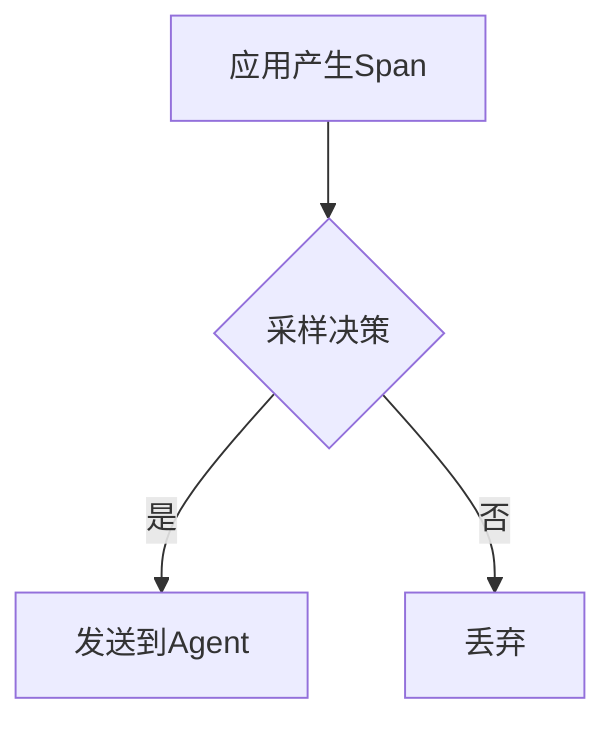

# Jaeger 客户端故障排除

## 介绍

当集成Jaeger客户端进行分布式追踪时，可能会遇到各种问题，如配置错误、网络连接问题或数据上报失败。本指南将帮助你识别和解决这些常见问题，确保你的应用能够正确上报追踪数据。

:::note
Jaeger是一个开源的分布式追踪系统，用于监控和排查微服务架构中的问题。
:::

## 常见问题及解决方案

### 1. 客户端无法连接到Jaeger Agent

**症状**：应用启动时抛出连接异常或超时错误。

**可能原因**：
- Jaeger Agent未运行
- 网络防火墙阻止连接
- 客户端配置的主机/端口错误

**检查步骤**：
1. 确认Agent是否运行：
   ```bash
   ps aux | grep jaeger-agent
   ```
2. 测试网络连通性：
   ```bash
   telnet <jaeger-agent-host> <port>
   ```
3. 验证客户端配置：
   ```javascript
   // Node.js示例
   const tracer = require('jaeger-client').initTracer({
     serviceName: 'your-service',
     reporter: {
       agentHost: 'localhost', // 确认这是正确的Agent地址
       agentPort: 6832        // 默认UDP端口
     }
   });
   ```

### 2. 追踪数据未出现在Jaeger UI中

**症状**：应用运行正常，但Jaeger UI中看不到追踪数据。

**可能原因**：
- 采样率设置过低
- 数据格式不兼容
- Collector服务问题

**解决方案**：
```javascript
// 强制设置采样率为100%（仅用于调试）
const sampler = {
  type: 'const',
  param: 1
};

const tracer = initTracer({
  serviceName: 'your-service',
  sampler: sampler
});
```

### 3. 高负载下的性能问题

**症状**：应用在启用追踪后性能显著下降。

**优化方案**：
- 调整采样策略
- 使用远程采样配置
- 批量上报Span数据



## 实际案例

### 案例：微服务间调用链路断裂

**场景**：在订单服务调用支付服务时，追踪链路在支付服务处断开。

**排查过程**：
1. 检查两个服务的`serviceName`配置是否唯一
2. 验证跨服务调用时`trace-id`是否正确传递
3. 检查网络策略是否允许跨服务通信

**修复代码**：
```javascript
// 在HTTP请求头中传递追踪上下文
const headers = {};
tracer.inject(span.context(), FORMAT_HTTP_HEADERS, headers);

axios.post('http://payment-service/pay', data, { headers })
  .then(response => {
    // 处理响应
  });
```

## 调试工具和技巧

1. **启用调试日志**：
   ```javascript
   const tracer = initTracer({
     serviceName: 'your-service',
     logger: {
       info: console.log,
       error: console.error
     }
   });
   ```

2. **使用Jaeger调试端点**：
   ```bash
   curl http://localhost:14269/debug/pprof/goroutine?debug=2
   ```

3. **内存分析**：
   ```bash
   go tool pprof http://localhost:14269/debug/pprof/heap
   ```

## 总结

Jaeger客户端故障排除需要系统性地检查配置、网络和数据处理流程。关键步骤包括：

1. 验证客户端与Agent的连接
2. 检查采样配置
3. 确保追踪上下文正确传播
4. 监控客户端性能指标

## 附加资源

- [Jaeger官方文档](https://www.jaegertracing.io/docs/)
- [OpenTracing规范](https://opentracing.io/specification/)
- [分布式追踪最佳实践](https://github.com/yurishkuro/opentracing-tutorial)

**练习**：
1. 故意配置错误的Agent地址，观察错误日志
2. 实现一个简单的跨服务调用，并验证追踪链路完整性
3. 尝试不同的采样策略，比较Jaeger UI中的结果差异