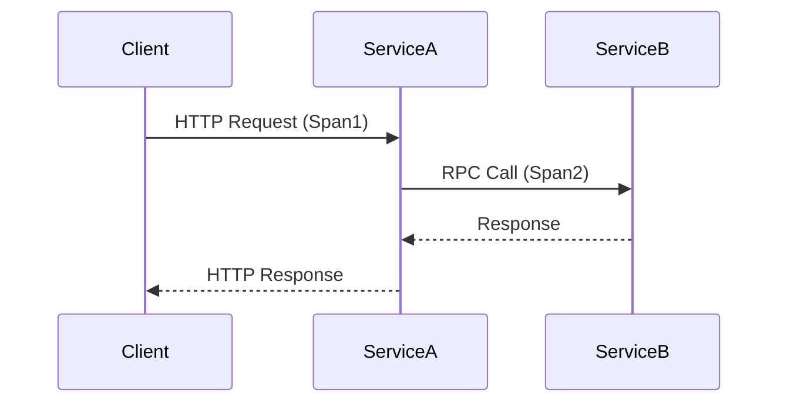

# Go客户端集成

## 介绍

Jaeger是一个开源的分布式追踪系统，用于监控和排查微服务架构中的性能问题。通过Go客户端集成，开发者可以轻松为应用程序添加追踪功能，帮助分析请求在不同服务间的流转情况。

:::note 什么是分布式追踪？
分布式追踪记录了请求在多个服务间的调用路径和耗时，常用于诊断延迟问题或依赖关系分析。
:::

## 前置条件

- 已安装Go 1.16+
- 运行中的Jaeger Collector（或使用All-in-one Docker镜像）
- 基础Go语言知识

## 基础配置

### 1. 安装依赖

```bash
go get github.com/jaegertracing/jaeger-client-go
```

### 2. 初始化Tracer

```go
package main

import (
	"context"
	"log"

	"github.com/uber/jaeger-client-go"
	jaegercfg "github.com/uber/jaeger-client-go/config"
)

func initTracer() (opentracing.Tracer, io.Closer) {
	cfg := jaegercfg.Configuration{
		ServiceName: "my-go-service",
		Sampler: &jaegercfg.SamplerConfig{
			Type:  jaeger.SamplerTypeConst,
			Param: 1,
		},
		Reporter: &jaegercfg.ReporterConfig{
			LogSpans: true,
		},
	}
	return cfg.NewTracer()
}
```

### 3. 创建Span示例

```go
func main() {
	tracer, closer := initTracer()
	defer closer.Close()

	// 创建根Span（代表完整请求）
	span := tracer.StartSpan("say-hello")
	defer span.Finish()

	ctx := opentracing.ContextWithSpan(context.Background(), span)

	// 业务逻辑
	greet(ctx, "World")
}

func greet(ctx context.Context, name string) {
	// 创建子Span
	span, _ := opentracing.StartSpanFromContext(ctx, "greet-function")
	defer span.Finish()

	log.Printf("Hello, %s!", name)
}
```

## 实际案例：HTTP服务追踪

### 集成net/http

```go
import "github.com/opentracing-contrib/go-stdlib/nethttp"

func main() {
	tracer, closer := initTracer()
	defer closer.Close()

	http.HandleFunc("/", func(w http.ResponseWriter, r *http.Request) {
		span := tracer.StartSpan("http-request")
		defer span.Finish()
		
		// 业务处理
		w.Write([]byte("Hello Traced World"))
	})

	// 包装Handler以自动处理追踪
	wrappedHandler := nethttp.Middleware(tracer, http.DefaultServeMux)
	http.ListenAndServe(":8080", wrappedHandler)
}
```

### 追踪流程图



## 高级配置

### 添加自定义标签

```go
span.SetTag("user.id", 1234)
span.LogKV("event", "processing_started")
```

### 错误处理

```go
if err != nil {
    span.SetTag("error", true)
    span.LogKV("error.message", err.Error())
}
```

## 总结

通过本教程你学会了：
1. 在Go中初始化Jaeger Tracer
2. 创建基础Span和上下文传播
3. 集成HTTP服务自动追踪
4. 添加自定义标签和错误处理

:::tip 最佳实践
- 为所有微服务使用相同的采样配置
- 避免在Span中记录敏感信息
- 合理设置采样率（生产环境建议动态采样）
:::

## 扩展练习

1. 尝试将追踪集成到数据库操作中
2. 在Jaeger UI中查看跨服务追踪数据
3. 实现一个包含3个服务的调用链追踪

## 附加资源

- [Jaeger官方文档](https://www.jaegertracing.io/docs/latest/)
- [OpenTracing语义规范](https://opentracing.io/specification/)
- [Jaeger Client Go示例库](https://github.com/jaegertracing/jaeger-client-go/tree/master/examples)