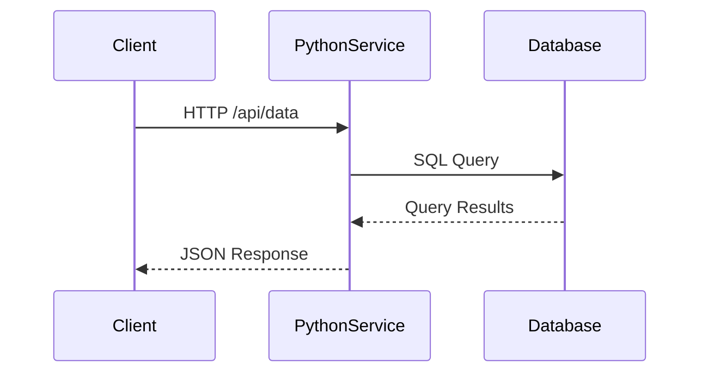

# Python客户端集成

## 什么是Jaeger客户端？

Jaeger是一个开源的**分布式追踪系统**，由Uber开发并贡献给CNCF。Python客户端集成允许你在应用中记录请求链路信息，帮助分析性能瓶颈和调试微服务架构问题。

:::tip 分布式追踪的核心价值
- 可视化请求在服务间的流转路径
- 分析跨服务调用的延迟问题
- 追踪分布式事务的执行情况
:::

## 基础环境准备

### 安装依赖包
首先安装必要的Python包：
```bash
pip install jaeger-client opentracing-instrumentation
```

### 最小化配置示例
```python
from jaeger_client import Config

def init_tracer(service_name):
    config = Config(
        config={
            'sampler': {
                'type': 'const',
                'param': 1,  # 采样率100%
            },
            'logging': True,
        },
        service_name=service_name,
    )
    return config.initialize_tracer()

tracer = init_tracer('my-python-service')
```

## 核心概念解析

### Span基础操作
Span代表追踪系统中的基本单元，记录单个操作的元数据：

```python
with tracer.start_span('database-query') as span:
    span.set_tag('db.type', 'mysql')
    span.log_kv({'event': 'query_start', 'query': 'SELECT * FROM users'})
    # 执行数据库操作...
    span.log_kv({'event': 'query_end', 'rows': 42})
```

### 上下文传播
跨服务追踪需要传递上下文：

```python
from opentracing.propagation import Format

# 服务A发送请求
headers = {}
tracer.inject(span_context, Format.HTTP_HEADERS, headers)

# 服务B接收请求
span_ctx = tracer.extract(Format.HTTP_HEADERS, headers)
with tracer.start_span('service-b-operation', child_of=span_ctx) as span:
    ...
```

## 实际应用案例

### Flask集成示例
```python
from flask import Flask
from opentracing_instrumentation.client_hooks import install_all_patches
from opentracing_instrumentation.flask import FlaskTracing

app = Flask(__name__)
install_all_patches()  # 自动拦截常见客户端库

tracing = FlaskTracing(tracer, True, app)

@app.route('/hello/<name>')
def hello(name):
    with tracer.start_span('generate-greeting'):
        return f"Hello, {name}!"

if __name__ == '__main__':
    app.run(port=8080)
```

### 异步任务追踪
```python
import asyncio
from jaeger_client import Tracer

async def async_task():
    with tracer.start_span('async-operation'):
        await asyncio.sleep(1)
        with tracer.start_span('sub-task'):
            return "Done"

loop = asyncio.get_event_loop()
result = loop.run_until_complete(async_task())
```

## 可视化追踪流程



## 常见问题解决

:::caution 采样策略选择
生产环境推荐使用概率采样：
```python
'sampler': {
    'type': 'probabilistic',
    'param': 0.1  # 采样10%的请求
}
```
:::

:::warning 性能开销
高频操作中避免过度创建span，建议：
- 对关键路径进行追踪
- 合并细粒度操作为一个span
- 使用`start_active_span`管理上下文
:::

## 总结与进阶

通过本指南，你已经学会：
- 配置Jaeger Python客户端
- 创建基础span和上下文传播
- 集成到Web框架和异步环境

### 扩展学习
1. 尝试集成到Django或FastAPI框架
2. 探索自定义metrics和tags的使用
3. 研究Jaeger与Prometheus的联合监控方案

### 实践建议
- 在本地使用Jaeger All-in-one镜像快速测试
- 使用`jaeger-client`的调试模式排查配置问题
- 关注span的父子关系构建