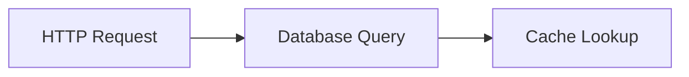

# C++客户端集成

## 介绍

Jaeger是一个开源的分布式追踪系统，用于监控和诊断微服务架构中的请求流。通过集成Jaeger客户端，C++应用可以自动记录和上报追踪数据，帮助开发者分析性能瓶颈和调试问题。本教程将指导你完成C++客户端的集成过程。

:::note
**什么是分布式追踪？**  
分布式追踪通过记录请求在多个服务间的流转路径，形成完整的调用链，便于分析延迟和故障点。
:::

## 准备工作

1. **安装依赖**  
   使用vcpkg或系统包管理器安装Jaeger C++客户端库：
   ```bash
   vcpkg install jaeger-client-cpp
   ```

2. **基础配置**  
   创建一个`Tracer`实例，配置上报地址和采样策略：
   ```cpp
   #include <jaegertracing/Tracer.h>

   auto config = jaegertracing::Config(
       jaegertracing::Config::kDefaultConfig);
   config.serviceName = "my-cpp-service";
   auto tracer = jaegertracing::Tracer::make(config);
   ```

## 核心概念

### 1. 创建Span

Span代表一个操作单元。以下代码创建并记录一个Span：
```cpp
auto span = tracer->StartSpan("database-query");
{
  jaegertracing::SpanScope scope(span);
  // 执行数据库操作
  span->SetTag("query", "SELECT * FROM users");
} // Span自动结束
```

### 2. 上下文传播

跨服务传递追踪上下文：
```cpp
// 提取上下文（如从HTTP头）
auto spanContext = tracer->Extract(headers);
auto childSpan = tracer->StartSpan("child-operation", { ChildOf(&spanContext) });
```

## 实际案例：HTTP服务追踪

假设有一个处理HTTP请求的服务：

```cpp
void handleRequest(const Request& req) {
  auto span = tracer->StartSpan("http-request");
  span->SetTag("http.method", req.method);
  
  try {
    processRequest(req); // 内部可能创建子Span
    span->SetTag("http.status_code", 200);
  } catch (...) {
    span->SetTag("error", true);
    span->SetTag("http.status_code", 500);
  }
}
```

## 可视化追踪数据

通过Jaeger UI查看追踪结果：



## 总结

- Jaeger C++客户端通过`StartSpan`创建追踪单元
- 使用`SetTag`添加关键元数据
- 上下文传播实现跨服务追踪

:::tip 练习建议
1. 在现有C++项目中添加简单Span
2. 尝试将追踪数据导出到本地Jaeger实例
3. 分析一个包含多个微服务的调用链
:::

## 扩展资源

- [Jaeger官方文档](https://www.jaegertracing.io/docs/)
- `jaeger-client-cpp` GitHub仓库示例
- OpenTracing C++ API规范
