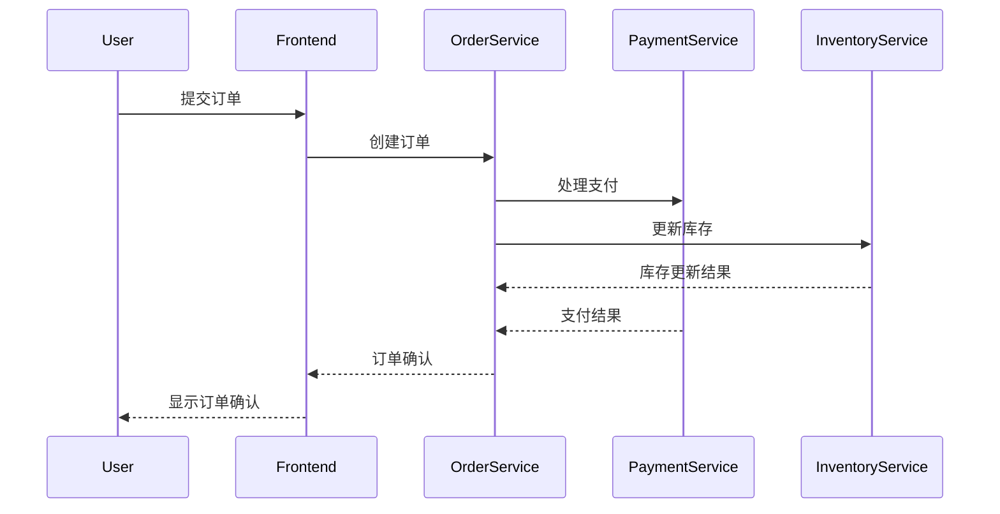

# C#客户端集成

## 介绍

Jaeger是一个开源的分布式追踪系统，由Uber开发并贡献给Cloud Native Computing Foundation（CNCF）。它帮助开发者监控和诊断微服务架构中的复杂事务。在本教程中，我们将学习如何在C#应用程序中集成Jaeger客户端，以便收集和发送追踪数据到Jaeger服务器。

:::note
分布式追踪系统（如Jaeger）通过记录请求在多个服务间的流转路径，帮助开发者理解系统行为并诊断性能问题。
:::

## 准备工作

在开始之前，请确保满足以下条件：
1. 已安装.NET Core 3.1或更高版本
2. 本地或远程运行Jaeger服务器（可通过Docker快速启动）
3. 熟悉C#基础语法

## 安装Jaeger客户端库

首先，通过NuGet安装Jaeger的C#客户端库：

```bash
dotnet add package Jaeger
dotnet add package OpenTracing
dotnet add package OpenTracing.Contrib.NetCore
```

## 基本配置

以下是一个最小化的Jaeger客户端配置示例：

```csharp
using Jaeger;
using Jaeger.Reporters;
using Jaeger.Samplers;
using Jaeger.Senders;
using OpenTracing;

public static class JaegerTracer
{
    public static ITracer CreateTracer(string serviceName)
    {
        var senderConfiguration = new Configuration.SenderConfiguration()
            .WithAgentHost("localhost")  // Jaeger代理地址
            .WithAgentPort(6831);       // Jaeger代理UDP端口

        var reporter = new RemoteReporter.Builder()
            .WithSender(new UdpSender(senderConfiguration.AgentHost, 
                                     senderConfiguration.AgentPort, 
                                     0))
            .Build();

        var tracer = new Tracer.Builder(serviceName)
            .WithSampler(new ConstSampler(true))  // 采样所有请求
            .WithReporter(reporter)
            .Build();

        return tracer;
    }
}
```

## 在ASP.NET Core中集成

对于ASP.NET Core应用程序，可以使用以下方式进行集成：

1. 在`Startup.cs`中配置服务：

```csharp
public void ConfigureServices(IServiceCollection services)
{
    services.AddOpenTracing();
    
    services.AddSingleton<ITracer>(serviceProvider =>
    {
        var loggerFactory = serviceProvider.GetRequiredService<ILoggerFactory>();
        
        var tracer = JaegerTracer.CreateTracer("my-awesome-service");
        
        GlobalTracer.Register(tracer);
        
        return tracer;
    });
}
```

2. 在控制器中使用追踪：

```csharp
[ApiController]
[Route("[controller]")]
public class WeatherForecastController : ControllerBase
{
    private readonly ITracer _tracer;

    public WeatherForecastController(ITracer tracer)
    {
        _tracer = tracer;
    }

    [HttpGet]
    public IEnumerable<WeatherForecast> Get()
    {
        using(var scope = _tracer.BuildSpan("get-weather-forecast").StartActive(true))
        {
            // 业务逻辑代码...
            return Enumerable.Range(1, 5).Select(index => new WeatherForecast
            {
                Date = DateTime.Now.AddDays(index),
                TemperatureC = Random.Shared.Next(-20, 55),
                Summary = Summaries[Random.Shared.Next(Summaries.Length)]
            })
            .ToArray();
        }
    }
}
```

## 追踪自定义操作

除了自动追踪HTTP请求，你还可以手动创建追踪span：

```csharp
public void ProcessOrder(Order order)
{
    using(var scope = _tracer.BuildSpan("process-order").StartActive(true))
    {
        try
        {
            scope.Span.Log(new Dictionary<string, object>
            {
                ["event"] = "order-processing-started",
                ["orderId"] = order.Id,
                ["customer"] = order.CustomerName
            });

            // 处理订单的业务逻辑
            ValidateOrder(order);
            ChargeCustomer(order);
            UpdateInventory(order);
            
            scope.Span.SetTag("success", true);
        }
        catch(Exception ex)
        {
            scope.Span.SetTag("error", true);
            scope.Span.Log(new Dictionary<string, object>
            {
                ["event"] = "error",
                ["error.object"] = ex,
                ["stack"] = ex.StackTrace,
                ["message"] = ex.Message
            });
            throw;
        }
    }
}
```

## 实际应用场景

假设你正在开发一个电子商务系统，包含以下服务：
1. 用户服务
2. 产品目录服务
3. 订单服务
4. 支付服务

当用户下单时，请求会流经所有这些服务。通过Jaeger追踪，你可以：

1. 查看完整的事务路径
2. 识别哪个服务响应最慢
3. 发现失败的请求是在哪个环节出现问题



## 高级配置选项

### 采样策略

Jaeger提供了多种采样策略来控制追踪数据的收集量：

```csharp
// 概率采样（例如采样50%的请求）
var sampler = new ProbabilisticSampler(0.5);

// 速率限制采样（例如每秒最多2个请求）
var sampler = new RateLimitingSampler(2);
```

### 日志和标签

你可以为span添加丰富的上下文信息：

```csharp
using(var scope = _tracer.BuildSpan("complex-operation").StartActive(true))
{
    scope.Span.SetTag("customer-tier", "premium");
    scope.Span.SetTag("priority", "high");
    
    scope.Span.Log("Starting phase 1");
    // 第一阶段处理...
    
    scope.Span.Log("Starting phase 2");
    // 第二阶段处理...
}
```

## 总结

在本教程中，我们学习了：
1. 如何在C#应用程序中集成Jaeger客户端
2. 基本的配置和初始化过程
3. 在ASP.NET Core中的集成方法
4. 创建自定义span和添加上下文信息
5. Jaeger在实际微服务架构中的应用场景

:::tip 最佳实践
- 为所有关键业务操作添加追踪
- 使用有意义的span名称（如"checkout-process"而非"span1"）
- 添加足够的上下文信息（如用户ID、订单号等）
- 在生产环境中使用适当的采样策略以控制数据量
:::

## 进一步学习

1. [Jaeger官方文档](https://www.jaegertracing.io/docs/)
2. [OpenTracing C# API规范](https://github.com/opentracing/specification/blob/master/specification.md)
3. [.NET微服务中的分布式追踪](https://docs.microsoft.com/en-us/dotnet/architecture/microservices/implement-resilient-applications/monitor-app-health)

## 练习

1. 创建一个简单的ASP.NET Core Web API，集成Jaeger追踪
2. 添加自定义span来追踪特定的业务逻辑
3. 配置不同的采样策略并观察结果差异
4. 尝试在span中添加自定义标签和日志

祝你追踪愉快！🚀